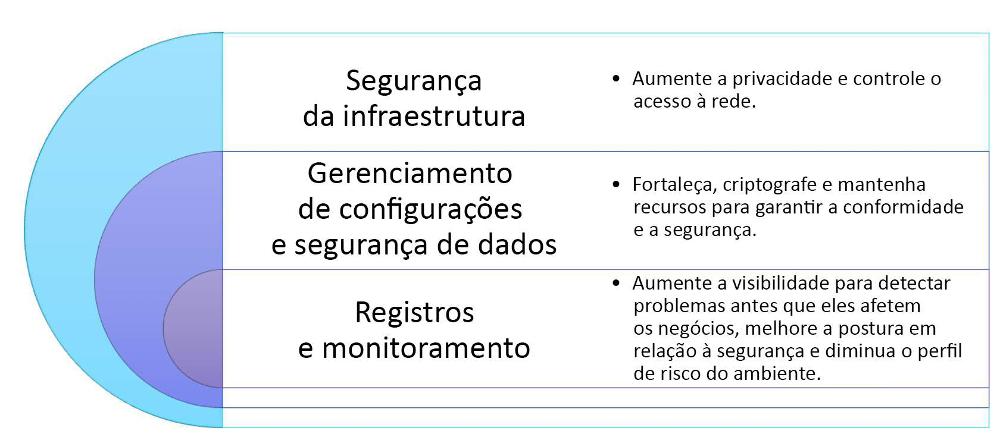

## Camadas em foco

A série digital AWS Security Best Practices tem quatro partes. As partes 2, 3 e 4 abordam infraestrutura de rede, segurança da computação e registros e alertas.

|Função e destino do CSF do NIST |	Série AWS Security Best Practices|
|-|-|
Proteger a infraestrutura de rede| Parte 2 - Infraestrutura de rede 
Proteger os recursos de computação| Parte 3 - Segurança de computação
Detectar eventos de segurança | Parte 4 - Monitoramento e alertas

Para saber mais sobre as áreas abordadas na série digital AWS Security Best Practices, selecione cada marcador numerado no gráfico abaixo:

- **Aumente a provacidade e controle o acesso à rede**:
    - **Segurança de infraestrutura**: A AWS disponibiliza vários recursos e serviços de segurança para aumentar a privacidade e controlar o acesso ã rede. Isso inclui:
        - Firewalls de rede integrados ã Amazon VPC permitem que voce crie redes privadas e controle o acesso ãs suas instâncias ou aplicativos. Os clientes podem controlar a criptografia em trânsito com Transport Layer Security (TLS) nos serviços da AWS.
        - As opçoes de conectividade permitem conexões privadas ou dedicadas do seu escritório ou ambiente on-premises
        - As tecnologias de mitigação de negação de servicoes distribuidos (DDoS) se aplicam na camada 3 ou 4, bem como na camada 7. Elas podem ser aplicadas como parte das estratégias de entrega de aplicativos e conteúdo.
        - O tráfego é protegido com criptografia automática de todo o tráfego das redes globais e regionais da AWS, bem como entre as instalações protegidas da AWS.

- **Fortaleça, criptografe  e mantenha recursos para garantir a conformidade e a segurança**: 
    - **Gerenciamento de configurações e seguranca de dados**: A AWS oferece uma variedade de ferramentas que, ao mesmo tempo em que oferecem segurança, ajudam você a ter mais rapidez, inclusive:
        - Ferramentas de implantação para gerenciar a criaçao e a desativaçao de recursos da AWS conforme os padrões da organizaçao.
        - Ferramentas de definição e gerenciamento de modelos para criar máquinas virtuais comuns, pré-configuradas e reforçadas para instâncias do Amazon Elastic Compute Cloud (Amazon EC2)
        - Recursos de criptografia de dados em repouso disponíveis na maioria dos serviços da AWS, como:
            - Amazon Elastic Block Store (Amazon EBS)
            - Amazon S3
            - Amazon Relational Database Service (Amazon RDS)
            - Amazon Redshift
            - Amazon ElasticCache
            - AWS Lambda
            - Amazon SageMaker

- **Aumente a visibilidade para detectar problemas antes que eles afetem os negócios, melhore a postura em relação ã seguranca e diminua operfil de risco do ambiente**:
    - **Monitoramento e registros**: A AWS disponibiliza ferramentas e recursos que ajudam você a ver o que está acontecendo no seu ambiente da AWS. Exemplos:
        - Com o AWS CloudTrail, você pode monitorar as suas implantacoes da AWS na nuvem por meio do histórico de chamadas de API da AWS na sua conta. Isso inclui chamadas de API feitas por meio do AWS Maganement Console, de SDKs da AWS, das ferramentas de linha de comando e de serviços da AWS de nível superior. Você pode identificar quais usuários e contas fizeram chamadas de APIs da AWS para serviços compatíveis com cloudTrail. Você também pode encontrar o endereço IP de origem das chamadas e quando elas ocorrem.
        - O Amazon CloudWatch é uma solução de monitoramento confiável, dimensionável e flexível que você pode começar a usar em minutos. Você não precisa mais configurar, gerenciar e dimensionar os seus próprios sistemas de monitoramento e infraestrutura.
        - O Amazon GuardDuty é um serviço de detecção de ameaças que monitora continuamente atividades maliciosas e comportamentos não autorizados para proteger as suas contas e cargas de trabalho da AWS. O GuardDuty expõe notificações por meio do CloudWatch para que voce inicie uma resposta automatizada ou notifique um humano.
