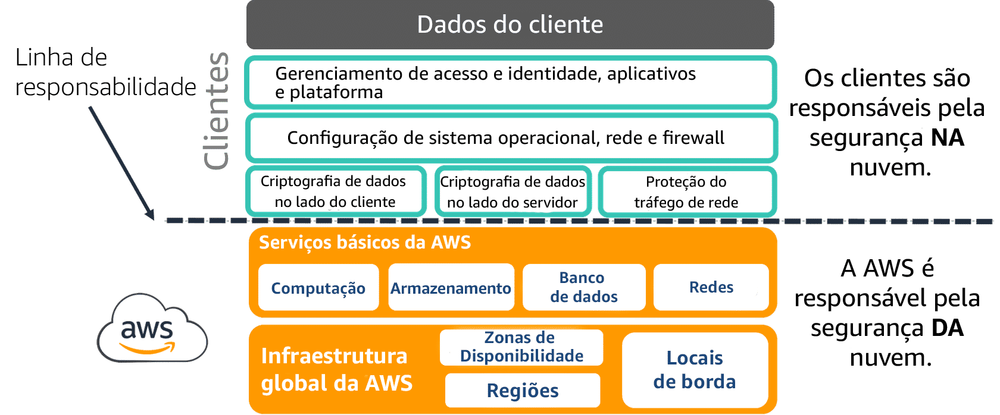
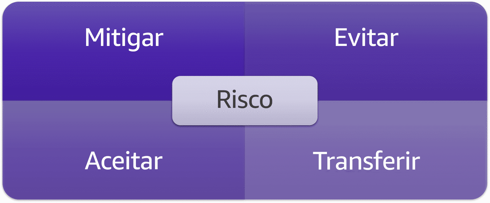

Modelo de responsabilidade compartilhada da AWS

Segurança e conformidade são responsabilidades compartilhadas entre a AWS e o cliente. Esse modelo compartilhado pode ajudar a aliviar a carga operacional do cliente. A AWS opera, gerencia e controla os componentes desde o sistema operacional do host e a camada de virtualização até a segurança física das instalações em que o serviço opera. 

A AWS é responsável por muitos controles de segurança que reduzem a superfície de ameaças e a vulnerabilidade de uma carga de trabalho hospedada na nuvem. No entanto, a responsabilidade do cliente ainda é crítica para um ambiente seguro geral.

As duas áreas de responsabilidade são normalmente categorizadas como segurança DA nuvem (responsabilidade da AWS) e segurança NA nuvem (responsabilidade do cliente). O foco deste curso será em como você pode proteger melhor os componentes de rede da sua carga de trabalho.

Delineação da responsabilidade compartilhada da AWS

O diagrama a seguir é um exemplo de uso de serviços IaaS na AWS.



## Segurança DA nuvem
Pontos principais:

A AWS gerencia a infraestrutura global fornecendo serviços em nuvem.
A AWS passa por programas contínuos de auditoria e garantia.
A AWS mantém a proteção da infraestrutura global que executa serviços da AWS e endpoints de serviço.
A AWS tem uma cultura de segurança e melhoria.
Segurança NA nuvem

Pontos principais:

- O cliente gerencia a própria carga de trabalho na nuvem AWS.
- Os clientes devem fazer as configurações de rede disponibilizadas pela AWS.
- Os clientes podem implementar e gerenciar seus próprios controles.
- Os clientes podem implantar garantias adicionais além dos controles disponibilizados pela AWS.
- Os clientes têm acesso a um mercado de fornecedores maduro.
Desafios do cliente

Os requisitos de segurança e conformidade estão em constante evolução devido a mudanças na tecnologia, nos processos e nas ameaças. A proteção e preservação de dados são dificultadas por:

- Mudanças tecnológicas em tamanho e complexidade
- Limitações de recursos e força de trabalho
- Evolução das ameaças e expansão das suas superfícies

O enfrentamento desses desafios depende dos recursos e capacidades da organização. Em geral, as organizações precisam aproveitar seus recursos e capacidades para gerenciar riscos. Antes de discutir risco, é importante definir três conceitos relacionados: vulnerabilidades, ameaças e riscos.


## Vulnerabilidade, ameaça e risco

Esses termos são frequentemente usados ​​de forma intercambiável e/ou incorreta. É importante entender como cada um deles deve ser usado, o que os liga e o que os diferencia.

Resumindo:
- 1 Vulnerabilidade é uma fraqueza.

- 2 Ameaça é a possibilidade de um evento ou ato de explorar uma vulnerabilidade.

- 3 Risco é o potencial de perda, dano ou destruição de recursos devido a uma ameaça.

## Vulnerabilidades

Sistema Common Vulnerabilities and Exposures (CVE – Vulnerabilidades e Exposições Comuns)

Você pode usar as práticas recomendadas para lidar com vulnerabilidades baseadas em configuração. Porém, outras vulnerabilidades existem como parte de um sistema operacional (seja de um servidor, host ou uma infraestrutura de rede) ou aplicativo. Elas são conhecidas como Vulnerabilidades e Exposições Comuns, ou CVE. O programa CVE é supervisionado pela MITRE Corporation com financiamento da Cybersecurity and Infrastructure Security Agency (CISA – Agência de Segurança Cibernética e Infraestrutura), parte do Departamento de Segurança Interna dos EUA.

As CVE são derivadas de uma lista de falhas de segurança da computação divulgadas publicamente. Quando nos referimos a uma CVE, significa que há uma falha de segurança identificada que recebeu um número de ID CVE. Os avisos de segurança emitidos por fornecedores e pesquisadores geralmente mencionam pelo menos um ID CVE. Os IDs CVE costumam ser usados ​​para descrever as vulnerabilidades abordadas pelos patches de segurança lançados pelos fornecedores.

O banco de dados oficial de CVE da [MITRE](https://cve.mitre.org/)

## Ameaças
Algumas das ameaças enfrentadas em ambientes corporativos e data centers on-premises tradicionais também podem se manifestar na nuvem. Algumas que devem ser consideradas são:

- Ataques de negação de serviço
- Infecções por malware
- Acesso não autorizado ou ameaças internas
- Configurações incorretas e controle de mudanças mal feito

Um estudo de 2020, realizado pela Positive Technologies, encontrou um número alarmante de serviços abertos e disponíveis no perímetro das organizações, expondo-as a uma infinidade de ataques. Desativar esses serviços quando não forem necessários é a melhor mitigação de risco. No entanto, para incluir uma camada adicional de proteção, eles também devem ser bloqueados ou filtrados quando não forem necessários.

```Das empresas pesquisadas, 100% tiveram protocolos HTTP e HTTPS expostos. Mais preocupante foi que protocolos de gerenciamento sensíveis como SSH e SNMP também foram expostos no perímetro em 74% e 58% (respectivamente) dessas empresas.```

[Referência de 2020 da Positive Technologies](https://www.ptsecurity.com/ww-en/analytics/vulnerabilities-corporate-networks-2020/)

## Erros de configuração: fáceis de cometer, difíceis de detectar

De acordo com o Relatório de Segurança em Nuvem de 2020 da Check Point, 68% das organizações apontaram a configuração incorreta da plataforma de nuvem como a maior ameaça à segurança nos seus ambientes de nuvem pública. A configuração incorreta pode criar uma variedade de vulnerabilidades que resultam em comprometimento.

[Referência da Check Point](https://research.checkpoint.com/)


## Ameaças baseadas em malware

Ransomware é um tipo de malware que usa criptografia para armazenar informações em troca de um resgate. Os dados críticos de um usuário ou organização são criptografados, impossibilitando o acesso a arquivos, bancos de dados ou aplicativos. O invasor exige um pagamento de resgate pela chave privada necessária que descriptografa as informações. De acordo com vários grupos de pesquisa de segurança, a frequência de ransomware mais que dobrou em 2021 em relação ao ano anterior.

O malware de criptomineração, ou cryptojacking, é um ataque de malware que usa os recursos de computação da vítima para minerar criptomoedas. Esse malware usa uma CPU (ou GPU) do sistema para realizar cálculos matemáticos complexos que resultam em hashes.

A imagem representa os principais componentes do ransomware: criptografia dos dados com o pedido de um resgate para a restauração dos ativos.

A criptomineração é realizada para a obtenção de uma variedade de criptomoedas, como o Bitcoin. O símbolo do Bitcoin está representado na imagem.

## Ameaças à disponibilidade

Um ataque distribuído de negação de serviço (DDoS – Distributed Denial of Service) acontece quando vários sistemas comprometidos tentam criar uma inundação de tráfego em um alvo, como uma rede ou um aplicativo web. Um ataque DDoS pode impedir que usuários legítimos acessem um serviço e causar falha no sistema por conta do volume de tráfego excessivo.

```Pesquisas sugerem um aumento de mais de 30% dos ataques distribuídos de negação de serviço (DDoS) no primeiro trimestre de 2021 em relação ao mesmo período de 2020.```

## Riscos

A análise de risco procura identificar, medir e mitigar várias exposições a riscos ou perigos para a sua carga de trabalho. Ela geralmente é realizada de duas maneiras, com análise quantitativa ou qualitativa.

- A análise quantitativa de risco usa modelos matemáticos e simulações para atribuir valores monetários ao risco. 
- A análise qualitativa de risco depende de julgamento subjetivo para construir um modelo teórico de risco para um determinado cenário. Isso geralmente é expresso com base em dois fatores principais: probabilidade e impacto da ameaça avaliada.

As ameaças estão em constante mutação; novas vulnerabilidades são descobertas todos os dias. O crescente volume e a gravidade das ameaças apresentam um risco significativo a organizações com operações dependentes de recursos digitais. Uma análise de risco serve como um snapshot pontual. Isso é usado como parte do processo de gerenciamento de riscos.

## Como lidar com ameaças usando gerenciamento de riscos

Gerenciar o risco organizacional é importante para as operações e, em alguns casos, é um requisito legal. Há quatro maneiras básicas de gerenciar riscos:

Mitigar aplicando controles.
Evitar o risco completamente (o que pode significar renunciar a benefícios ou alterar significativamente as operações).
Aceitar, supondo que a organização possa absorver os impactos potenciais se a ameaça se concretizar.
Transferir para outra parte gerenciar.


Esta imagem representa as opções que uma organização tem ao gerenciar uma ameaça: mitigar, evitar, aceitar e transferir.

## Segurança é responsabilidade de todos

É importante entender a sua responsabilidade (como usuário da nuvem) e a da AWS (como provedora da nuvem). Segurança e conformidade são responsabilidades compartilhadas entre a AWS e você.

Para proteger efetivamente seu ambiente, é importante entender o seguinte:

Objetivos e requisitos de conformidade necessários

Controles de segurança que atendem a esses objetivos e requisitos

Verificação da eficácia dos controles de segurança

Felizmente, a implantação na nuvem AWS oferece muitas opções de aplicação de vários tipos de controles com métodos de verificação para ajudar a mitigar riscos. 

[Documento de Posicionamento da AWS em Relação à Responsabilidade Compartilhada
Se você quiser saber mais sobre o modelo de responsabilidade compartilhada, confira este documento de posicionamento da AWS.](https://docs.aws.amazon.com/whitepapers/latest/aws-risk-and-compliance/shared-responsibility-model.html)