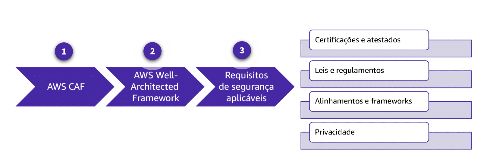

Abordagem baseada em padrões

Muitos controles de segurança estão disponíveis na AWS para serem implementados de várias maneiras. Isso pode ser complexo e confuso, especialmente quando a organização precisa atender a vários requisitos regulatórios e legais.

Com uma abordagem baseada em padrões, as organizações podem aproveitar o conhecimento e a experiência de uma ampla variedade de práticas recomendadas do setor para proteger as cargas de trabalho delas. Com os frameworks certos, você pode usar essas práticas recomendadas e mapear os controles de segurança conforme os seus requisitos. Ao implementar melhores práticas por meio de frameworks aplicáveis, fica mais fácil para a sua organização atender aos requisitos de segurança e proteger os recursos certos com os controles certos.

Para saber mais, selecione cada marcador numerado no gráfico a seguir.



### AWS CAF
**Novo Na Nuvem** As organizações que estão migrando para a nuvem contam com recursos como o AWS CAF (Cloud Adoption Framework) para orientá-las usando as práticas recomendadas comprovadas. Esse framework fornece orientação que auxilia cada unidade da organização. Assim, cada área entende como atualizar habilidades, adaptar processos e introduzir novos processos para aproveitar ao máximo os serviços fornecidos pela computação em nuvem.
Milhares de organizações em todo o mundo migraram com sucesso seus negócios para a nuvem, contando com o AWS CAF para orientar seus esforços.

### AWS Well-Architected Framework
**Qualquer usuário da nuvem** As organizações que já estão na nuvem e as que estão migrando para a nuvem podem usar o AWS Well-Architected Framework. Esse framework fornece as práticas recomendadas de arquitetura atuais para projetar e operar cargas de trabalho na nuvem com confiança, segurança, eficiência e economia. Ele serve como uma forma de medir consistentemente sua carga de trabalho em relação às práticas recomendadas e identificar áreas de melhoria. Este curso se concentra especificamente no pilar de segurança desse framework

### Requisitos de segurança aplicáveis
**Requisitos adicionais** Os usuários da nuvem devem implementar um gerenciamento de risco do ciclo de vida que conecta os objetivos dos negócios e da missão a atividades de segurança cibernética com base nos requisitos de segurança aplicáveis. Esses requisitos são orientados por padrões operacionais e do setor, regulamentações geopolíticas e outras variáveis, como a tecnologia disponível.

## Uso de frameworks em uma abordagem baseada em padrões.

No mundo altamente conectado de hoje, os clientes enfrentam uma infinidade de ameaças à segurança. O CSF do NIST é um exemplo de guia prático de uma abordagem baseada em padrões para segurança e gerenciamento de riscos. 


As organizações devem empregar controles de segurança eficazes para identificar, proteger, detectar, responder e se recuperar de eventos de segurança destrutivos.
O pilar de segurança do AWS Well-Architected Framework é compatível com essas cinco funções de CSF com base em um longo histórico de experiência em práticas recomendadas para ambientes de nuvem.
O CSF do NIST tem suporte da AWS e de parceiros da AWS por meio de um portfólio crescente de serviços que ajudam os clientes a conseguir os controles de segurança necessários.
Esta lição abordará os seguintes frameworks e seus padrões ou diretrizes associados:

1- AWS Well-Architected Framework

2- Cloud Adoption Framework (CAF)

3- Framework de Cibersegurança do NIST


## AWS Well-Architected Framework

O AWS Well-Architected Framework descreve os principais conceitos, princípios de design e práticas recomendadas de arquitetura necessárias para você projetar e executar cargas de trabalho no seu ambiente de nuvem. Ele proporciona uma abordagem consistente que você pode usar para avaliar arquiteturas e implementar designs que podem ser dimensionados ao longo do tempo.

O Well-Architected Framework é baseado em seis pilares: excelência operacional, segurança, confiabilidade, eficiência de desempenho, otimização de custos e sustentabilidade. Para os propósitos desta aula e da série AWS Security Best Practices, discutiremos apenas o pilar de segurança.

[AWS Well-Architected Framework](https://docs.aws.amazon.com/wellarchitected/latest/framework/welcome.html)
Saiba mais sobre até que ponto a sua arquitetura está alinhada às práticas recomendadas de nuvem e receba orientação para fazer melhorias.


O Well-Architected Framework é baseado nos seis pilares representados nesta imagem: excelencia operacional, seguranca, confiabilidade, eficiencia de desemprenho, otimizaçao de custos e sustentabilidade.

### Pilar de segurança
O foco do pilar de segurança é proteger informações, sistemas e ativos, ao mesmo tempo em que atende às necessidades de negócios. Esse pilar está organizado nas seguintes áreas:

- Proteção de infraestrutura
- Detecção
- Proteção de dados
- Gerenciamento de acessos e identidades (IAM - Identity and Access Management)
- Resposta a incidentes

Cada uma dessas áreas é importante, e muitas delas se sobrepõem. Este curso explorará as áreas de proteção de infraestrutura, detecção e proteção de dados.

### Proteção de infraestrutura

A proteção de infraestrutura pode usar várias metodologias de controle para atender aos padrões de práticas recomendadas e às obrigações organizacionais e regulatórias. Um exemplo dessa metodologia é a defesa em profundidade. A defesa em profundidade envolve implantar e configurar vários tipos diferentes de controles de segurança, de preferência em todas as camadas do seu ambiente. A defesa em profundidade é feita com controles de segurança fornecidos pela AWS, como:

- Amazon Virtual Private Cloud (Amazon VPC)
- Implantações de sub-rede em camadas
- Tabelas de rotas
- Listas de controle de acesso à rede (ACLs de rede)
- Grupos de segurança
- Elastic Load Balancing (ELB)
- AWS Shield
- AWS WAF
- Amazon GuardDuty
- AWS Firewall Manager

### Detecção

Muitos serviços da AWS oferecem funções que se sobrepõem por todo o pilar de segurança. Os controles de detecção, especificamente, são usados para identificar possíveis ameaças ou incidentes de segurança que pertencem à infraestrutura, aos dados ou mesmo ao gerenciamento de identidade e acesso. Eles são parte essencial dos frameworks de governança de segurança. Muitas vezes, eles são usados para dar suporte a obrigações legais ou de conformidade, para identificação de ameaças e para esforços de resposta.

Na AWS, você pode implementar serviços nativos ou oferecidos por parceiros para monitorar, analisar ou avaliar e fornecer alarmes. Alguns dos serviços da AWS que facilitam isso são:

- AWS Trusted Advisor
- AWS Audit Manager
- AWS CloudTrail
- Amazon CloudWatch
- VPC Flow Logs

### Proteção de dados

A proteção de dados envolve a proteção de dados em repouso e em trânsito. Esses dados podem ser informações residentes nos seus recursos em estado não volátil ou volátil. Da mesma forma, podem ser dados em trânsito, enviados ou recebidos dos seus recursos. A proteção dos seus dados pode ser alcançada de várias maneiras, mas este curso se concentrará em dados em repouso e na proteção dos recursos de computação por meio de: 

- Sistema de proteção
- Criptografia de dados (em repouso ou em trânsito)
- Métodos de acesso remoto mais seguros possíveis

Ao protegermos recursos computacionais, precisamos pensar em como eliminar ou minimizar a possibilidade de acesso não autorizado às informações. Esse objetivo está alinhado à confidencialidade e é importante para atender a padrões de práticas recomendadas e a requisitos organizacionais ou baseados em conformidade.

```
Estados voláteis e não voláteis referem-se ao tipo de memória onde os dados residem. 
- A memória volátil precisa de energia constante para reter dados. 
- O armazenamento não volátil é um tipo de memória de computador que pode reter informações armazenadas mesmo após a remoção da energia.
```

### Gerenciamento de acessos e identidades

Com o IAM, você pode gerenciar o acesso aos serviços e recursos da AWS com segurança. Usando o IAM, você pode implementar o princípio de privilégio mínimo e impor a separação de tarefas com autorização apropriada para cada interação com seus recursos da AWS. O IAM permite centralizar o gerenciamento de privilégios e reduzir ou até eliminar a dependência de credenciais de longo prazo.

[Deep Dive with Security: AWS Identity and Access Management (IAM)
Expanda seu conhecimento de IAM com nosso curso digital autogerido A Deep Dive with Security: AWS Identity and Access Management (IAM).](https://explore.skillbuilder.aws/learn/course/external/view/elearning/104/deep-dive-with-security-aws-identity-and-access-management-iam)


### Resposta a incidentes

A resposta a incidentes na nuvem AWS pode ser mais rápida, barata, eficaz e simples de gerenciar do que em um ambiente on-premise. Sua capacidade de detectar, reagir e recuperar pode ser significativamente melhorada com a AWS. Acesse este blog da AWS e confira alguns recursos para investigação que só são possíveis usando a AWS.

[Building a Cloud-Specific Incident Response Plan
Esta publicação no blog da AWS discute um exemplo das etapas necessárias para criar um plano de resposta a incidentes.](https://aws.amazon.com/blogs/publicsector/building-a-cloud-specific-incident-response-plan/)


### Cloud Adoption Framework (CAF)

- O Cloud Adoption Framework (CAF) identifica os stakeholders críticos para a adoção da nuvem.
- Ele agrupa os stakeholders relacionados em seis perspectivas.
- As perspectivas nos ajudam a entender a adoção da nuvem do ponto de vista desses stakeholders.

 

As seis perspectivas que compõem o CAF: negócios, plataformas, segurança, operações, governança e pessoas.

### Perspectiva de segurança do CAF

O objetivo da perspectiva de segurança é ajudar você a estruturar a seleção e implementação de controles adequados para a sua organização. Essa perspectiva consiste em realizar ações com mais rapidez, maior escala e menor custo, sem deixar de seguir princípios de segurança da informação bem estabelecidos.

Para saber mais, expanda cada uma das quatro categorias de controle.

#### Controles diretivos

Incluem conceitos como:

- Propriedade da conta e informações de contato
    - Exemplo de controle: atribuir contas da AWS a unidades de negócios
- Gerenciamento de alterações e ativos
    - Exemplo de controle: atribuir tags específicas do cliente a recursos.
- Acesso de privilégio mínimo
    - Exemplo de controle: atribuir perfis da AWS à equipe, com apenas a permissão necessária para os recursos especificados.

#### Controles preventivos

Incluem conceitos como:

- Identidade e acesso
    - Exemplo de controle: negar ec2::CreateVpc a todos os usuários do AWS Identity and Access Management (IAM), exceto aqueles com necessidade justificada.
- Proteção de infraestrutura
    - Exemplo de controle: negar pacotes de uma sub-rede pública para uma sub-rede sigilosa.
- Proteção de dados
    - Exemplo de controle: exigir autenticação multifator (MFA) para uma ação de exclusão no bucket sigiloso do Amazon Simple Storage Service (Amazon S3).

#### Controles de detecção

Incluem conceitos como:

- Registro e monitoramento
    - Exemplo de controle: registrar todas as atividades da interface de programação de aplicativo (API) da AWS por meio do CloudTrail.
- Inventário de ativos
    - Exemplo de controle: alertar os administradores da nuvem se alguma regra do AWS Config não estiver em conformidade.
- Detecção de alterações
    - Exemplo de controle: alertar sobre solicitações de API do IAM negadas.

#### Controles responsivos

Incluem conceitos como:

- Vulnerabilidades
    - Exemplo de controle: iniciar aplicação de patches de segurança do sistema operacional.
- Escalonamento de privilégios
    - Exemplo de controle: reverter alterações perigosas no IAM.
- Ataque DDoS
    - Exemplo de controle: negar IPs de origem.


### AWS e o Framework de Cibersegurança do NIST

O Cybersecurity Framework (CSF) do National Institute of Standards and Technology (NIST) não foi criado pela AWS. No entanto, esse framework faz referência a padrões, diretrizes e práticas globalmente aceitos, tornando-se uma fonte relevante e importante de práticas recomendadas de segurança.

O CSF tem uma composição simples de três elementos: núcleo, níveis e perfis. O núcleo representa um conjunto de práticas de segurança cibernética, resultados e controles de segurança compatíveis com cinco funções de gerenciamento de risco: identificar, proteger, detectar, responder e recuperar. Essas funções são alocadas em categorias de controle que podem ser referenciadas na publicação especial do NIST (SP) 800-53. A infraestrutura e os serviços da nuvem AWS foram validados por testes de terceiros realizados usando os controles do NIST SP 800-53, Revisão 4.

De acordo com o modelo de responsabilidade compartilhada da AWS, a AWS gerencia a segurança DA nuvem, e o cliente é responsável por sua segurança NA nuvem. Para oferecer suporte à sua implementação de responsabilidades compartilhadas, a AWS criou as **soluções Quick Start com tecnologia AWS CloudFormation**. Com um único clique, elas automatizam a sua implantação de tecnologias importantes na nuvem AWS. Cada solução Quick Start inicia, configura e executa os serviços de computação, rede, armazenamento e outros serviços da AWS necessários para implantar uma carga de trabalho que atenda aos requisitos de conformidade de padrões e frameworks de segurança, como o NIST 800-53.

[Quick Starts da AWS 
Explore os guias Quick Start, inclusive modelos do AWS CloudFormation que automatizam a implantação e um guia que descreve a arquitetura e as etapas de criação.](https://aws.amazon.com/quickstart/?solutions-all.sort-by=item.additionalFields.sortDate&solutions-all.sort-order=desc&awsf.filter-content-type=*all&awsf.filter-tech-category=*all&awsf.filter-industry=*all)


## Funções do CSF Core

Seja a sua organização do setor público ou comercial, você pode usar o CSF do NIST para avaliar o seu ambiente AWS e melhorar as medidas de segurança que você implementa e opera como parte do modelo de responsabilidade compartilhada. O CSF Core consiste em cinco funções simultâneas e contínuas que proporcionam a base para um programa de segurança holístico.


A natureza cíclica das cinco funções principais no CSF do NIST: identificar, proteger, detectar, responder e recuperar.

No geral, o CSF do NIST oferece muitos benefícios, incluindo:

- É projetado para ser independente de tamanho, setor e país.
- Faz referência a padrões, diretrizes e práticas globalmente aceitos.
- Organizações em todo o mundo podem usá-lo para operar com eficiência em um ambiente global.


## Funções de segurança do CSF Core

Para saber mais sobre a função de segurança do CSF Core, expanda cada uma das cinco categorias.


#### Identificar

Categorias de controle:

- Gerenciamento de ativos (ID.AM)
    - Ambiente de negócios (ID.BE)
    - Governança (ID.GV)
    - Avaliação de riscos (ID.RA)
    - Estratégia de gerenciamento de riscos (ID.RM)

- Exemplos de resultados:
    - Identificar ativos físicos e de software para estabelecer um programa de gerenciamento de ativos
    - Identificar políticas de segurança cibernética para definir um programa de governança
    - Identificar uma estratégia de gerenciamento de riscos para a organização

#### Proteger

- Categorias de controle:
    - Gerenciamento de identidade, autenticação e controle de acesso (PR.AC)
    - Conscientização e treinamento (PR.AT)
    - Segurança de dados (PR.DS)
    - Processos e procedimentos para proteção de informações (PR.IP)
    - Manutenção (PR.MA)
    - Tecnologia de proteção (PR.PT)

- Exemplos de resultados:
    - Estabelecer proteções de segurança de dados para preservar a confidencialidade, integridade e disponibilidade
    - Gerenciar a tecnologia de proteção para garantir a segurança e a resiliência de sistemas e auxílios
    - Capacitar a equipe dentro da organização por meio de conscientização e treinamento

#### Detectar

- Categorias de controle:
    - Anomalias e eventos (DE.AE)
    - Monitoramento contínuo de segurança (DE.CM)
    - Processos de detecção (DE.DP)

- Exemplos de resultados:
    - Implementar recursos de monitoramento contínuo de segurança para eventos de segurança cibernética
    - Garantir que anomalias e eventos sejam detectados e seu possível impacto seja entendido
    - Verificar a eficácia das medidas de proteção

#### Responder

- Categorias de controle:
    - Planejamento de resposta (RS.RP)
    - Mitigação (RS.MI)
    - Comunicações (RS.CO)
    - Análise (RS.AN)
    - Melhorias (RS.IM)

- Exemplos de resultados:
    - Garantir que os processos de planejamento de resposta sejam executados durante e após um incidente
    - Gerenciar comunicações durante e após um evento
    - Analisar a eficácia das atividades de resposta

#### Recuperar
- Categorias de controle:
    - Planejamento de recuperação (RC.RP)
    - Melhorias (RC.IM)
    - Comunicações (RC.CO)

- Exemplos de resultados:
    - Garantir que a organização implemente processos e procedimentos de planejamento de recuperação
    - Implementar melhorias com base nas lições aprendidas
    - Coordenar as comunicações durante as atividades de recuperação


## Segurança de recursos

A AWS cria e mantém uma variedade de recursos para ajudar você a proteger seus ambientes e cargas de trabalho. Alguns exemplos desses recursos incluem uma variedade de produtos por meio do **AWS Marketplace**, de **boletins de segurança** para ajudar você a manter tudo atualizado, de **documentação de segurança** para orientar a configuração e de ferramentas da AWS, como o **AWS Trusted Advisor**. 

Para saber mais, expanda cada um dos quatro recursos.

#### AWS Marketplace
O AWS Marketplace oferece produtos preeminentes do setor de segurança que são equivalentes, idênticos ou integrados aos controles existentes nos seus ambientes on-premises. Esses produtos complementam os serviços existentes da AWS para que você possa implantar uma arquitetura de segurança abrangente e uma experiência mais integrada nos seus ambientes de nuvem e on-premises.

#### Boletins de segurança da AWS
A AWS disponibiliza boletins de segurança sobre vulnerabilidades e ameaças atuais. Os clientes podem trabalhar com especialistas em segurança da AWS para resolver problemas como denúncias de abuso, vulnerabilidades e testes de penetração. Há também recursos on-line para notificação de vulnerabilidades.

#### Documentação de segurança da AWS
A AWS disponibiliza documentação sobre como configurar os serviços da AWS para atender aos seus objetivos de segurança e conformidade. Você pode se beneficiar de arquiteturas de data center e rede criadas para atender aos requisitos das organizações mais sensíveis à segurança.

#### AWS Trusted Advisor
O Trusted Advisor é uma ferramenta on-line que atua como um especialista em nuvem personalizado e ajuda você a configurar os seus recursos para que eles sigam as práticas recomendadas. O Trusted Advisor inspeciona seu ambiente da AWS para ajudar a eliminar falhas de segurança e encontra oportunidades para economizar dinheiro, melhorar o desempenho do sistema e aumentar a confiabilidade.

## Informações adicionais

Para mais informações sobre os tópicos discutidos nesta lição, consulte os recursos a seguir.

[Security Best Practices the Well-Architected Way 
Saiba mais sobre as práticas recomendadas de segurança neste vídeo de sessão avançada do re:Inforce.](https://www.youtube.com/watch?v=u6BCVkXkPnM)

[Matriz de responsabilidades do cliente para alinhamento ao CSF
Use esta planilha do Excel para examinar as responsabilidades do cliente com base no CSF do NIST e como elas são facilitadas pelos serviços da AWS.](https://d1.awsstatic.com/whitepapers/compliance/AWS_Services_and_Customer_Responsibility_Matrix_for_Alignment_to_the_CSF.fca4b7f5c7282cc221dee72732624a0389aa2596.xlsx)

[Boletins de segurança da AWS
Você pode assinar o feed RSS do Boletim de segurança da AWS para ficar a par dos anúncios de segurança.](https://aws.amazon.com/security/security-bulletins)
