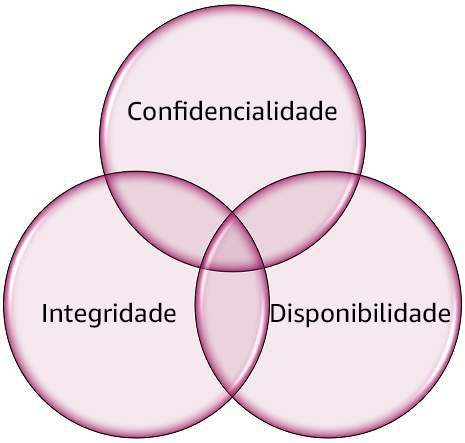
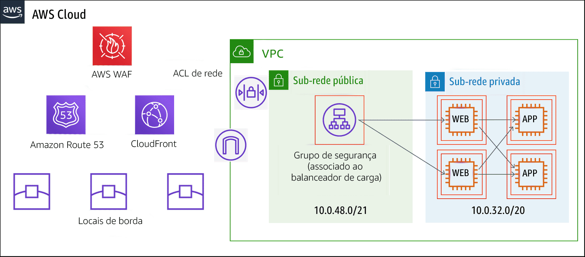

Com o tempo, as práticas recomendadas precisam evoluir e mudar para acompanhar os fluxos de trabalho modernos e a tecnologia em evolução. Determinar os requisitos da organização, entender os recursos e as capacidades atuais e definir as metas de segurança ajudam a decidir quais frameworks devem ser seguidos. 

## Tríade CIA

As três letras da tríade CIA significam confidencialidade (confidentiality), integridade (integrity) e disponibilidade (availability). A tríade CIA é um modelo comum e confiável usado para compreensão dos requisitos de segurança e desenvolvimento de controles para atendê-los. O modelo ajuda as organizações a olhar para os objetivos de negócios e definir as metas de segurança que melhor se alinham para alcançá-los.

De preferência, as organizações devem se esforçar para atender aos três padrões a fim de alcançar um perfil de segurança mais forte e ficarem mais bem equipadas para lidar com incidentes relacionados a ameaças.

*As três áreas da tríade CIA são tipicamente representadas em um triângulo, porque nenhuma área é mais importante que a outra. Além disso, elas geralmente dependem uma da outra.*

Veja no verso de cada cartão didático exemplos de serviços da AWS que ajudam a atender a cada área.

Confidencialidade
Criptografia do Amazon EBS

Integridade
Validação de integridade de arquivos de log do Amazon CloudTrail (hashing com assinatura digital)

Disponibilidade
Elastic Load Balancing (ELB)

## Suas práticas recomendadas são únicas

Frameworks e padrões servem como um ponto de partida para proteger a sua carga de trabalho, mas ela é única. Ao estabelecer os controles de segurança da sua organização, lembre-se de que **nenhum mecanismo de segurança ou controle por si só é confiável**. A sobreposição de vários mecanismos ou controles é uma importante prática recomendada.

## Defesa em profundidade
*A estratégia de defesa em profundidade geralmente usa uma analogia de defesa de um castelo, como a imagem exemplificada aqui.*

O termo defesa em profundidade é uma prática recomendada amplamente reconhecida que faz referência à estratégia de usar camadas de controles de segurança. Muitas vezes, a analogia de defender um castelo é usada. Nela, o castelo representa um computador, dados ou outro ativo importante. Para protegê-lo, o defensor emprega várias camadas de defesa. Isso tem dois propósitos: parar os invasores mais fracos e desacelerar os mais fortes.

Múltiplas camadas de defesa podem retardar os invasores, porque eles precisam rompê-las antes de comprometer o ativo. Esse tempo extra para atingir o alvo pode dar aos defensores a oportunidade de parar ou conter e atacar.

## Defesa em profundidade em ação
Para saber mais, selecione cada marcador numerado no gráfico.

#### Amazon Route 53
**O fosso** Os invasores primeiro se deparam com a barreira mais externa, um fosso. Isso pode representar a proteção fora do perímetro do ambiente, como restrição geográfica do Amazon CloudFront e o bloqueio de áreas proibidas.

#### AWS WAF
**O muro externo** Se conseguirem passar pelo fosso, os invasores serão recebidos por um muro externo ao redor do castelo. Isso pode representar proteção na borda ou no perímetro, como o AWS WAF.

#### ACL de REDE
**O muro interno** Se os invasores passarem pelo muro externo, eles se depararão com um muro interno bem alto. Isso pode representar proteção na borda ou no perímetro, como uma ACL de rede.

#### Sub-rede publica
**Guarda do castelo** Se um invasor conseguir passar pelo muro interno, ele se deparará com mais outra barreira na forma de uma guarda do castelo. Isso pode representar um grupo de segurança associado a um balenceador de carga que atende a um aplicativo web voltado para a internet. Aqui, o grupo de seguraná é representado pelo contorno ao redor do balanceador de carga.

## Camadas de segurança heterogêneas

A metodologia de defesa em profundidade envolve usar camadas de tecnologias de segurança heterogêneas para que ataques não contidos por uma tecnologia sejam capturados por outra. Isso pode ser conseguido com tipos de controles diferentes, aplicados com os seguintes princípios em mente:

- Aplicar diversas camadas de controle; tratar camadas distintas com controles distintos.
- Diversificar suas fontes de assinatura e fontes de inteligência de ameaças.
- Diversificar a tecnologia.
