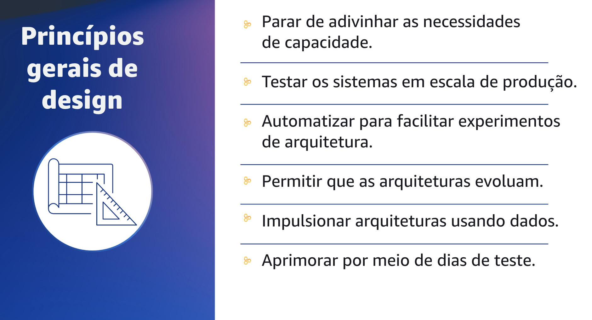

## 1.13 Princípios gerais de design

Os princípios gerais de design são aplicados a todas as cargas de trabalho e a todos os pilares. Há também princípios de design específicos para cada pilar, sobre os quais você aprenderá mais a seguir.

A computação em nuvem abriu espaço tecnológico para um mundo totalmente novo na forma de pensar onde as restrições que tínhamos no ambiente tradicional não existem mais. Ao pensar nos princípios gerais de design, é interessante contrastar com a forma como você pensaria sobre isso em um ambiente tradicional. Você precisaria adivinhar o tamanho da infraestrutura que seria necessária, o que se baseia em demanda e requisitos de negócio de alto nível e, muitas vezes, antes que uma linha de código fosse escrita. Você não poderia se dar ao luxo de testar e dimensionar porque uma duplicação completa dos custos de produção é difícil de justificar, especialmente com baixa utilização.

Então, quando você entrava em produção, normalmente encontrava uma nova classe de problemas em alta escala.

Qualquer prova de conceito ou experimento de arquitetura teria sido feito manual mente e geralmente apenas no início do projeto. Você tinha arquiteturas estáticas e seria difícil até mesmo pensar em fazer mudanças. Geralmente, não era possível gerar conjuntos de dados que possibilitassem a tomada de decisões informadas, portanto, você provavelmente usava modelos e suposições para dimensionar sua arquitetura. Por fim, em um ambiente tradicional, você apenas usaria o runbook quando algo ruim ocorresse na produção.

Na nuvem, as restrições foram removidas. Você pode usar esses princípios para tirar proveito disso.
