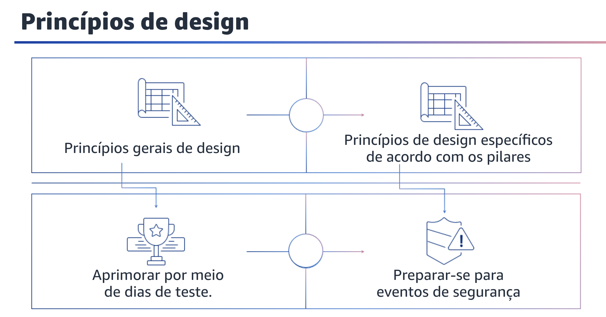

## 1.14 Princípios de design

Cada pilar do framework também tem seus próprios princípios de design. Eles são chamados de princípios de design específicos de cada pilar e se aplicam somente a pilares específicos do framework.

Como você aprendeu anteriormente, um dos princípios gerais do design é aprimorar por meio de dias de teste. Dias de teste é um termo que significa testar sua arquitetura e seus processos, simulando regularmente eventos em produção. Isso o ajudará a entender onde é possível fazer melhorias e a desenvolver a experiência organizacional para lidar com eventos.

Um exemplo de princípio de design específico de um pilar é a preparação para eventos de segurança, que é um dos princípios de design do pilar de segurança.

Prepare-se para um incidente tendo processos e uma política de investigação e gerenciamento de incidentes que estejam alinhados aos requisitos da organização. Execute simulações de resposta a incidentes e use ferramentas com automação para aumentar sua velocidade de detecção, investigação e recuperação.
