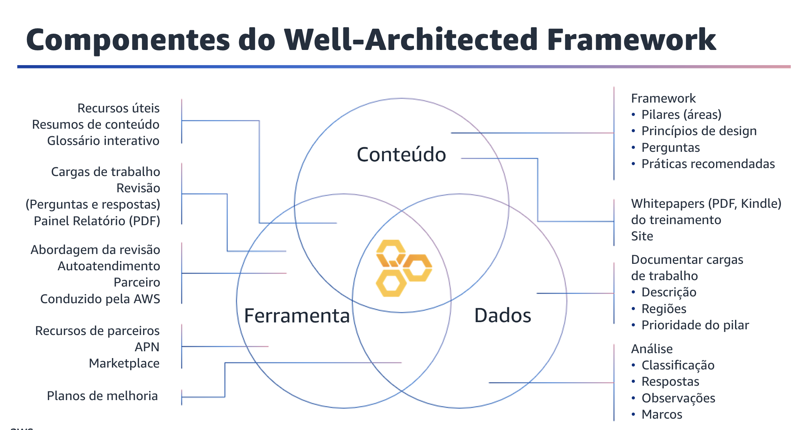
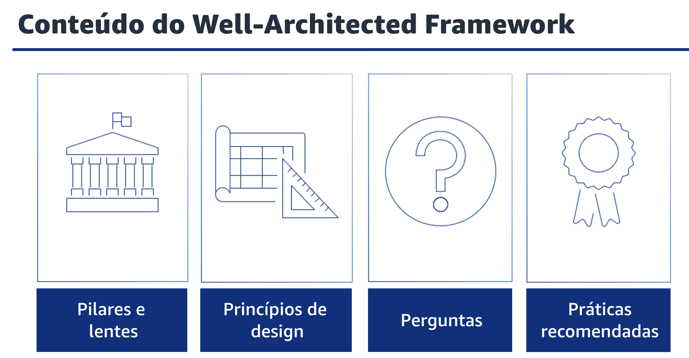
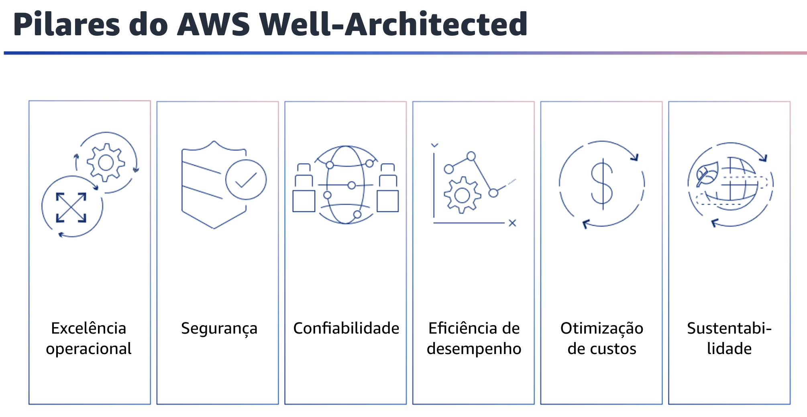
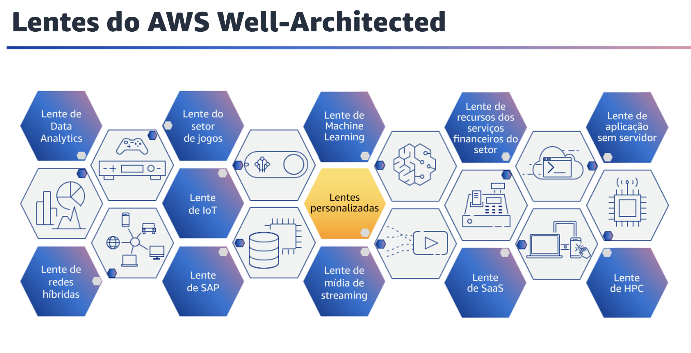

## 1.9 Componentes do Well-Architected Framework

O Well-Architected Framework é composto de conteúdo, ferramenta e dados. 

O framework inclui conteúdo que pode usar para aprender as diretrizes da AWS, como pilares, princípios de design e práticas recomendadas. 
O framework também inclui a ferramenta do AWS Well-Architected, que você pode usar para medir sua carga de trabalho e suas equipes em relação a essas práticas recomendadas. Outro componente do framework são os dados que você adquire durante a análise do Well-Architected Framework de suas cargas de trabalho.
Você pode usar esses dados para melhoria de suas cargas de trabalho e operações. Neste módulo, você se aprofundará no conteúdo. Você vai saber mais sobre a ferramenta do AWS Well-Architected e sobre a análise do WellArchitected Framework em módulos futuros.

## 1.10 Conteúdo do Well-Architected Framework

O Well-Architected Framework é um conjunto de perguntas e princípios de design em seis pilares. Junto com os pilares do framework estão as lentes, que fornecem orientação com foco em domínios específicos do setor ou da tecnologia.
Para avaliar a integridade de suas cargas de trabalho, você responde a um conjunto de perguntas fundamentais, com base no framework, nos pilares e nas lentes. Essas perguntas validarão se uma determinada prática recomendada está em vigor na carga de trabalho ou não.

## 1.11 Pilares do AWS Well-Architected

Atualmente, há seis pilares do Well-Architected Framework:excelência operacional, segurança, confiabilidade, eficiência de desempenho, otimização de custos e sustentabilidade. Esses pilares são os fundamentos da arquitetura de suas soluções de tecnologia na nuvem.

## 1.12 Lentes do AWS Well-Architected

As lentes do Well-Architected se estendem à orientação oferecida pelo AWS Well-Architected a domínios específicos do setor e da tecnologia. Exemplos desses domínios são Machine Learning, data analytics, aplicações sem servidor, computação de alto desempenho e Internet das Coisas, SAP, mídia de streaming, setor de jogos, redes híbridas, e serviços financeiros.
Para avaliar totalmente as cargas de trabalho, você usa as lentes aplicáveis juntamente com a estrutura e seus seis pilares. Também é possível criar lentes personalizadas definidas pelo usuário e gerenciadas para melhor se alinhar ao setor, aos planos operacionais e aos processos internos da sua organização. Você pode criar seus conjuntos de perguntas e adicionar contexto e práticasr ecomendadas conforme se relacionam com sua própria organização e processos. Nem todas as lentes estão presentes na ferramenta no momento, mas todas estão disponíveis como parte do framework.
