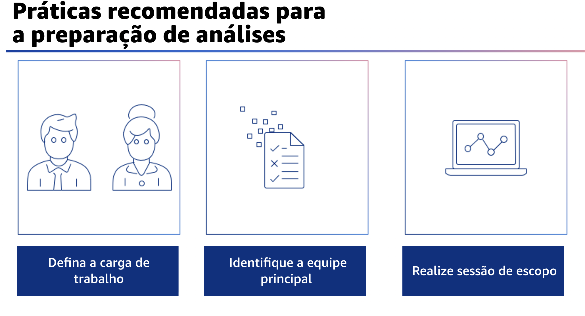

## 1.10 Práticas recomendadas para a preparaçao de análises

Que medidas você pode tomar para ajudar a se preparar para a análise?

Primeiro, defina a carga de trabalho que será analisada. Uma carga de trabalho pode ser
um processo, uma tecnologia, uma infraestrutura, uma equipe ou uma combinação de todos eles, que agrega valor comercial à sua organização. Por exemplo, um site em que você recebe pedidos de compra de seus clientes pode ser uma carga de trabalho.

Em seguida, identifique a equipe principal para a carga de trabalho analisada. Essa equipe é responsável pelo sucesso dessa carga de trabalho e contém especialistas no assunto para cada pilar.

Os especialistas dessa equipe devem ser capazes de responder às perguntas de cada pilar e devem ser responsáveis pelo plano de aprimoramento futuro que pode resultar da identificação de riscos na arquitetura. Em seguida, você precisa realizar uma sessão de escopo É aqui que você decide sobre a carga de trabalho e os pilares a serem revisados. 

## 1.11 Práticas recomendadas para a preparação de análises (cont.)

Outros aspectos da preparação incluem a decisão sobre o tipo de análise. Por exemplo, trata-se de uma sessão de um dia para analisar os seis pilares ou de várias sessões para analisar os pilares separadamente? Os participantes também precisam se preparar e reunir os dados necessários para responder às perguntas da análise. Finalmente, você está pronto para agendar a análise.

## 1.12 Etapas de preparação da análise

A seguir, um exemplo de cronograma que pode ajudar você a planejar a análise.

Aproximadamente três semanas antes de uma análise planejada, selecione uma carga de trabalho e uma equipe principal de análise. Convide os participantes para a reunião de definição do escopo.

Cerca de 14 dias antes da análise, realize a sessão de definição do escopo. Nessa reunião, confirme e registre a definição da carga de trabalho. Selecione as perguntas apropriadas daferramenta do AWS Well-Architected, incluindo as lentes relevantes, quando aplicável. Identifique especialistas no assunto para todas as questões relevantes e defina o tipo e a abordagem da análise. Solicite que os participantes coletem dados relevantes que sejam acessíveis, em vez de criar novos dados para a análise.

Então, cinco dias antes da análise, o escopo deve ser confirmado por todos os participantes. Envie um lembrete para que eles tragam todas as informações relevantes que estejam prontamente disponíveis.

No dia anterior à análise, envie um lembrete final a todos os participantes.
