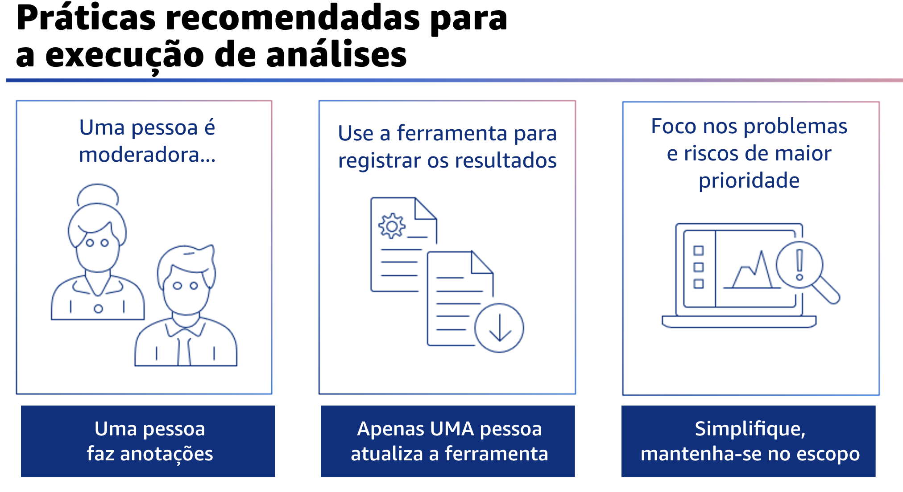

## 1.13 Análise

A segunda fase é a fase de análise para conduzir a análise real.

## 1.14 Práticas recomendadas para a execução de análises

Ao realizar uma análise, recomendam-se algumas práticas recomendadas.

A partir da equipe principal de análise, o moderador administra a reunião e se atém ao escopo definido durante a preparação. Convém que a equipe de análise nomeie uma pessoa para fazer anotações sobre a discussão e inseri-las na ferramenta. É possível fazer rodízio dessa função na equipe para distribuir a carga e o esforço. **É importante que o moderador não seja também o tomador de notas, pois isso pode levar a análises menos produtivas**.

Somente uma pessoa atualiza a ferramenta por vez. Os campos não são alterados dinamicamente conforme modificados em vários clientes. Os registros atualizados são substituídos.

Use a ferramenta do AWS Well-Architected para monitorar os resultados. Uma dica é configurar um bucket do Amazon Simple Storage, ou Amazon S3, para armazenar análises ou outros diagramas ou documentação relacionados a essa carga de trabalho. Você pode usar uma convenção de nomenclatura simples, como o nome da conta e da carga de trabalho
