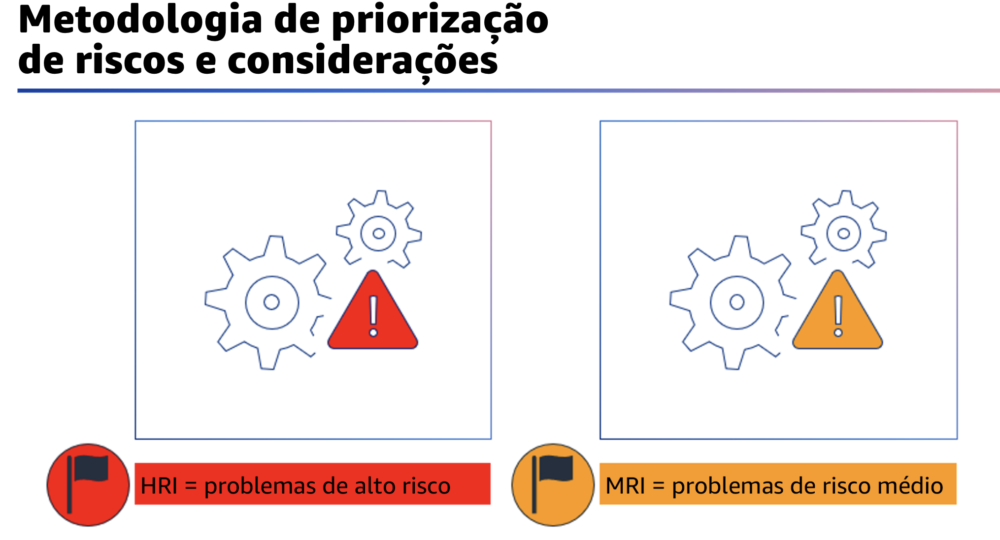

## 1.15 Aprimoramento

A terceira fase é a fase de aprimoramento. Essa fase consiste em elaborar um
plano de aprimoramento para mitigar alguns dos riscos identificados como
resultado da realização da análise.

## 1.16 Metodologia de priorização de riscos e considerações

A primeira etapa da fase de aprimoramento da análise é a priorização dos riscos.

Antes de começar a priorização de riscos, é uma boa ideia definir brevemente o termo.

A priorização de riscos é o processo de identificação dos riscos mais críticos para que eles possam ser tratados primeiro. As prioridades devem ser definidas com base na probabilidade de um risco e no impacto potencial que ele representa para a organização ou para os negócios.

O objetivo é determinar uma ordem de classificação dos riscos identificados do mais crítico para o menos crítico.

Exemplos de impactos de risco incluem perda de vendas, responsabilidade corporativa, danos à reputação da marca, perda de participação no mercado, maior tempo de colocação no mercado, questões legais, regulatórias e assim por diante.

Os riscos são identificados com base nas metas, necessidades e prioridades da empresa. Os exemplos incluem tempo de colocação no mercado, segurança, confiabilidade, desempenho e custo. No Well-Architected Framework, os níveis de risco são categorizados como alto ou médio.

Como o nome sugere, os problemas de alto risco são escolhas arquitetônicas e operacionais que a AWS descobriu que podem resultar em um impacto negativo significativo para uma empresa. Embora os problemas de risco médio também possam afetar negativamente os negócios, eles geralmente o fazem em menor escala.
