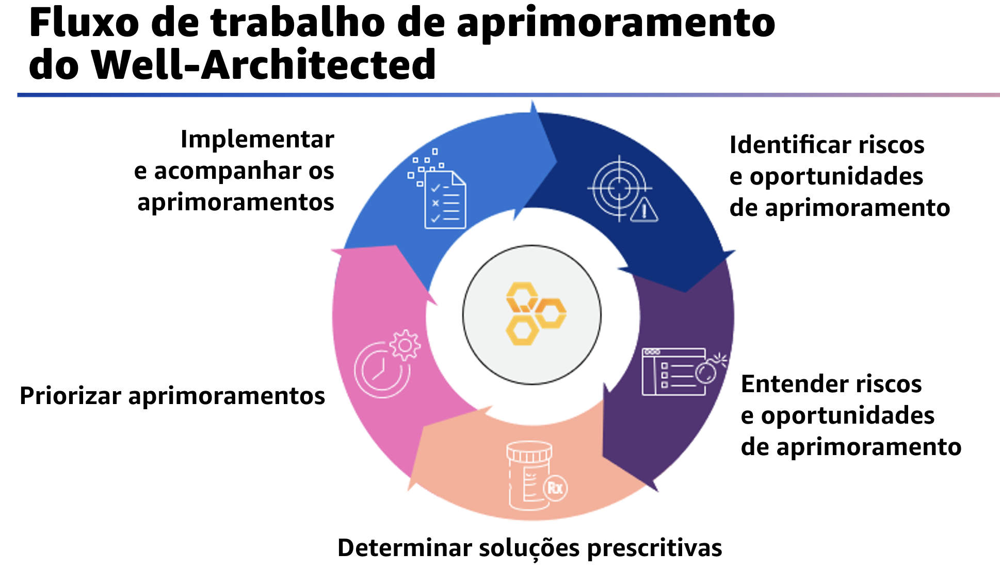

## 1.17 Fluxo de trabalho de aprimoramento do Well-Architected

Agora que você conhece os níveis de risco, é útil revisar o fluxo de trabalho de aprimoramento para identificar, priorizar e, posteriormente, abordar esses riscos.

Comece identificando os riscos e as oportunidades de aprimoramento. Isso é obtido com a execução de uma análise do Well-Architected Framework em relação a uma carga de trabalho para entender onde a carga de trabalho é medida em relação às práticas recomendadas de nuvem no framework. À medida que você coleta dados sobre a carga de trabalho, geramos informações para entender onde estão os riscos e as oportunidades de aprimoramento.

Em seguida, você aproveitará as oportunidades de aprimoramento e determinará soluções prescritivas. Elas abordam os problemas que têm maior prioridade com base no impacto potencial e no nível de esforço necessário para implementá-las e eliminar o maior número possível de riscos ao mesmo tempo. Depois que as soluções forem determinadas, é importante identificar quais são as mais prioritárias do ponto de vista comercial.

Então, é possível começar o trabalho para implementar as soluções de aprimoramento por ordem de prioridade. O progresso de aprimoramento deve ser acompanhado, monitorando os resultados para garantir que os benefícios desejados sejam alcançados. As práticas recomendadas no framework incluem orientações sobre pessoas, processos e tecnologia.

A implantação de uma prática recomendada ausente requer uma combinação de colaboração entre a equipe da sua conta AWS e ações da sua parte para aplicá-las. Essas fases serão explicadas em mais detalhes nos próximos módulos.
