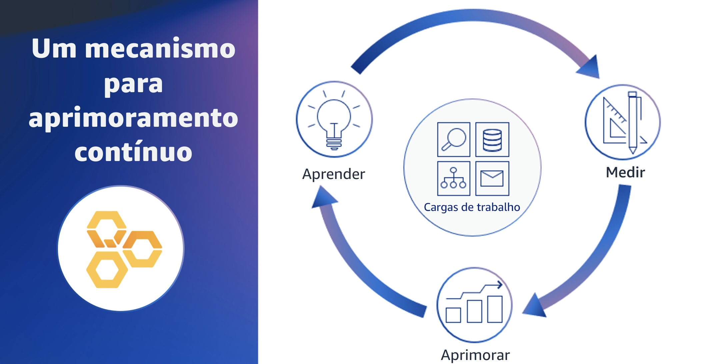

## 1.3 O que é a análise do Well-Architected Framework?

A análise do Well-Architected Framework é um mecanismo de aprimoramento contínuo que ajuda os clientes a avaliar consistentemente as cargas de trabalho em relação às práticas recomendadas da Amazon Web Services, ou AWS.

Por meio dessa análise, é possível identificar as correções recomendadas para tratar de problemas de alto e médio risco. O objetivo da análise de uma arquitetura é ajudar a identificar quaisquer problemas críticos que podem precisar ser resolvidos ou áreas que possam ser aprimoradas. O resultado da análise é um conjunto de ações criadas para aprimorar a arquitetura da carga de trabalho com base nos seis pilares do framework.

## 1.4 Um mecanismo

Para atingir o objetivo desejado com uma análise do framework, é importante considerá-la como uma etapa de um plano de aprimoramento contínuo que se integre ao ciclo de vida da carga de trabalho. Esse mecanismo tem três etapas: aprender, medir e aprimorar. Primeiro, comece aprendendo as estratégias e as práticas recomendadas para a arquitetura na nuvem.

Em seguida, você pode avaliar sua arquitetura usando o framework; as lentes do Well-Architected, como a lente de data analytics e as práticas recomendadas de sua organização com as lentes personalizadas na ferramenta do AWS Well-Architected ou AWS WA Tool.

Por fim, você pode usar o resultado para aprimorar sua arquitetura de nuvem, abordando quaisquer problemas de alto risco. Você pode identificar problemas usando planos de aprimoramento, laboratórios do Well-Architected, a Rede de Parceiros da AWS (APN), equipes de arquitetura de soluções da AWS e muito mais. Você precisa aplicar esse mecanismo de três etapas em todas as cargas de trabalho da sua organização. Uma carga de trabalho identifica um conjunto de componentes que, juntos, proporcionam valor comercial. Você saberá mais sobre os detalhes da carga de trabalho em um módulo posterior.

