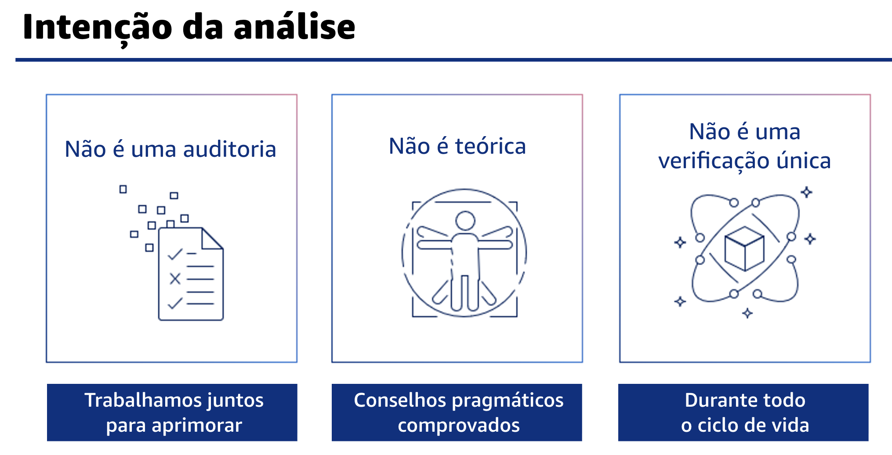
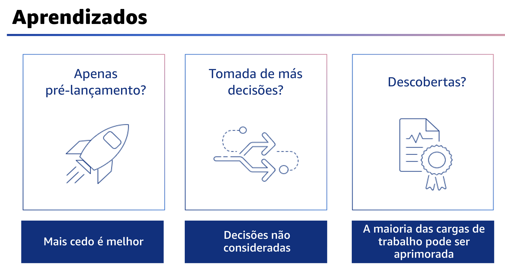

## 1.5 Intenção da análise

O objetivo da análise de uma arquitetura é ajudar a identificar quaisquer problemas críticos que precisam ser resolvidos ou áreas que possam ser aprimoradas. O resultado da análise é um conjunto de ações que devem aprimorar a experiência de uso da carga de trabalho.

Para atingir esse objetivo, a análise da arquitetura precisa ser feita de forma consistente e com uma abordagem sem acusações que incentive a equipe a se aprofundar. Deve ser um processo leve que seja concluído em horas, não em dias. Trata-se de uma conversa, não de uma auditoria. Os membros da equipe que criam uma arquitetura usando esse framework devem analisar continuamente a arquitetura, em vez de realizar uma reunião formal de análise.

Uma abordagem contínua ajuda os membros da sua equipe a atualizar as respostas à medida que a arquitetura evolui, aprimorando-a à medida que você fornece recursos.

## 1.6 Aprendizados

Algumas das lições que aprendemos ao fazer as análises incluem o seguinte.

- Primeiro, faça a análise no início do ciclo de vida, pois é mais rápido e mais fácil corrigir problemas e influenciar o design. 
- Segundo, os problemas às vezes não são causados por decisões ruins, mas sim por não perceber que há uma decisão que precisa ser tomada. Por exemplo, os membros da equipe normalmente não decidem não fazer backup dos dados; eles simplesmente se esquecem de falar sobre isso. 
- E terceiro, a maioria das cargas de trabalho tem itens de alto risco que precisam ser resolvidos. Descobrir tais itens não é uma coisa ruim, eles sempre estiveram ali. Se você resolvê-los, será uma coisa a menos que pode prejudicar ou atrasar seus negócios
