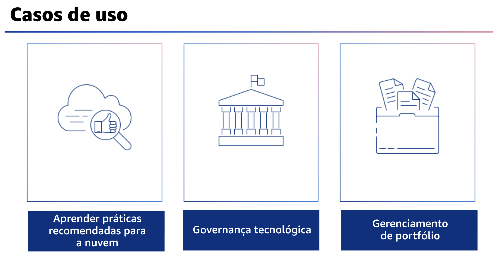

## 1.7 Casos de uso

Agora, você conhecerá alguns dos casos de uso mais comuns das análises da ferramenta do AWS Well-Architected. 

- O primeiro caso de uso é aprender as práticas recomendadas para a nuvem. 

Isso se aplica à maioria dos clientes e suas equipes que desejam aprender a arquitetar para a nuvem. Ao conhecer as práticas recomendadas da AWS, as empresas podem identificar riscos e oportunidades de aprimoramento para sua arquitetura. A governança tecnológica é outra consideração. Antes de iniciar a produção,você quer saber se você e sua carga de trabalho estão prontos. Com muitas equipes, pode ser difícil saber se todas elas estão fazendo as coisas certas.

Quando se trata de iniciar qualquer processo ou análise, como é possível obter consistência? Como os problemas são priorizados ao longo do tempo? O ferramenta do AWS Well-Architected fornece um processo consistente para medir sua arquitetura usando as práticas recomendadas da AWS. Para o gerenciamento de portfólio, a maioria das organizações depende de seu portfólio de tecnologia para operar. As organizações geralmente não têm um registro central do que está nesse portfólio e quais são os riscos. Isso significa que pode ser difícil tomar decisões informadas sobre onde investir. As organizações que têm um processo de análise provavelmente não têm um processo consistente e abrangente, e os resultados não podem ser descobertos.

Ao usar a ferramenta do AWS Well-Architected, você terá um portfólio de cargas de trabalho em sua organização. Você tem um local para registrar metadados sobre as cargas de trabalho, como produção, conta ou Regiões. Os clientes costumam usar a ferramenta para documentar as decisões de arquitetura que tomaram. Isso cria uma visão central de todos os seis pilares e de todos os riscos existentes. A gerência sênior pode então verificar as tendências em todo o portfólio e qualquer treinamento que possa ser necessário.
