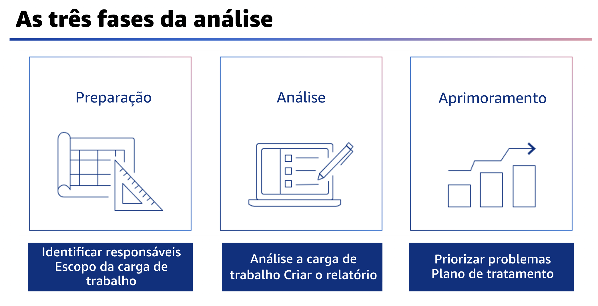

## 1.8 As tres fases da análise

Há três fases na execução de uma análise do Well-Architected Framework: preparação, análise e aprimoramento. 

- Na fase de preparação, você define uma carga de trabalho para a análise em sua organização e identifica as pessoas que podem responder às perguntas durante a análise de cada pilar. Você também precisa identificar alguém para ser o responsável pelo plano de aprimoramento e, eventualmente, pela implantação do aprimoramento como resultado da análise. Esses indivíduos são chamados de responsáveis. 

- Durante a fase de análise, você executa a análise real usando o AWS WA Tool. Em seguida, você publica o relatório que contém detalhes sobre o estado atual da carga de trabalho,incluindo notas e ações de aprimoramento recomendadas. Durante essa fase, você identifica problemas de alto risco e problemas de médio risco para correção.

- Na fase de aprimoramento, você começa a analisar os problemas de risco identificados como parte da análise, prioriza-os e cria um plano de tratamento detalhado para resolvê-los. Você se aprofundará em cada fase e nas práticas recomendadas.
