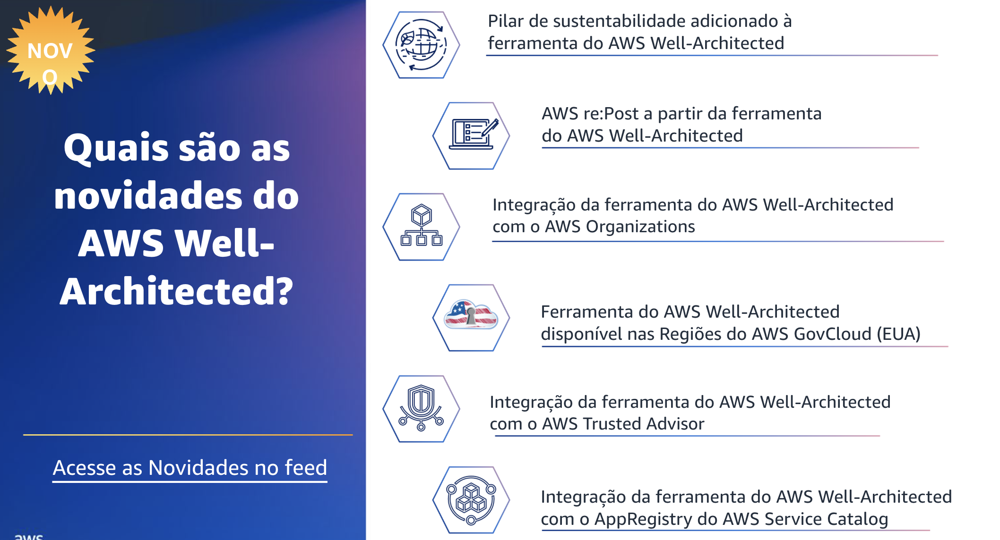

## 1.15 Quais são as novidades do AWS WA?

A AWS apresentou o pilar de sustentabilidade durante a re:Invent 2021 para ajudar os clientes a minimizar os impactos ambientais da execução de cargas de trabalho na nuvem. Em março de 2022, esse pilar ficou disponível para os clientes usarem durante as análises de carga de trabalho na ferramenta do AWS Well-Architected. 

O pilar de sustentabilidade foi criado para ajudar chief technology officers, arquitetos, desenvolvedores e membros da equipe de operações a contribuir para um número cada vez maior de metas de sustentabilidade definidas por suas organizações. A ferramenta agora apresenta acesso direto ao AWS re:Post, um serviço de perguntas e respostas orientado pela comunidade para ajudar os clientes da AWS a remover obstáculos técnicos, acelerar a inovação e melhorar a operação. O AWS re:Post inclui mais de 40 tópicos, com uma comunidade específica para o AWS WellArchitected. A ferramenta do AWS Well-Architected lançou a integração com o AWS Organizations em junho de 2022. Essa integração ajudou os arquitetos de nuvem a compartilhar cargas de trabalho e lentes personalizadas de forma mais ampla em toda a organização.

O AWS Organizations é um serviço de gerenciamento de contas que os clientes usam para consolidar várias contas AWS em uma única organização gerenciada de forma centralizada. Essa atualização aumenta a eficiência e simplifica o compartilhamento de lentes e cargas de trabalho em várias contas. A ferramenta foi iniciada nas Regiões do AWS GovCloud (EUA) em agosto de 2022 para clientes com requisitos regulatórios e de conformidade específicos e parceiros da AWS. Tanto o setor público quanto o comercial podem usá-la para realizar análises do WellArchitected com autoatendimento. O AWS GovCloud (EUA) é uma Região isolada projetada para hospedar dados sigilosos e cargas de trabalho regulamentadas na nuvem. Com a integração do AWS Trusted Advisor, a ferramenta do AWS Well-Architected agora apresenta descobertas com base em verificações automatizadas de recursos do Trusted Advisor.

Isso fornece mais informações contextuais durante as análises, melhorando a precisão das respostas e a velocidade da análise. Anteriormente, os clientes que realizavam análises do framework tinham que gastar tempo verificando as respostas, checando novamente as cargas de trabalho para verificar se estavam seguindo as práticas recomendadas. Não havia uma ligação clara entre a carga de trabalho que estava sendo analisada e os recursos associados.

A ferramenta do AWS Well-Architected também está agora integrada ao AppRegistry do AWS Service Catalog. Você pode usar o AppRegistry para armazenar suas aplicações AWS, coleções de recursos associados e grupos de atributos de aplicações. A integração com o AppRegistry oferece melhor visibilidade de quais aplicações estão associadas a quais cargas de trabalho durante o processo de análise. Isso pode economizar seu tempo ao rastrear e organizar os recursos associados às suas cargas de trabalho.

Você pode verificar o link do feed de novidades para obter mais recursos atualizados à medida que eles são adicionados à ferramenta do AWS Well-Architected.
