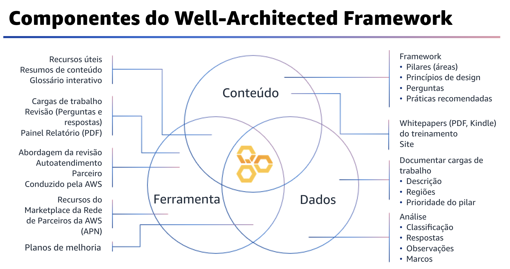

## 1.4 Componentes do Well-Architected Framework

Você viu uma versão desse diagrama dos componentes do framework em um módulo anterior.

Para revisar, o framework inclui conteúdo que você pode usar para aprender as práticas recomendadas da AWS. Ele também tem uma ferramenta que pode ajudar a medir sua carga de trabalho e suas equipes em relação às práticas recomendadas. Além disso, a ferramenta contém dados que você adquire durante a revisão de suas cargas de trabalho. Isso pode ser usado para melhorar continuamente suas cargas de trabalho e operações.

Neste módulo, você se aprofundará em como o AWS Well-Architected pode ser usado pelos clientes para medir e melhorar ao longo do tempo.

## 1.5 Ferramenta do AWS Well-Architected

A ferramenta do AWS Well-Architected foi desenvolvida para ajudar você a analisar o estado das suas aplicações e cargas de trabalho, fornecendo um local central para as práticas recomendadas e orientações de arquitetura. Além da orientação padrão fornecida pelo framework e pelas lentes da AWS, a ferramenta ajuda você a adicionar orientações de práticas recomendadas usando lentes personalizadas.

A maneira mais rápida de iniciar é realizar uma análise do Well-Architected Framework, usando a ferramenta no console ou com as APIs.

Você pode criar a carga de trabalho da ferramenta do AWS Well-Architected na conta AWS do cliente para armazená-la com segurança. Isso segue o acesso com privilégio mínimo, em que somente as pessoas certas têm acesso aos detalhes da carga de trabalho. As cargas de trabalho podem ser compartilhadas com seu arquiteto de soluções e equipe de contas ou recurso de parceiro para colaboração nas etapas de revisão ou correção. As lentes personalizadas também podem ser compartilhadas com o arquiteto de soluções ou com o recurso do parceiro para colaboração.
