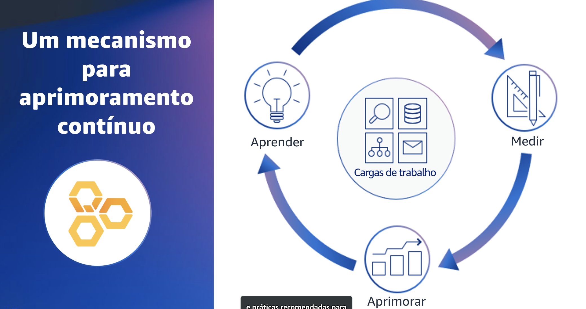

## 1.3 Um mecanismo para aprimoramento contínuo

Para atingir o objetivo desejado com uma análise do framework, é importante considerá-la como uma etapa de um plano de melhoria contínua que se integre ao ciclo de vida dacarga de trabalho.

Esse mecanismo começa primeiro com o aprendizadodas estratégias e práticas recomendadas para a arquitetura na nuvem. Depois,você pode avaliar sua arquitetura usando as lentes do AWS WellArchitected framework e as práticas recomendadas de sua organização com as lentes personalizadas na ferramenta do AWS Well-Architected. 

Por fim, você pode usar o resultado para aprimorar sua arquitetura de nuvem, abordando quaisquer problemas de alto risco. Esses problemas podem ser identificados usando planos de melhoria, laboratórios do Well-Architected, a Rede de Parceiros da AWS (APN), equipes de arquitetura de soluções da AWS e muito mais.

Esse mecanismo de três etapas deve ser aplicado de forma consistente em todas as cargas de trabalho de sua organização. Uma carga de trabalho identifica um conjunto de componentes que, juntos, proporcionam valor comercial.
