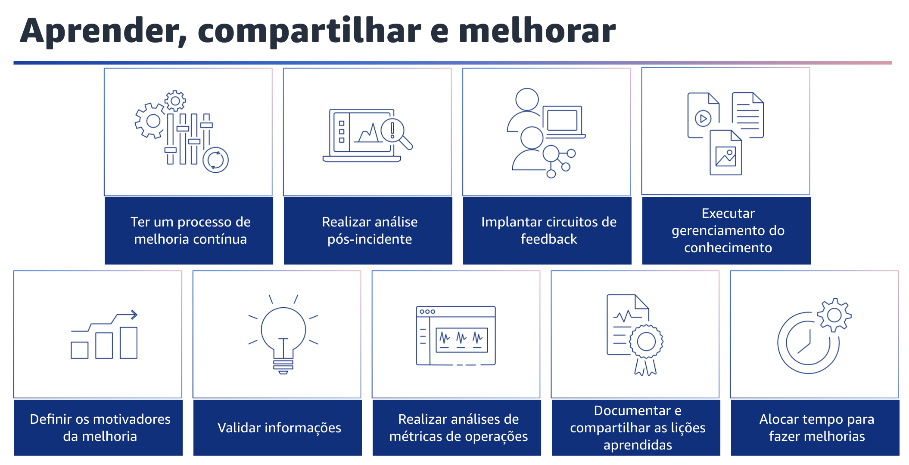

## 1.23 Evoluir

A evolução é o ciclo contínuo de aprimoramento ao longo do tempo. Implemente pequenas e frequentes mudanças incrementais com base nas lições aprendidas em suas atividades operacionais e avalie o sucesso dessas mudanças para obter melhorias.

## 1.24 Aprender, compartilhar e melhorar

Aprender, compartilhar e melhorar. É fundamental que você reserve periodicamente tempo para fazer análises das atividades operacionais, analisar falhas, experimentar e fazer melhorias. Em caso de falha, você deve garantir que a sua equipe, bem como a comunidade de engenharia mais ampla, aprenda com essas falhas.

Você deve analisar as falhas para identificar as lições aprendidas e planejar melhorias. Você deverá analisar regularmente as lições aprendidas com outras equipes para validar suas informações. Você deve ter um processo de melhoria contínua. Avalie sua carga de trabalho em relação às práticas recomendadas de arquitetura interna e externa. Realize revisões da carga de trabalho pelo menos uma vez por ano.

Priorize as oportunidades de melhoria em sua cadência de desenvolvimento de software. Você também deve realizar uma análise pós-incidente. Analise os eventos que afetam o cliente e identifique os fatores contribuintes e as ações preventivas. Use essas informações para desenvolver mitigações para limitar ou evitar a recorrência. Desenvolva procedimentos para respostas rápidas e eficazes.

Comunique os fatores que contribuíram para isso e as ações corretivas conforme apropriado, adaptadas aos públicos-alvo.

Implemente circuitos de feedback, que podem fornecer informações acionáveis que orientam a tomada de decisões. Crie circuitos de feedback em seus procedimentos e cargas de trabalho. Assim, você pode identificar problemas e áreas que precisam ser melhoradas. Eles também validam os investimentos feitos em melhorias.
Esses circuitos de feedback são a base para melhorar continuamente sua carga de trabalho.

O gerenciamento do conhecimento ajuda os membros da equipe a encontrar as informações para realizar seu trabalho. Nas organizações de aprendizagem, as informações são compartilhadas livremente, o que capacita os indivíduos. As informações podem ser descobertas ou pesquisadas. As informações são precisas e atualizadas. Existem mecanismos para criar novas informações, atualizar informações existentes e arquivar informações desatualizadas. O exemplo mais comum de uma plataforma de gerenciamento de conhecimento é um sistema de gerenciamento de conteúdo, como um Wiki.

Identifique os fatores de melhoria para ajudar você a avaliar e priorizar as oportunidades. Você também pode validar informações. Analise os resultados e as respostas da sua análise com equipes multifuncionais e proprietários de negócios. Use essas análises para estabelecer um entendimento comum, identificar impactos adicionais e determinar cursos de ação. Ajuste as respostas conforme apropriado. Realize regularmente análises retrospectivas de métricas de operações com participantes de várias equipes de diferentes áreas da empresa. Use essas análises para identificar oportunidades de melhoria, possíveis cursos de ação e para compartilhar as lições aprendidas. Procure oportunidades de melhoria em todos os seus ambientes, como desenvolvimento, teste e produção.

Você também deve documentar e compartilhar as lições aprendidas com as atividades de operações para que possa usá-las internamente e entre as equipes. Compartilhar o que suas equipes aprendem pode aumentar os benefícios em toda a organização. Convém compartilhar informações e recursos para impedir erros evitáveis e facilitar os esforços de desenvolvimento. Isso ajudará você a se concentrar no fornecimento dos recursos desejados. Por fim, dedique tempo e recursos em seus processos para possibilitar melhorias incrementais contínuas.
