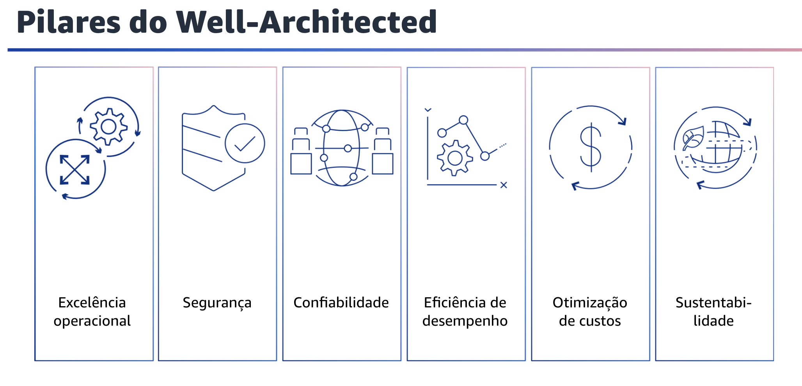

## 1.4 Pilares do Well-Architected

Atualmente, há seis pilares do Well-Architected Framework: excelência operacional, segurança, confiabilidade, eficiência de desempenho, otimização de custos e sustentabilidade.

Esses pilares são os fundamentos da arquitetura de suas soluções de tecnologia na nuvem. O foco deste módulo será o pilar de excelência operacional.

