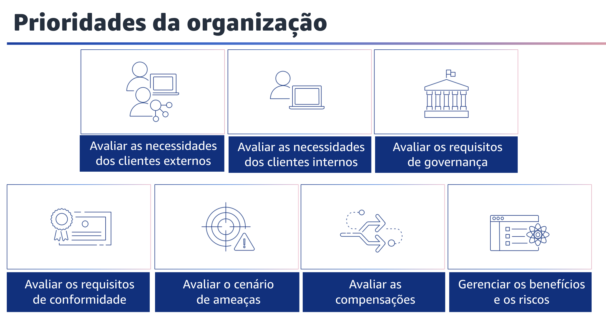
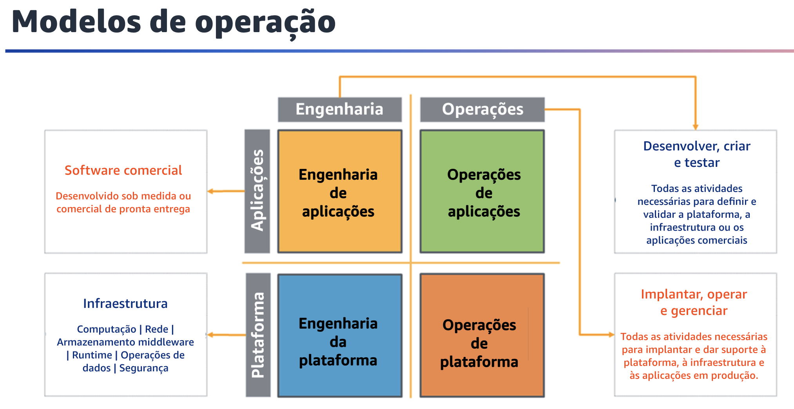
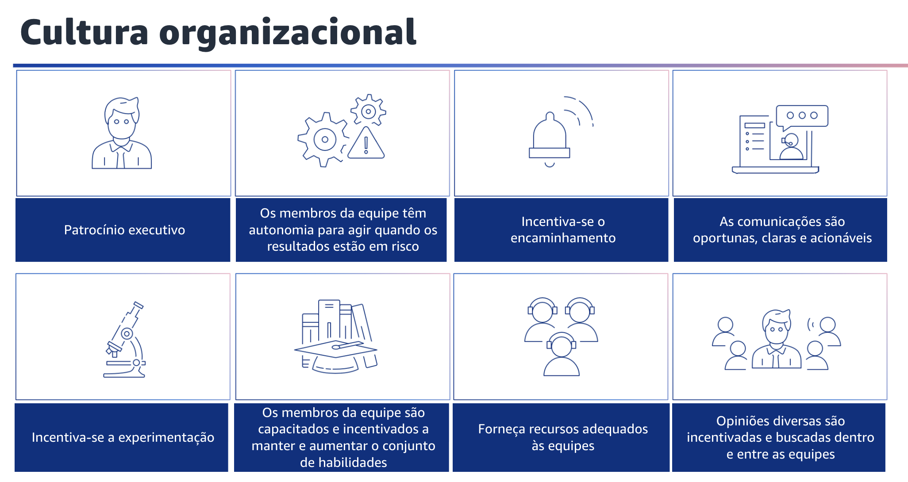

## 1.10 Organização

A organização é a primeira área de práticas recomendadas de excelência
operacional.

## 1.11 Prioridades da organização

Prioridades da organização. Suas equipes precisam entender toda a carga de trabalho, a função que desempenham nela e as metas comerciais compartilhadas para definir asprioridades que impulsionarão o sucesso dos negócios.

Prioridades bem definidas maximizarão os benefícios de seus esforços.

Revise suas prioridades regularmente para que possa atualizá-las à medida que as necessidades da sua organização mudarem. Você pode considerar algumas práticas recomendadas para isso. Avalie as necessidades dos clientes externos.

Envolva stakeholders importantes, incluindo equipes de negócios, desenvolvimento e operações, para determinar onde concentrar esforços nas necessidades dos clientes externos.
Isso garantirá que você tenha um entendimento completo do suporte operacional necessário para alcançar os resultados comerciais desejados.
Você também deve avaliar as necessidades dos clientes internos. Envolva os principais stakeholders ao determinar onde concentrar esforços, nas necessidades dos clientes internos, para garantir que você entenda o suporte operacional necessário para alcançar os resultados comerciais.

Use suas prioridades estabelecidas para concentrar seus esforços de aprimoramento onde eles terão o maior impacto. Isso pode significar, por exemplo, desenvolver habilidades de equipe, melhorar o desempenho da carga de trabalho, reduzir custos, automatizar runbooks ou aprimorar o monitoramento.

Atualize suas prioridades conforme as necessidades mudarem.
Você também deve considerar a avaliação dos requisitos de governança.

Governança é o conjunto de políticas, regras ou estruturas que uma empresa usa para atingir as metas comerciais.
Os requisitos de governança são gerados dentro de sua organização. Eles podem afetar os tipos de tecnologias que você escolhe ou influenciar a maneira como você opera sua carga de trabalho. Incorpore os requisitos de governança organizacional em sua carga de trabalho.

Conformidade é a capacidade de demonstrar que você implementou os requisitos de governança. Avalie os requisitos de conformidade.
Os requisitos de conformidade regulatória, do setor e internos são um importante fator para definir as prioridades de sua organização.

Seu framework de conformidade pode impedi-lo de usar tecnologias ou localizações geográficas específicas.
Aplique a devida diligência se nenhuma estrutura de conformidade externa for identificada.

Gere auditorias ou relatórios que validem a conformidade.

Se você anuncia que seu produto atende a padrões de conformidade específicos, deve ter um processo interno para garantir a conformidade contínua. Exemplos de padrões de conformidade incluem PCI DSS, FedRAMP e HIPAA.

Os padrões de conformidade aplicáveis são determinados por vários fatores, como os tipos de dados que a solução armazena ou transmite e as Regiões geográficas às quais a solução oferece suporte.

Você também deve avaliar o cenário de ameaças. Avalie as ameaças aos negócios, como concorrência, riscos e responsabilidades comerciais, riscos operacionais e ameaças à segurança das informações.
Mantenha informações atualizadas em um registro de riscos.
Inclua o impacto dos riscos ao determinar onde concentrar os esforços.

Avalie o impacto das compensações entre interesses conflitantes ou abordagens alternativas, para ajudar você a tomar decisões informadas ao determinar onde concentrar esforços ou escolher um curso de ação.
Por exemplo, você pode enfatizar a aceleração da velocidade de lançamento de novos recursos no mercado em detrimento da otimização de custos.
Ou você pode escolher um banco de dados relacional para dados não relacionais para simplificar o esforço de migração de um sistema, em vez de migrar para um banco de dados otimizado para o seu tipo de dados e atualizar a aplicação.

A última prática recomendada é gerenciar benefícios e riscos. Isso ajudará você a tomar decisões informadas ao determinar onde concentrar seus esforços. Por exemplo, pode ser vantajoso implantar uma carga de trabalho com problemas não resolvidos para disponibilizar novos recursos significativos aos clientes.

Pode ser possível mitigar os riscos associados ou pode se tornar inaceitável que um risco permaneça e, nesse caso, você tomará ações para lidar com o risco. Talvez você queira enfatizar um pequeno subconjunto de suas prioridades em algum momento.

Use uma abordagem equilibrada de longo prazo para garantir o desenvolvimento das capacidades necessárias e o gerenciamento de riscos. Atualize suas prioridades conforme as necessidades mudarem.

## 1.12 Modelos de operação

Neste diagrama, o eixo vertical mostra aplicações e plataformas. Aplicações referem-se à carga de trabalho que atende a um resultado comercial e podem ser softwares desenvolvidos sob medida ou adquiridos.

A plataforma refere-se à infraestrutura física e virtual e a outros softwares que dão suporte a essa carga de trabalho. No eixo horizontal, temos engenharia e operações. Engenharia refere-se ao desenvolvimento, à criação e ao teste de aplicações e infraestrutura. Operações é a implantação, atualização e suporte contínuo de aplicações e infraestrutura.

Há outras versões desse modelo que representam como essas responsabilidades tendem a ser distribuídas entre as equipes. Para mais detalhes, consulte a documentação desse pilar.

## 1.13 Cultura organizacional

Ofereça suporte aos membros da sua equipe para que eles possam ser mais eficazes na tomada de ações e no suporte aos resultados do seu negócio.

Uma maneira de fazer isso é por meio do patrocínio executivo. A liderança sênior define claramente as expectativas para a organização e avalia o sucesso.

A liderança sênior é a patrocinadora, defensora e impulsionadora da adoção de práticas recomendadas e da evolução da organização.

Outra forma é capacitar os membros da equipe. O proprietário da carga de trabalho definiu a orientação e o escopo, capacitando os membros da equipe a responder quando os resultados estiverem em risco. Os mecanismos de encaminhamento são usados para obter orientação quando os eventos estão fora do escopo definido.

Os membros da equipe também têm mecanismos e são incentivados a levar suas preocupações aos tomadores de decisão e stakeholders se acreditarem que os resultados estão em risco.

O encaminhamento deve ser realizado antecipadamente e com frequência para que os riscos possam ser identificados e impedidos de causar incidentes.

As comunicações são oportunas, claras e acionáveis.

Mecanismos existem e são usados para avisar em tempo hábil os membros da equipe sobre riscos conhecidos e eventos planejados. O contexto, os detalhes e o tempo necessários são fornecidos, quando possível, para ajudar a determinar se a ação é necessária, qual ação é exigida e para agir em tempo hábil. Por exemplo, avisar sobre vulnerabilidades de software para agilizar a aplicação de patches ou avisar sobre promoções de vendas planejadas para que um congelamento de mudanças possa ser implementado para evitar o risco de interrupção do serviço.

Os eventos planejados podem ser registrados em um calendário de mudanças ou cronograma de manutenção para que os membros da equipe possam identificar as atividades pendentes.

A experimentação é incentivada, pois pode ser um catalisador para transformar novas ideias em produtos e recursos. Ela acelera o aprendizado e mantém os membros da equipe interessados e engajados. Os membros da equipe são incentivados a experimentar com frequência para impulsionar a inovação. Mesmo quando ocorre um resultado indesejado, é importante saber o que não fazer.

Os membros da equipe não são punidos por experiências bemsucedidas com resultados indesejados. Os membros da equipe são capacitados e incentivados a manter e aumentar os conjuntos de habilidades. As equipes precisam desenvolver os conjuntos de habilidades para adotar novas tecnologias e dar suporte às mudanças na demanda e nas responsabilidades em apoio às suas cargas de trabalho.

O desenvolvimento de habilidades em novas tecnologias é frequentemente uma fonte de satisfação para os membros da equipe e apoia a inovação.
Apoie os membros da sua equipe na busca e manutenção de certificações do setor que validem e reconheçam as habilidades que eles estão desenvolvendo.

Promova capacitação cruzada para promover a transferência de conhecimento e reduzir o risco de impacto significativo ao perder membros da equipe qualificados e experientes com conhecimento institucional. Proporcione tempo estruturado dedicado ao aprendizado.

Forneça recursos adequados às equipes. Garanta a capacidade dos membros da equipe e forneça ferramentas e recursos para atender às suas necessidades de carga de trabalho.

A sobrecarga de tarefas dos membros da equipe aumenta o risco de incidentes resultantes de erro humano. Os investimentos em ferramentas e recursos, por exemplo, fornecendo automação para atividades realizadas com frequência, podem dimensionar a eficácia da sua equipe. Isso pode fazer com que eles auxiliem em atividades adicionais. Opiniões diversas são incentivadas e buscadas dentro e entre as equipes.

Aproveite a diversidade interorganizacional para buscar várias perspectivas únicas. Use essa perspectiva para aumentar a inovação, desafiar suas suposições e reduzir o risco dos vieses de confirmação. Aumente a inclusão, a diversidade e a acessibilidade em suas equipes para obter perspectivas benéficas.
