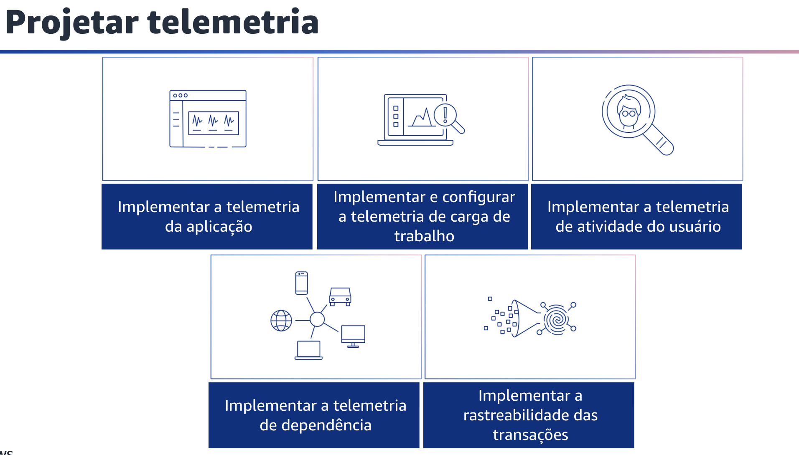
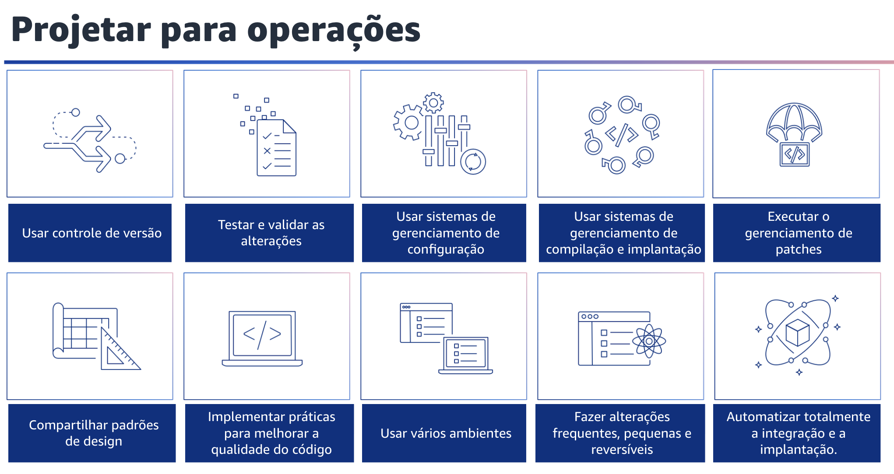

## 1.14 Preparar

Para se preparar para a excelência operacional, você precisa entender suas cargas de trabalho e os comportamentos esperados. Em seguida, você pode projetá-los para fornecer informações sobre o status e criar procedimentos para apoiá-los

## 1.15 Projetar Telemetria

Projete sua carga de trabalho de modo que ela forneça as informações necessárias para que você entenda o estado interno. Os exemplos incluem métricas, logs, eventos e rastreamentos.

Isso deve ser feito em todos os componentes para apoiar a observabilidade e a investigação de problemas. Faça iterações para desenvolver a telemetria necessária para monitorar a integridade de sua carga de trabalho, identificar quando os resultados estão em risco e gerar respostas eficazes.

Implemente a telemetria de aplicações, que é a base para a observabilidade de sua carga de trabalho. Sua aplicação deve emitir telemetria que forneça informações sobre o estado da aplicação e a obtenção de resultados comerciais.

Desde a solução de problemas até a medição do impacto de um novo recurso, a telemetria de aplicações informa a maneira como você cria, opera e desenvolve sua carga de trabalho.
A telemetria de aplicações consiste em métricas e logs. As métricas são informações de diagnóstico, como seu pulso ou temperatura.

As métricas são usadas coletivamente para descrever o estado da sua aplicação. A coleta de métricas ao longo do tempo pode ser usada para desenvolver linhas de base e detectar anomalias.

Os logs são mensagens que a aplicação envia sobre seu estado interno ou eventos que ocorrem. Exemplos de eventos que são registrados incluem códigos de erro, identificadores de transação e ações do usuário. Implemente e configure a telemetria de carga de trabalho.

Projete e configure sua carga de trabalho para emitir informações sobre seu estado interno e status atual, por exemplo, volume de chamadas de API, códigos de status HTTP e eventos de scaling.

Use essas informações para ajudar a determinar quando uma resposta é necessária.

Implemente a telemetria de atividade do usuário. Instrumenteo código da aplicação para emitir informações sobre a atividade do usuário. Exemplos de atividade do usuário incluem transmissões de cliques ou transações iniciadas, abandonadas e concluídas.

Use essas informações para ajudar a entender como a aplicação é usada, os padrões de uso e para determinar quando uma resposta é necessária. Ao capturar a atividade real do usuário, é possível criar uma atividade sintética que pode ser usada para monitorar e testar a carga de trabalho na produção.

Implemente a telemetria de dependência.

Projete e configure sua carga de trabalho para emitir informações sobre o status dos recursos dos quais ela depende. Esses são recursos externos à sua carga de trabalho. Exemplos de dependências externas incluem bancos de dados externos, DNS e conectividade de rede.

Use essas informações para determinar quando uma resposta é necessária e fornecer contexto adicional sobre o estado da carga de trabalho.

Por fim, implemente a rastreabilidade das transações. Implemente o código da sua aplicação e configure os componentes da sua carga de trabalho para emitir eventos, que são acionados como resultado de operações lógicas únicas e consolidados em vários limites da sua carga de trabalho.

Gere mapas para ver como os registros trafegam em sua carga de trabalho e serviços. Obtenha informações sobre as relações entre os componentes e identifique e analise problemas.

Em seguida, use as informações coletadas para determinar quando uma resposta é necessária e para ajudá-lo a identificar os fatores que contribuem para um problema.

## 1.16 Projetar para operações

Projetar para operações. Adote abordagens que melhorem o fluxo de mudanças na produção e que possibilitem a refatoração, o feedback rápido sobre a qualidade e a correção de bugs.

Isso acelera a entrada de mudanças benéficas na produção, limita os problemas implantados e promove a rápida identificação e correção dos problemas introduzidos pelas atividades de implantação. Com a AWS, você pode visualizar toda a sua carga de trabalho, incluindo aplicações, infraestrutura, política, governança e operações, como código.

Tudo pode ser definido e atualizado usando código. Isso significa que você pode aplicar a mesma disciplina de engenharia usada para código de aplicação a cada elemento de sua pilha. 

Use o controle de versão para iniciar o rastreamento de alterações e versões. 

Além disso, teste e valide as alterações. Você precisa testar cada alteração implantada para evitar erros na produção. Essa prática recomendada se concentra em testar as alterações do controle de versão para a compilação de artefatos. Além das alterações no código da aplicação, os testes devem incluir infraestrutura, configuração, controles de segurança e procedimentos operacionais. 

Os testes assumem várias formas, desde testes unitários até análise de componentes de software (SCA). 

Mover os testes mais para a esquerda no processo de integração e entrega de software resulta em maior certeza da qualidade do artefato. 

Sua organização deve desenvolver padrões de teste para todos os artefatos de software. Os testes automatizados reduzem o trabalho e evitam erros nos testes manuais. Em alguns casos, podem ser necessários testes manuais. 

Os desenvolvedores devem ter acesso aos resultados dos testes automatizados para criar circuitos de feedback que melhorem a qualidade do software. 

Você também pode usar sistemas de gerenciamento de configuração para fazer e rastrear alterações de configuração.
Esses sistemas reduzem os erros causados por processos manuais e reduzem o nível de esforço para implantar alterações. 

Use sistemas de gerenciamento de implantação e compilação, que reduzem os erros causados por processos manuais e o nível de esforço para implantar alterações. Você pode realizar o gerenciamento de patches para obter recursos, resolver problemas e manter a conformidade com a governança. 

Automatize o gerenciamento de patches para reduzir os erros causados por processos manuais e reduzir o nível de esforço para aplicar patches. O gerenciamento de patches e vulnerabilidades faz parte de suas atividades de gerenciamento de riscos e benefícios.

É preferível ter infraestruturas imutáveis e implantar cargas de trabalho em estados bons conhecidos e verificados. Quando isso não for viável, você pode aplicar um patch no local. Compartilhe padrões de design e práticas recomendadas entre as equipes para aumentar a conscientização e maximizar os benefícios dos esforços de desenvolvimento.

Documente-os e mantenha-os atualizados à medida que sua arquitetura evolui. Se os padrões compartilhados forem aplicados em sua organização, é fundamental que existam mecanismos para solicitar adições, alterações e exceções aos padrões. Sem essa opção, os padrões se tornam uma restrição à inovação. Você também pode implantar práticas para melhorar a qualidade do código e minimizar os defeitos.

Alguns exemplos incluem desenvolvimento orientado por testes, revisões de código, adoção de padrões e programação em pares.

Incorpore essas práticas em seu processo de integração contínua e entrega. Além disso, use vários ambientes para experimentar, desenvolver e testar sua carga de trabalho.

Use níveis crescentes de controles à medida que os ambientes se aproximam da produção para ganhar confiança de que a sua carga de trabalho funcionará como pretendido quando implantada. Fazer mudanças frequentes, pequenas e reversíveis pode reduzir o escopo e o impacto de uma mudança.

Isso facilita a solução de problemas, possibilita a correção mais rápida e oferece a opção de reverter uma mudança.

Por fim, você deve automatizar totalmente a integração e a implantação. Automatize a criação, a implantação e o teste da carga de trabalho. Isso reduz os erros causados por processos manuais e reduz o esforço para implantar alterações.
