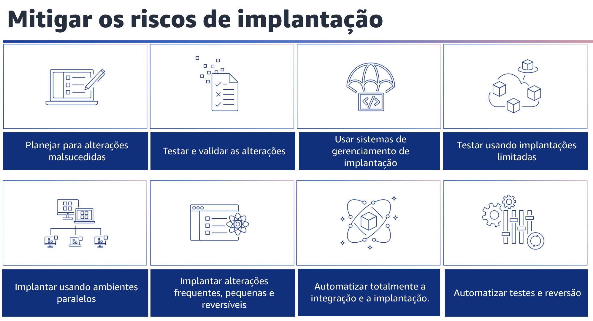
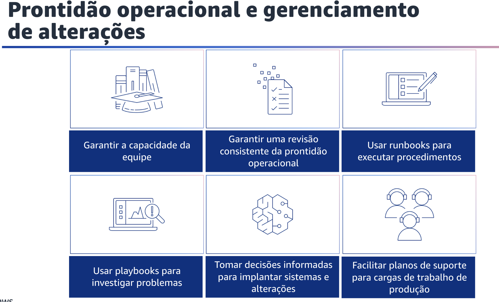

## 1.17 Mitigar os riscos de implantação

Há também maneiras de reduzir os riscos de implantação.

Primeiro, planeje-se para mudanças malsucedidas. Planeje reverter para um estado bom conhecido ou corrigir no ambiente de produção se uma alteração não tiver o resultado desejado. Essa preparação reduz o tempo de recuperação por meio de respostas mais rápidas.

Além disso, teste as alterações e valide os resultados em todos os estágios do ciclo de vida para confirmar os novos recursos e minimizar o risco e o impacto de implantações malsucedidas.

Use sistemas de gerenciamento de implantação para rastrear e implementar alterações. Isso reduz os erros causados por processos manuais e reduz o esforço para implantar alterações. Você também pode testar usando implantações limitadas junto com os sistemas existentes para confirmar os resultados desejados antes da implantação em escala total. Por exemplo, use testes de canary de implantação ou implantações de caixa única. Implante usando ambientes paralelos.

Implemente as alterações em ambientes paralelos e depois faça a transição para o novo ambiente. Mantenha o ambiente anterior até que haja confirmação de que a implantação foi bem-sucedida.
Isso minimiza o tempo de recuperação, possibilitando a reversão para o ambiente anterior.

Implante alterações frequentes, pequenas e reversíveis para reduzir o escopo de uma alteração. Isso resulta em uma solução de problemas mais fácil e uma correção mais rápida com a opção de reverter uma alteração.

Você também pode automatizar totalmente a integração e a implantação. Automatize a criação, a implantação e o teste da carga de trabalho. Isso reduz os erros causados por processos manuais e reduz o esforço para implantar alterações.

Por fim, automatize testes e reversão. Automatize os testes de ambientes implantados para confirmar os resultados desejados. Automatize a reversão para um bom estado anterior conhecido quando os resultados não forem alcançados para minimizar o tempo de recuperação e reduzir os erros causados por processos manuais.

## 1.18 Prontidão operacional e gerenciamento de alterações

Prontidão operacional e gerenciamento de alterações. Avalie a prontidão operacional de sua carga de trabalho, processos, procedimentos e pessoal para entender os riscos operacionais relacionados à sua carga de trabalho.

Gerencie o fluxo de alterações em seus ambientes. Você deve usar um processo consistente, incluindo listas de verificação manuais ou automatizadas, para saber quando está pronto para colocar em prática sua carga de trabalho ou uma alteração. Isso também ajudará você a encontrar áreas que precisa planejar para resolver.

Você terá runbooks que documentam suas atividades de rotina e playbooks que orientam seus processos de resolução de problemas. Use um mecanismo para gerenciar as alterações que suporte o fornecimento de valor comercial e ajude a reduzir os riscos associados à alteração.

Garantir a capacidade do pessoal com um mecanismo para validar se você tem o número adequado de pessoal treinado para suportar a carga de trabalho. Eles devem ser treinados na plataforma e nos serviços que compõem sua carga de trabalho.
Forneça a eles o conhecimento necessário para operar a carga de trabalho. Deve haver pessoal suficiente para dar suporte à operação normal da carga de trabalho e solucionar quaisquer incidentes que ocorram. Tenha pessoal suficiente para que você possa fazer trocas durante o plantão e as férias para evitar o esgotamento.

Você também deve garantir uma revisão consistente da prontidão operacional. Use as Revisões de Prontidão Operacional, ou ORRs, para validar que é possível operar sua carga de trabalho.

ORR é um mecanismo desenvolvido na Amazon para validar se as equipes podem operar as cargas de trabalho com segurança. É um processo de análise e inspeção que utiliza uma lista de verificação de requisitos e uma experiência de autoatendimento que as equipes usam para certificar as cargas de trabalho. As ORRs incluem práticas recomendadas de lições aprendidas em nossos anos de desenvolvimento de software. A lista de verificação inclui recomendações de arquitetura, processos operacionais, gerenciamento de eventos e qualidade de lançamento. Nosso processo de Correção de Erros é um dos principais impulsionadores desses itens.

Sua própria análise pós-incidente deve orientar a evolução de sua própria ORR.

Uma ORR não trata apenas de seguir as práticas recomendadas, mas de evitar a recorrência de eventos que você já presenciou antes. Os requisitos de segurança, governança e conformidade também podem ser incluídos em uma ORR. Use runbooks, que são processos documentados para alcançar resultados específicos, para executar procedimentos. Os runbooks consistem em uma série de etapas que alguém segue para realizar algo. Os runbooks têm sido usados em operações desde os primórdios da aviação. Em operações na nuvem, usamos runbooks para reduzir os riscos e alcançar os resultados desejados.
Em sua forma mais simples, um runbook é uma lista de verificação para concluir uma tarefa.

Use playbooks, que são guias passo a passo usados para investigar um incidente. Quando ocorrem incidentes, você pode usar playbooks para investigar, avaliar o impacto e identificar a causa-raiz. Você pode usar os playbooks para uma variedade de cenários, desde implantações com falha até incidentes de segurança. Em muitos casos, os playbooks identificam a causa-raiz na qual se usa um runbook com objetivo de mitigação. Os playbooks são um componente essencial dos planos de resposta a incidentes de sua organização. Você também deve tomar decisões informadas para implantar sistemas e alterações. Tenha processos em vigor para alterações bem-sucedidas e malsucedidas em sua carga de trabalho. Um pre-mortem é um exercício em que uma equipe simula uma falha para desenvolver estratégias de mitigação.

Use pre-mortem para prever falhas e criar procedimentos quando apropriado. Avalie os benefícios e os riscos da implantação de alterações em sua carga de trabalho. Verifique se todas as alterações estão em conformidade com a governança. Facilite planos de suporte para cargas de trabalho de produção. Garanta o suporte a todos os softwares e serviços dos quais sua carga de trabalho de produção depende.
Selecione um nível de suporte adequado para atender às suas necessidades de nível de serviço de produção. Os planos de suporte para essas dependências são necessários em caso de interrupções de serviço ou problemas de software.

Documente os planos de suporte e o modo de solicitar suporte para todos os fornecedores de serviços e software. Implemente mecanismos que verifiquem se os pontos de contato de suporte são mantidos atualizados.

## 1.19 Operar

Sucesso é a obtenção de resultados comerciais medidos pelas métricas que você define. Ao compreender a integridade de sua carga de trabalho e de suas operações, você pode identificar quando os resultados organizacionais e comerciais podem estar em risco, ou estão em risco, e responder adequadamente.
