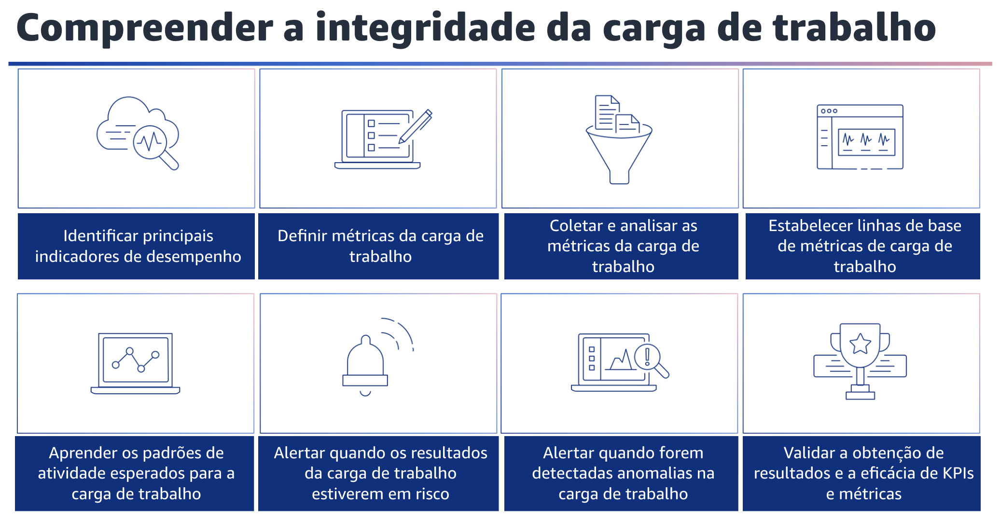

## 1.20 Compreender a integridade da carga de trabalho

Compreender a integridade da carga de trabalho. Defina, capture e analise métricas de carga de trabalho para obter visibilidade dos eventos de carga de trabalho, de modo que você possa tomar as medidas adequadas. Sua equipe deve ser capaz de entender facilmente a integridade da sua carga de trabalho.

Você deverá usar métricas com base nos resultados da carga de trabalho para obter informações úteis. Você deve usar essas métricas para implementar painéis com pontos de vista comerciais e técnicos que ajudarão os membros da equipe a tomar decisões informadas.

Primeiro, identifique os indicadores-chave de desempenho, ou KPIs, com base nos resultados comerciais desejados e nos resultados dos clientes. Os resultados comerciais desejados podem incluir a taxa de pedidos, a taxa de retenção de clientes e o lucro em relação às despesas operacionais. A satisfação do cliente é um exemplo de resultados para o cliente. Avalie os KPIs para determinar o sucesso da carga de trabalho. Além disso, defina as métricas de carga de trabalho, que medem a integridade da carga de trabalho. A integridade da carga de trabalho é medida pela obtenção de resultados comerciais ou KPIs e pelo estado dos componentes e aplicações da carga de trabalho. Exemplos de KPIs incluem carrinhos de compras abandonados, pedidos feitos, custo, preço e despesa de carga de trabalho alocada. Embora você possa coletar a telemetria de vários componentes, selecione um subconjunto que forneça informações sobre a integridade geral da carga de trabalho. Ajuste as métricas de carga de trabalho ao longo do tempo, conforme as necessidades comerciais mudam. Colete analise as métricas de carga de trabalho. Realize análises regulares e proativas dessas métricas para identificar tendências e determinar se é necessária uma resposta e validar a obtenção de resultados comerciais. Agregue métricas de suas aplicações e componentes de carga de trabalho em um local central. Use painéis e ferramentas de analytics para analisar a telemetria e determinar a integridade da carga de trabalho.

Implemente um mecanismo para realizar análises periódicas da integridade da carga de trabalho com stakeholders em sua organização. Além disso, estabeleça linhas de base de métricas de carga de trabalho para ajudar a entender a integridade e o desempenho da carga de trabalho. Usando linhas de base, você pode identificar aplicações e componentes com desempenho abaixo ou acima do esperado. Uma linha de base de carga de trabalho aumenta sua capacidade de atenuar os problemas antes que eles se tornem incidentes. As linhas de base são fundamentais para desenvolver padrões de atividade e implementação de detecção de anomalias quando as métricas se desviam dos valores esperados.

Aprenda os padrões de atividade esperados para a carga de trabalho. Estabeleça padrões de atividade de carga de trabalho para identificar atividades anômalas e, assim, poder responder adequadamente, se necessário. Você também deve alertar quando os resultados da carga de trabalho estiverem em risco, para que possa reagir adequadamente, se necessário. O ideal é que você tenha identificado previamente um limite de métrica sobre o qual possa disparar um alarme ou um evento que possa usar para invocar uma resposta automatizada.

Além disso, alerte quando forem detectadas anomalias para que você possa responder adequadamente, se necessário. A análise das métricas da carga de trabalho ao longo do tempo pode estabelecer padrões de comportamento que podem ser quantificados o suficiente para definir um evento ou acionar um alarme em resposta. Valide a obtenção dos resultados e a eficácia dos KPIs e métricas. Crie uma visão comercial das operações de sua carga de trabalho para ajudar você a determinar se está atendendo às necessidades e a identificar as áreas que precisam ser aprimoradas para atingir as metas de negócios.
