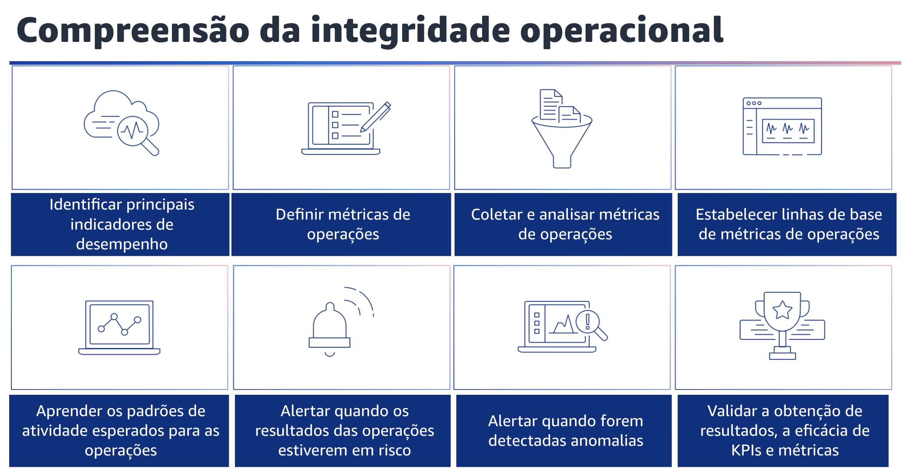

## 1.21 Compreensão da integridade operacional

Compreensão da integridade operacional. Defina, capture e analise métricas de operações para obter visibilidade dos eventos de carga de trabalho, para que você possa tomar as medidas adequadas.

Sua equipe deve ser capaz de entender facilmente a integridade da suas operações. Você deverá usar métricas baseadas nos resultados das operações para obter informações úteis. Você deve usar essas métricas para implementar painéis de controle com pontos de vista comerciais e técnicos que ajudarão os membros da equipe a tomar decisões informadas.

Identifique KPIs com base nos resultados comerciais desejados, como novos recursos entregues, e nos resultados dos clientes, como casos de suporte ao cliente. Avalie os KPIs para determinar o sucesso das operações. Além disso, defina métricas de operações para medir as realizações dos KPIs, por exemplo, implantações bem-sucedidas e implantações com falha.

- Defina métricas de operações para medir a integridade das atividades operacionais, como o tempo médio para detectar um incidente, ou MTTD, e o tempo médio de recuperação, ou MTTR, de um incidente.
- Avalie as métricas para determinar se as operações estão alcançando os resultados desejados e para entender a integridade das atividades de suas operações. Colete e analise métricas de operações.
- Realize análises proativas regulares das métricas para identificar tendências e determinar onde são necessárias respostas adequadas. Você deve agregar dados de log da execução de suas atividades de operações e chamadas de API de operações em um serviço como o CloudWatch Logs.

Gere métricas a partir de observações do conteúdo de log necessário para obter informações sobre o desempenho das atividades de operações.
Estabeleça linhas de base para que as métricas forneçam valores esperados como base para comparação e identificação de atividades operacionais com desempenho abaixo ou acima do esperado.

Você também deve aprender os padrões de atividade esperados para as operações. Estabeleça padrões de atividade de operações para identificar comportamentos anômalos, de modo que possa responder adequadamente, se necessário. Alerte quando os resultados das operações estiverem em risco.

Sempre que estiverem em risco, um alerta deve ser emitido e acionado. Os resultados das operações são qualquer atividade que ofereça suporte a uma carga de trabalho na produção. Isso inclui tudo, desde a implantação de novas versões de aplicações até a recuperação de uma interrupção.
Os resultados operacionais devem ser tratados com a mesma importância que os resultados comerciais. As equipes de software devem identificar as principais métricas e atividades de operações e criar alertas para elas. Os alertas devem ser oportunos e acionáveis. Se um alerta for gerado, deverá ser incluída uma referência a um runbook ou playbook correspondente.

Os alertas sem uma ação correspondente podem levar à fadiga de alertas. Alerte quando forem detectadas anomalias. Alerte quando forem detectadas anomalias nas operações para que você possa responder adequadamente, se necessário. A análise das métricas das operações ao longo do tempo pode estabelecer padrões de comportamento que podem ser quantificados o suficiente para definir um evento ou acionar um alarme em resposta. Valide a obtenção de resultados e a eficácia dos KPIs e métricas. Crie uma visão comercial das atividades de operações para ajudar a determinar se você está atendendo às necessidades e a identificar as áreas que precisam ser aprimoradas para atingir as metas de negócios. Valide a eficácia dos KPIs e métricas e revise-os, se necessário.
