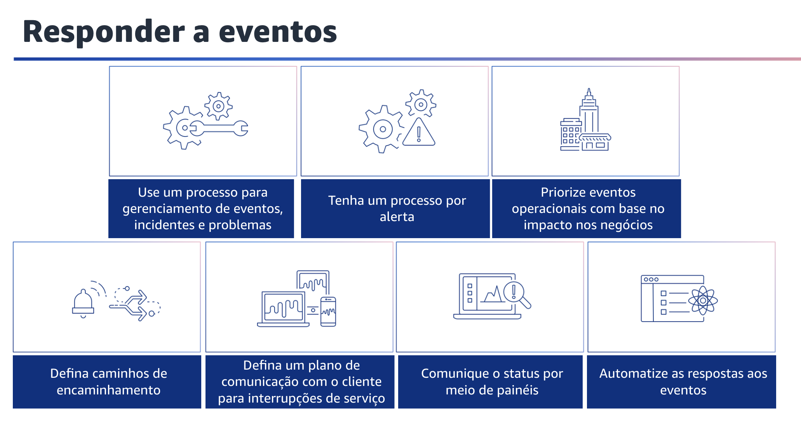

## 1.22 Responder a eventos

Responder a eventos. Você deve se antecipar aos eventos operacionais. Isso pode incluir eventos planejados, como promoções de vendas, implantações e testes de falhas. Eles também podem incluir eventos não planejados, como picos de utilização e falhas de componentes. Você deve usar seus runbooks e playbooks existentes para fornecer resultados consistentes ao responder aos alertas. Uma função ou uma equipe responsável pela resposta e pelos encaminhamentos deve ser responsável pelos alertas definidos. Você também deve conhecer o impacto comercial dos componentes do seu sistema e usá-lo para direcionar esforços quando necessário. Você deve realizar uma análise da causa-raiz após os eventos e, em seguida, evitar a recorrência de falhas ou documentar as soluções alternativas. Sua organização deve ter processos para lidar com eventos, incidentes e problemas. Eventos são coisas que ocorrem em sua carga de trabalho, mas que talvez não precisem de intervenção. Incidentes são eventos que exigem intervenção. Os problemas são eventos recorrentes que exigem intervenção ou não podem ser resolvidos. Você precisa de processos para reduzir o impacto desses eventos em sua empresa e garantir uma resposta adequada.

Você deve ter um processo por alerta. Tenha uma resposta bem definida (runbook ou playbook), com um proprietário especificamente identificado, para qualquer evento para o qual você emita um alerta. Isso garante respostas eficazes e imediatas aos eventos operacionais e evita que eventos acionáveis sejam obscurecidos por notificações menos valiosas. Você também deve priorizar os eventos operacionais com base no impacto nos negócios.

Quando vários eventos exigirem intervenção, assegure-se de que os mais significativos para a empresa sejam tratados primeiro. Os impactos podem incluir mortes ou ferimentos, perdas financeiras ou danos à reputação ou à confiança.
Defina caminhos de encaminhamento em seus runbooks e palybooks, incluindo o gatilho do encaminhamento e os procedimentos para encaminhar. Identifique especificamente os proprietários de cada ação para garantir respostas eficazes e imediatas aos eventos operacionais. Identifique quando uma decisão humana é necessária antes de uma ação ser tomada.

Trabalhe com os tomadores de decisão para que essa decisão seja tomada com antecedência e a ação seja pré-aprovada, a fim de evitar um longo tempo médio para reparo, ou MTTR, à espera de uma resposta. Defina e teste um plano de comunicação confiável para manter seus clientes e stakeholders informados sobre interrupções do sistema. Comunique-se diretamente com seus usuários quando os serviços que eles usam forem afetados e quando os serviços voltarem ao normal. Você também pode comunicar o status por meio de painéis. Forneça painéis adaptados aos seus públicos-alvo, como equipes técnicas internas, liderança e clientes, para comunicar o status operacional atual dos negócios e fornecer métricas de interesse. Por fim, automatize as respostas aos eventos
para reduzir os erros causados por processos manuais e para garantir respostas rápidas e consistentes.
