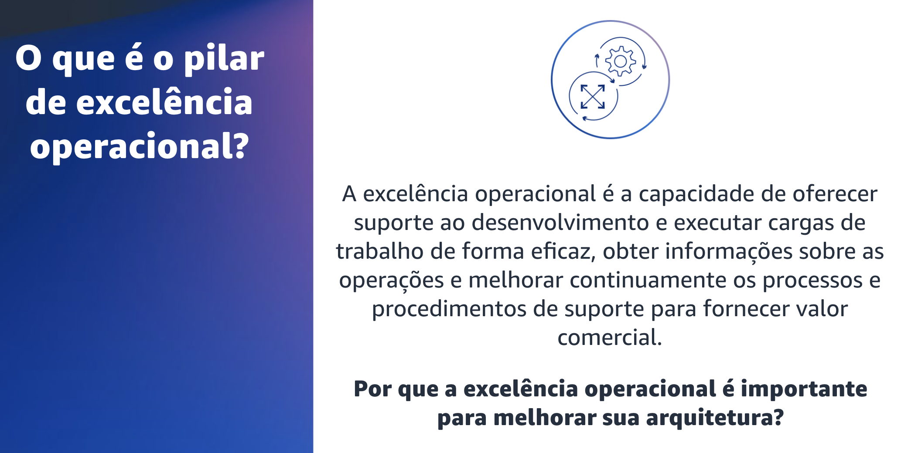
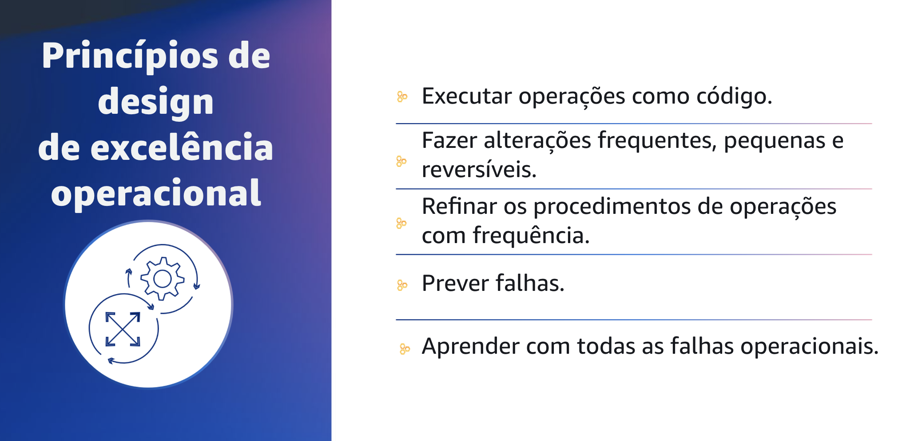
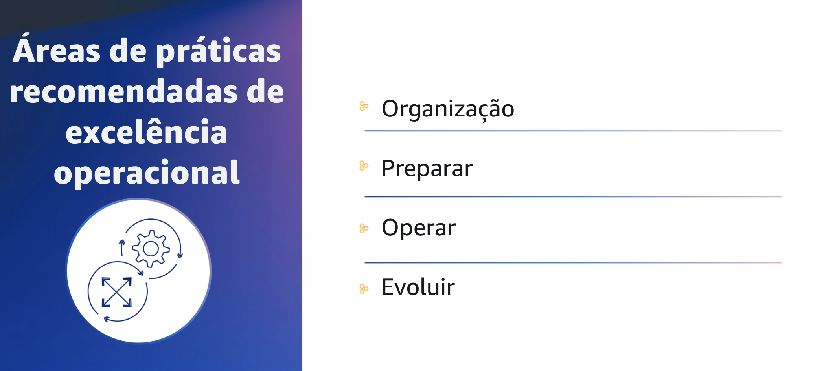

## 1.5 O que é o pilar de excelência operacional?

Alguns dos fundamentos da excelência operacional são garantir que suas cargas de trabalho, seus processos e procedimentos forneçam valor comercial para sua organização. Suas cargas de trabalho precisam fornecer valor comercial efetivo, e todas as funções de suporte em torno dessa carga de trabalho precisam reforçar isso. Excelência operacional é a execução de suas cargas de trabalho de forma eficiente.

Ter uma carga de trabalho segura, com custo otimizado, confiável e de alto desempenho é fantástico, mas se suas equipes não conseguirem executá-la e operá-la com eficiência, ela se torna uma despesa para o negócio.

## 1.6 Excelência operacional

Agora que já sabe o que é o pilar de excelência operacional, você se aprofundarános princípios de design do pilar da excelência operacional.

## 1.7 Excelência operacional

Existem cinco princípios de design para a excelência operacional na nuvem.

- O primeiro é realizar operações como código. Na nuvem, é possível aplicar a mesma disciplina de engenharia utilizada no código da aplicação a todo o ambiente. Você pode definir toda a sua carga de trabalho, como aplicações, infraestrutura e assim por diante, como código e atualizá-la com código. Você pode criar scripts para seus procedimentos de operações e automatizar a inicialização deles, invocando-os em resposta a eventos. Isso pode limitar o erro humano e gerar respostas consistentes aos eventos.
- O segundo princípio é fazer mudanças frequentes, pequenas e reversíveis. Projete cargas de trabalho de modo que você possa atualizar os componentes regularmente para aumentar o fluxo de alterações benéficas em sua carga de trabalho. Faça alterações em pequenos incrementos para possibilitar a reversão em caso de falha, a fim de ajudar a identificar e resolver problemas introduzidos em seu ambiente, sem afetar os clientes, quando possível.
- O terceiro princípio é refinar os procedimentos operacionais com frequência. Conforme você usa os procedimentos operacionais, procure oportunidades para melhorá-los. À medida que sua carga de trabalho evolui, aprimore seus procedimentos adequadamente. Defina dias de teste regulares para revisar e validar que todos os procedimentos são eficazes e que as equipes estão familiarizadas com eles.
- O quarto princípio é prever falhas. Execute exercícios pre-mortem para identificar possíveis fontes de falha para que você possa removê-las ou atenuá-las. Teste os cenários de falha e valide a compreensão do seu impacto. Teste seus procedimentos de resposta para garantir que eles sejam eficazes e que as equipes estejam familiarizadas com a forma de iniciá-los. Defina dias de teste regulares para testar a carga de trabalho e as respostas da equipe a eventos simulados.
- O último princípio de design é aprender com todas as falhas operacionais. Promover melhorias por meio das lições aprendidas com todos os eventos e falhas operacionais. Compartilhe o que aprendeu com as equipes e com toda a organização.

## 1.8 Práticas recomendadas de excelência operacional

Agora que você já entendeu os princípios de design da excelência operacional, aprenderá sobre as práticas recomendadas de excelência operacional

## 1.9 Excelência operacional

Para ajudar você a navegar pelas práticas recomendadas de excelência operacional, o pilar analisa quatro áreas de foco diferentes.

A primeira área de foco é a organização. Você precisa entender as prioridades da sua organização, sua estrutura organizacional e como ela dá suporte aos membros da sua equipe, para que eles possam dar suporte aos seus resultados comerciais.

Outra área de foco é se preparar. Para se preparar para a excelência operacional, você precisa entender suas cargas de trabalho e os comportamentos esperados. Em seguida, você pode projetá-los para fornecer informações sobre seu status e criar os procedimentos para apoiá-los.

A terceira área de foco é operar. Sucesso é a obtenção de resultados comerciais medidos pelas métricas que você define. Ao compreender a integridade de sua carga de trabalho e de suas operações, você pode identificar quando os resultados organizacionais e comerciais podem estar em risco, ou estão em risco, e responder adequadamente.

A última área de foco de práticas recomendadas é evoluir. A evolução é o ciclo contínuo de aprimoramento ao longo do tempo. Implemente pequenas e frequentes mudanças incrementais com base nas lições aprendidas em suas atividades operacionais e avalie o sucesso dessas mudanças para obter melhorias.
