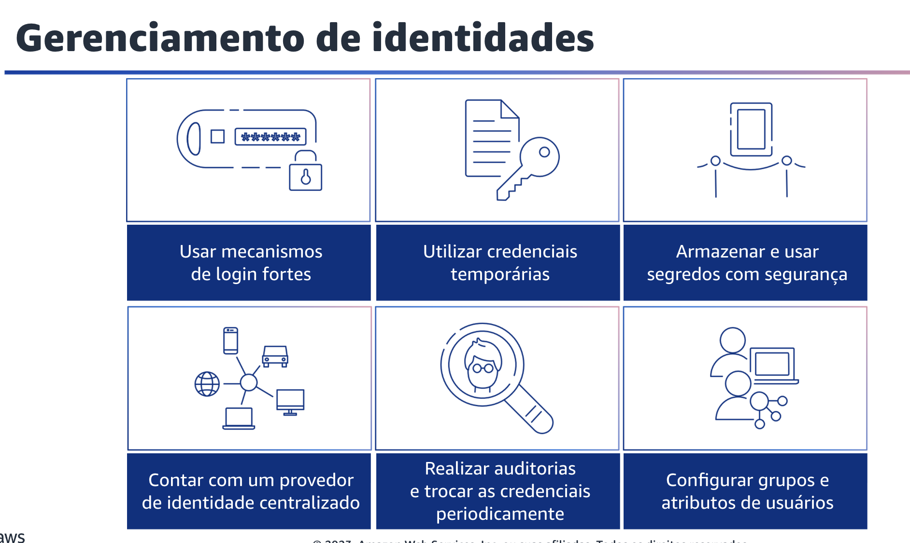
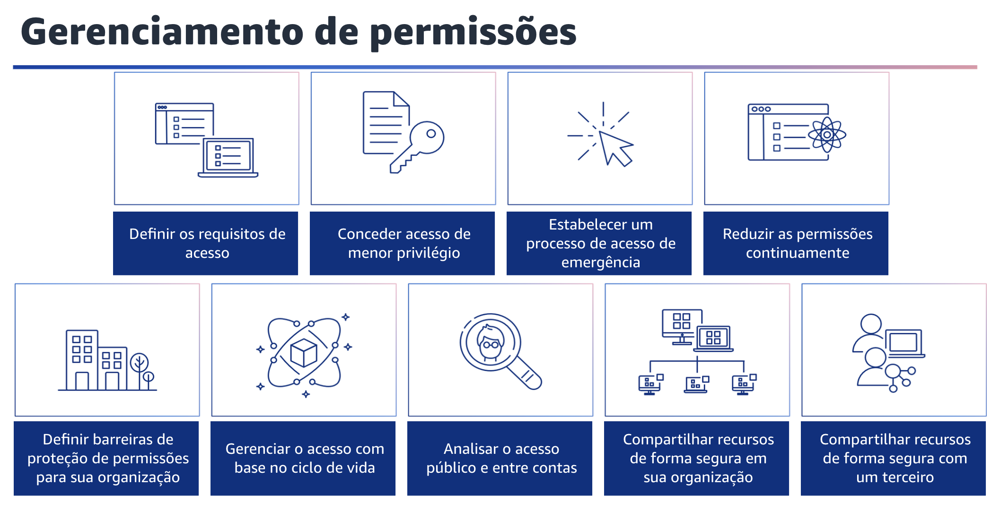

## 1.14 Identity and Access Management

A próxima área de práticas recomendadas de segurança é o Identity and Access Management. Para usar os serviços da AWS, você deve conceder aos seus usuários e aplicações acesso aos recursos nas suas contas AWS. À medida que você executa mais cargas de trabalho na AWS, precisa de gerenciamento de identidade e permissões robustos para garantir que as pessoas certas tenham acesso aos recursos certos nas condições certas. A AWS oferece uma grande variedade de recursos para ajudar você a gerenciar suas identidades humanas e de máquina e suas permissões. As práticas recomendadas para esses recursos se enquadram em duas áreas principais: gerenciamento de identidade e gerenciamento de permissões.

## 1.15 Gerenciamento de identidades

Gerenciamento de identidades. Há dois tipos de identidades que você precisa gerenciar ao abordar como operar cargas de trabalho seguras da AWS. 

Primeiro, as identidades humanas: os administradores, desenvolvedores, operadores e consumidores das suas aplicações precisam de uma identidade para acessar seus ambientes e aplicações AWS. Elas podem ser membros da sua organização ou usuários externos com os quais você colabora. Elas interagem com seus recursos da AWS por meio de um navegador da web, uma aplicação cliente, um aplicativo móvel ou ferramentas interativas de linha de comando.

Segundo, as identidades de máquina: suas aplicações de carga de trabalho, ferramentas operacionais e componentes exigem uma identidade para fazer solicitações aos serviços da AWS, como ler dados. Essas identidades incluem máquinas em execução em seu ambiente AWS, como instâncias do EC2 ou funções do AWS Lambda. Você também pode gerenciar identidades de máquinas para partes externas que precisam de acesso. Além disso, você pode ter máquinas fora da AWS que precisam de acesso ao seu ambiente AWS.

Há várias práticas recomendadas para o gerenciamento de identidades, como o uso de mecanismos de login fortes. Autenticação com credenciais de login pode apresentar riscos quando não são usados mecanismos como a autenticação multifator, ou MFA. Isso é verdadeiro em situações em que as credenciais de login foram divulgadas inadvertidamente ou são facilmente adivinhadas. Os mecanismos de login podem ajudar a reduzir esses riscos, exigindo MFA e políticas de senhas fortes.

É melhor usar credenciais temporárias para autenticação em vez de credenciais de longo prazo. Isso ajuda a reduzir ou eliminar riscos, como a divulgação, o compartilhamento ou o roubo inadvertido de credenciais. Você também pode armazenar e usar segredos com segurança.

Uma carga de trabalho requer um recurso automatizado para comprovar a identidade em bancos de dados, recursos e serviços de terceiro. Isso é feito usando credenciais de acesso secretas, como chaves de acesso à API, senhas e tokens OAuth. O uso de um serviço criado para armazenar, gerenciar e trocar essas credenciais ajuda a reduzir a probabilidade de que elas sejam comprometidas. Para as identidades da força de trabalho, conte com um provedor de identidade que o ajude a gerenciar identidades em um local centralizado. Isso facilita o gerenciamento do acesso em várias aplicações e serviços porque você está criando, gerenciando e revogando o acesso a partir de um único local. Realize auditorias e troque as credenciais periodicamente para limitar o tempo que as credenciais podem ser usadas para acessar seus recursos.

As credenciais de longo prazo criam muitos riscos, e esses riscos podem ser reduzidos com a troca regular das credenciais de longo prazo. À medida que o número de usuários que você gerencia aumenta, será necessário determinar maneiras de organizá-los para que possa gerenciálos de forma dimensionada. Coloque os usuários com requisitos de segurança comuns em grupos definidos pelo seu provedor de identidade. Implemente mecanismos para garantir que os atributos do usuário que podem ser usados para controle de acesso, como departamento ou local, estejam corretos e atualizados. Use esses grupos e atributos para controlar o acesso em vez de usuários individuais. Isso ajuda a gerenciar o acesso de forma centralizada, alterando a associação ao grupo ou os atributos de um usuário uma vez com um conjunto de permissões. Evita-se a necessidade de atualizar muitas políticas individuais quando o acesso de um usuário precisa ser alterado.

## 1.16 Gerenciamento de permissões

Gerenciamento de permissões. Gerencie as permissões para controlar o acesso a identidades humanas e de máquinas que exigem acesso à AWS e às suas cargas de trabalho. As permissões controlam quem pode acessar o que e em que condições. Defina permissões para identidades humanas e de máquina específicas para conceder acesso a ações de serviço específicas em recursos específicos. Além disso, especifique as condições que devem ser verdadeiras para que o acesso seja concedido. Por exemplo, você pode permitir que os desenvolvedores criem novas funções Lambda, mas somente em uma Região específica. Ao gerenciar seus ambientes AWS dimensionados, siga as práticas recomendadas a seguir para garantir que as identidades tenham apenas o acesso necessário e nada mais. Cada componente ou recurso de sua carga de trabalho precisa ser acessado por administradores, usuários finais ou outros componentes. Tenha uma definição clara de quem ou o que deve ter acesso a cada componente.

Escolha o tipo de identidade adequado e o método de autenticação e autorização. Recomenda-se conceder apenas o acesso necessário para que as identidades realizem ações específicas em recursos específicos sob condições específicas. Use atributos de grupo e identidade para definir dinamicamente as permissões de acordo com suas dimensões, em vez de definir permissões para usuários individuais. Por exemplo, você pode permitir que um grupo de desenvolvedores tenha acesso para gerenciar apenas os recursos de seu projeto. Dessa forma, se um desenvolvedor deixar o projeto, o acesso dele será automaticamente revogado sem alterar as políticas de acesso subjacentes. Você também pode considerar um processo que dê acesso de emergência à sua carga de trabalho no caso improvável de um processo automatizado ou problema no pipeline. Isso ajudará você a contar com o acesso de menor privilégio, mas garantirá que os usuários possam obter o nível certo de acesso quando necessário. À medida que as equipes e as cargas de trabalho determinam o acesso de que precisam, remova as permissões que não são mais usadas e estabeleça processos de revisão para obter permissões de privilégio mínimo. Reduza e monitore as identidades e permissões não utilizadas. Defina barreiras de permissão para a sua organização e estabeleça controles comuns que restrinjam o acesso a todas as identidades da sua organização. Você também pode gerenciar o acesso com base no ciclo de vida. Integre os controles de acesso ao ciclo de vida do operador e da aplicação e ao seu provedor de federação centralizado. Para analisar o acesso público e entre contas, monitore continuamente as descobertas que destacam o acesso público e entre contas. Reduza o acesso público e o acesso entre contas a apenas recursos que exigem esse tipo de acesso. Com o aumento do número de cargas de trabalho, talvez seja necessário compartilhar o acesso aos recursos nessas cargas de trabalho ou provisionar os recursos várias vezes em várias contas. Você pode ter construções para compartimentar seu ambiente, como ambientes de desenvolvimento, teste e produção. No entanto, ter construções de separação não impede você de compartilhar com segurança. Ao compartilhar componentes que se sobrepõem, é possível reduzir a sobrecarga operacional e criar uma experiência consistente sem adivinhar o que pode ter perdido ao criar o mesmo recurso várias vezes. A segurança de seu ambiente de nuvem não se limita à sua organização. Sua organização pode confiar em um terceiro para gerenciar uma parte de seus dados. O gerenciamento de permissões para o sistema gerenciado por terceiros deve seguir a prática de acesso just-in-time usando o princípio de menor privilégio com credenciais temporárias. Ao trabalhar em conjunto com um terceiro, você pode reduzir o escopo do impacto e o risco de acesso não intencional.
