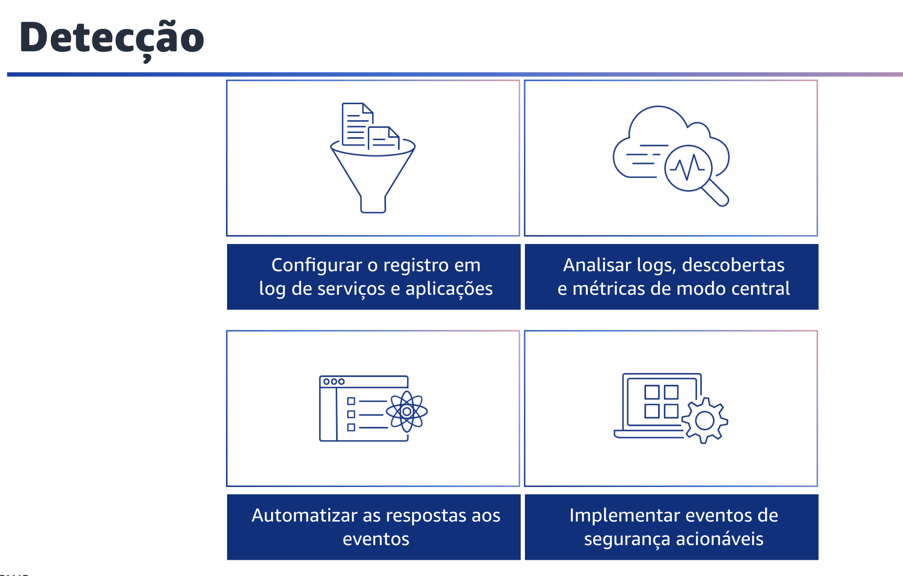

## 1.17 Detecção

A próxima área de práticas recomendadas de segurança é a detecção. Você pode usar controles de detecção para identificar uma ameaça ou incidente de segurança potencial. Eles são parte essencial das estruturas de governança e podem ser usados para dar suporte a um processo de qualidade, a uma obrigação legal ou de conformidade e para esforços de identificação e resposta a ameaças.

## 1.18 Detecção

A detecção consiste em duas partes: detecção de alterações inesperadas ou indesejadas na configuração e detecção de comportamento inesperado. A detecção ajuda você a identificar uma possível configuração incorreta da segurança, uma ameaça ou um comportamento inesperado. Trata-se de parte essencial do ciclo de vida da segurança e pode ser usada para dar suporte a um processo de qualidade, a uma obrigação legal ou de conformidade e para esforços de identificação e resposta a ameaças. Para a AWS, há várias abordagens que você pode usar ao tratar de mecanismos de detecção. Veja a seguir as práticas recomendadas de detecção. Primeiro,configure o log de serviços e aplicações.

Retenha os logs de eventos de segurança de serviços e aplicações. Esse é um princípio fundamental de segurança para auditoria, investigações e casos de uso operacional. É um requisito de segurança comum orientado por governança, risco e conformidade, ou GRC, padrões, políticas e procedimentos. Depois, analise logs, descobertas e métricas de modo central. As equipes de operações de segurança dependem da coleta de logs e do uso de ferramentas de pesquisa para descobrir possíveis eventos de interesse que possam indicar atividade não autorizada ou alteração não intencional. No entanto, a simples análise dos dados coletados e o processamento manual das informações são insuficientes para acompanhar o volume de informações que flui de arquiteturas complexas. A análise e os relatórios, por si só, não facilitam a atribuição dos recursos certos para trabalhar em um evento em tempo hábil.

Terceiro, automatize respostas a eventos de métrica. O uso da automação para investigar e corrigir eventos reduz o esforço e o erro humano e ajuda a dimensionar os recursos de investigação. Por
meio de revisões regulares, você pode ajustar as ferramentas de automação e iterar continuamente. Por fim, implemente eventos de segurança acionáveis. Crie alertas que são enviados e podem ser acionados pela sua equipe. Garanta que os alertas incluam informações relevantes para que a equipe tome providências.

Para cada mecanismo de detecção que tiver, você também deve ter um processo, na forma de um runbook ou playbook, para investigar.
