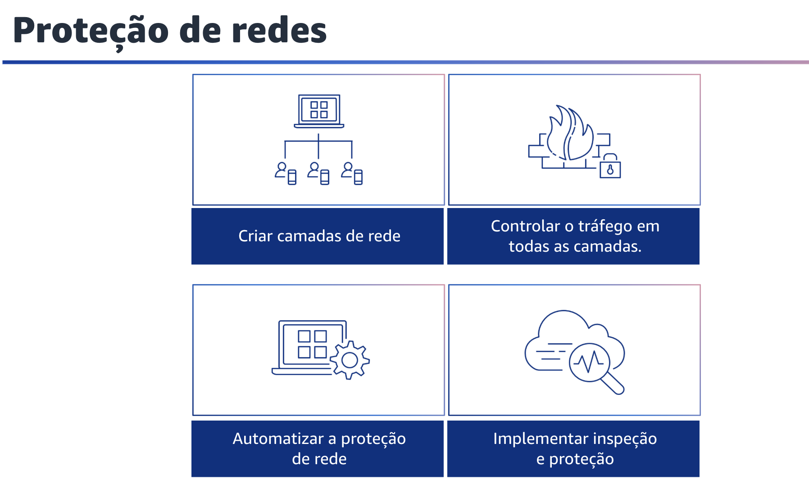
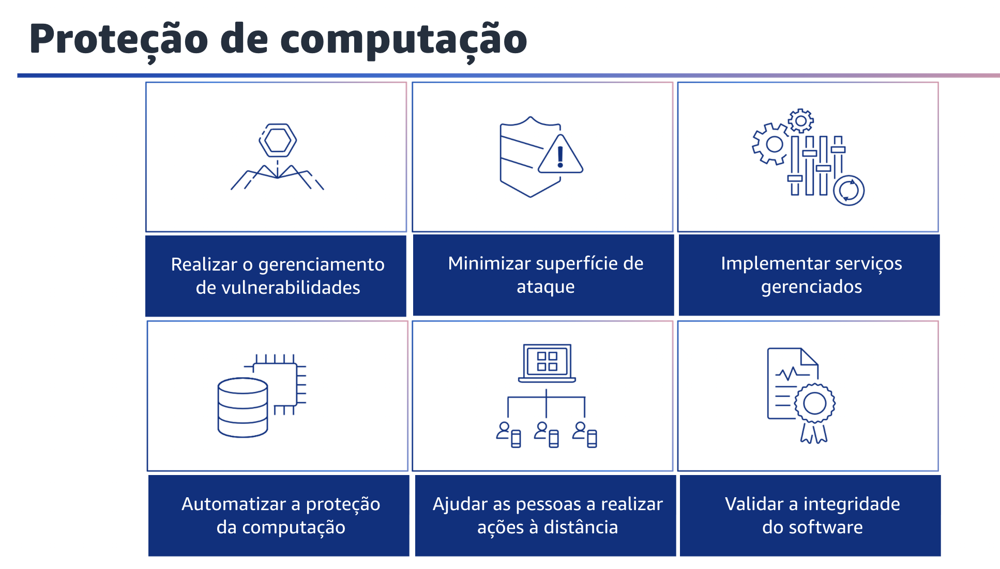

## 1.19 Proteção de infraestrutura

A próxima área de práticas recomendadas de segurança é a proteção da infraestrutura. A proteção da infraestrutura abrange metodologias de controle, como defesa em profundidade, necessárias para atender às práticas recomendadas e às obrigações organizacionais ou regulatórias. O uso dessas metodologias é fundamental para o sucesso das operações contínuas na nuvem.
A proteção da infraestrutura é uma parte fundamental de um programa de segurança da informação. Ela garante que os sistemas e recursos em suas cargas de trabalho sejam protegidos contra acesso não intencional, não autorizado e outras possíveis vulnerabilidades.

## 1.20 Proteção de redes

Proteção de redes. Os usuários, tanto da sua força de trabalho quanto de seus clientes, podem estar localizados em qualquer lugar. Você precisa abandonar os modelos tradicionais de confiar em qualquer pessoa e em qualquer coisa que tenha acesso à sua rede. Quando você segue o princípio de aplicar a segurança em todas as camadas, emprega uma abordagem Zero Trust. A segurança Zero Trust é um modelo em que os componentes da aplicação ou os microsserviços são considerados distintos uns dos outros, e nenhum componente ou microsserviço confia em outro.

Veja a seguir as práticas recomendadas para proteger as redes.

- Primeiro, crie camadas de rede. Agrupe os componentes que compartilham requisitos de confidencialidade em camadas para minimizar o escopo potencial do impacto do acesso não autorizado.
- Em seguida, controle o tráfego em todas as camadas. Ao arquitetar a topologia da rede, você deve examinar os requisitos de conectividade de cada componente.
- Terceiro, automatize os mecanismos de proteção da rede para fornecer uma rede autodefensiva com base na inteligência contra ameaças e na detecção de anomalias.

Por fim, implemente inspeção e proteção. Inspecione e filtre seu tráfego em cada camada.

## 1.21 Proteção de computação

Proteção de computação. Os recursos de computação incluem instâncias EC2, contêineres, funções Lambda, serviços de banco de dados, dispositivos da Internet das Coisas e muito mais. Cada um desses tipos de recursos de computação exige abordagens diferentes para protegê-los. Porém, elas compartilham estratégias comuns que você precisa considerar: defesa em profundidade, gerenciamento de vulnerabilidades, redução da superfície de ataque, automação da configuração e da operação e execução de ações à distância. Nesta seção, você encontrará orientações gerais para proteger seus recursos de computação para os principais serviços. Para cada serviço AWS usado, é importante que você verifique as recomendações de segurança específicas na documentação do serviço.

Veja a seguir as práticas recomendadas para proteger os recursos de computação: realizar o gerenciamento de vulnerabilidades. Examine e corrija com frequência as vulnerabilidades em seu código, dependências e infraestrutura para ajudar na proteção contra novas ameaças.
Reduza a superfície de ataque. Limite sua exposição a acessos indesejados tornando os sistemas operacionais mais fortes e minimizando os componentes, as bibliotecas e os serviços consumíveis externamente em uso. Implemente serviços que gerenciam recursos, como o Amazon Relational Database Service (Amazon RDS), o Lambda e o Amazon Elastic Container Service (Amazon ECS). Isso pode ajudar a reduzir suas tarefas de manutenção de segurança como parte do modelo de responsabilidade compartilhada.

Automatize seus mecanismos de proteção de computação, incluindo o gerenciamento de vulnerabilidades, a redução da superfície de ataque e o gerenciamento de recursos. A automação o ajudará a investir tempo na proteção de outros aspectos de sua carga de trabalho e reduzirá o risco de erro humano. Ajude as pessoas a realizar ações à distância.

A remoção da capacidade de acesso interativo reduz o risco de erro humano e o potencial de configuração ou gerenciamento manual. Implemente mecanismos como assinatura de código para validar se o software, o código e as bibliotecas usados na carga de trabalho são de fontes confiáveis e não foram adulterados.

## 1.22 Proteção de dados

A próxima área de práticas recomendadas de segurança é a proteção de dados.
Antes de arquitetar qualquer carga de trabalho, as práticas fundamentais que influenciam a segurança devem estar em vigor. Por exemplo, a classificação de dados oferece uma maneira de categorizar os dados com base em níveis de confidencialidade. A criptografia protege os dados, tornandoos inacessíveis para quem não tem autorização. Esses métodos são importantes porque apoiam objetivos como limitar o manuseio incorreto ou ajudar a cumprir as obrigações regulatórias. Com a AWS, há várias abordagens diferentes que você pode usar ao tratar da proteção de dados.
A seção a seguir descreve como usar essas abordagens.
