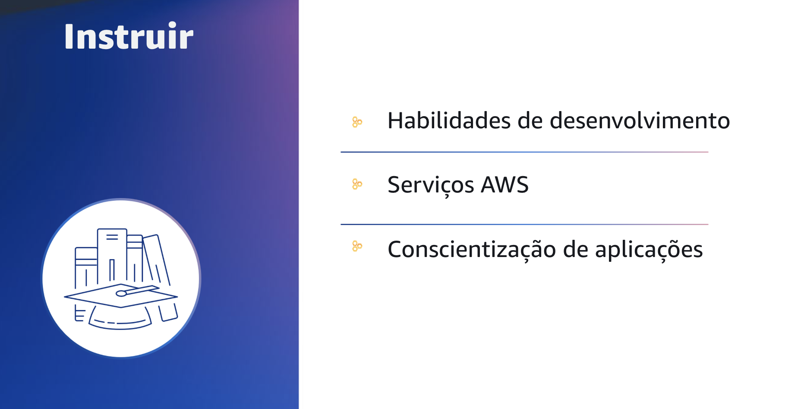
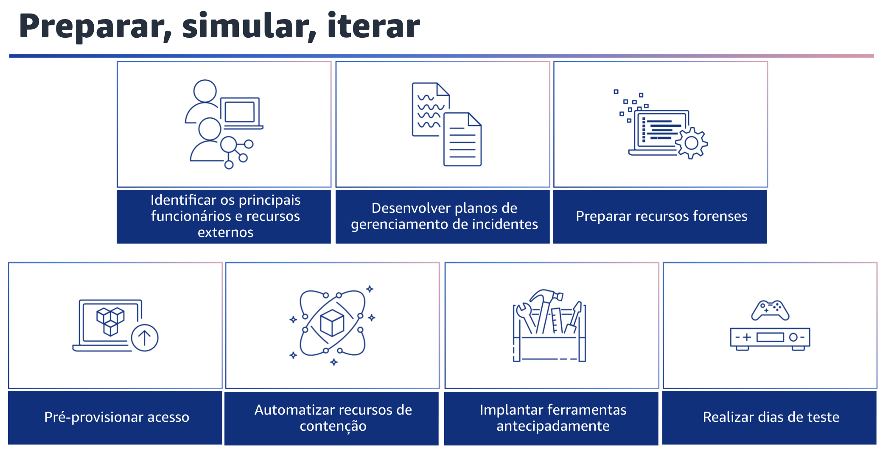

## 1.28 Instruir

Os processos automatizados ajudam as organizações a dedicar mais tempo às medidas para aumentar a segurança das cargas de trabalho. A resposta automatizada a incidentes também torna os seres humanos disponíveis para correlacionar eventos, praticar simulações, elaborar novos procedimentos de resposta, realizar pesquisas, desenvolver novas habilidades e testar ou criar novas ferramentas. Apesar do aumento da automação, a sua equipe, os especialistas e os respondentes de uma organização de segurança ainda precisam de educação contínua.

Convém analisar e incorporar as seguintes áreas ao pensar em educar suas equipes de segurança. Para iniciar, considere as habilidades de desenvolvimento. Equipar os profissionais de segurança com habilidades de programação pode ajudar a acelerar os esforços de automação da sua organização. Isso inclui não apenas garantir a educação em linguagens de programação, como Python, mas também garantir a familiaridade com o sistema de controle de origem, controle de versão e processos de CI/CD.

Quando os desenvolvedores têm esse entendimento, eles podem aumentar a eficiência e reduzir os erros ao automatizar. Você também pode treinar sua equipe para que ela seja proficiente com os serviços de segurança oferecidos pela AWS. Entender como usar as ferramentas de nuvem ajuda a reduzir o tempo de resposta e a aumentar a confiança da equipe.

Além disso, estabeleça uma cadência de educação sobre novos serviços e recursos para iterar continuamente seus recursos. Assim como o cenário de ameaças muda, o mesmo acontece com as ferramentas. Por fim, mantenha a conscientização das aplicações. Treine a sua equipe de resposta a incidentes sobre as especificidades das cargas de trabalho e dos ambientes de sua propriedade. Isso inclui entender quais logs são emitidos, quais informações os registros contêm, o fluxo de tráfego do aplicativo e os mecanismos de autenticação e autorização em uso.

Esse é um componente essencial porque o conhecimento profundo da infraestrutura e das aplicações da sua organização oferece uma vantagem para protegê-las. A melhor maneira de aprender é a prática, por exemplo, por meio de dias de teste de resposta a incidentes. Isso ajuda os especialistas da sua equipe a aprimorar as ferramentas e técnicas enquanto ensinam outras pessoas. Isso é abordado em mais detalhes na seção a seguir

No futuro, lembre-se de manter o treinamento necessário para toda a sua organização. A conscientização sobre a segurança é uma importante linha de defesa. Todos os usuários devem ser treinados para relatar comportamentos suspeitos à sua equipe de segurança para investigação adicional.

## 1.29 Preparar, simular, iterar

Não deixe de considerar o acesso pré-provisionado. Durante um incidente, suas equipes de resposta a incidentes devem ter acesso a várias ferramentas e recursos de carga de trabalho envolvidos no incidente. Verifique se suas equipes têm acesso pré-provisionado adequado para realizar suas tarefas antes da ocorrência de um evento. Todas as ferramentas, acessos e planos devem ser documentados e testados para garantir que possam fornecer uma resposta em tempo hábil.

Considere as seguintes práticas recomendadas.

Identifique os principais funcionários e recursos externos. Busque o pessoal interno e externo, os recursos e as obrigações legais que ajudariam sua organização a responder a um incidente. Desenvolva planos de gerenciamento de incidentes. Crie planos para ajudar você a responder, comunicar-se durante e recuperar-se de um incidente. Em seguida, prepare os recursos forenses. É importante que os responsáveis pela resposta a incidentes entendam quando e como a investigação forense se encaixa no seu plano de resposta. Sua organização deve definir quais provas são coletadas e quais ferramentas são usadas no processo.

Identifique e prepare os recursos de investigação forense adequados, incluindo especialistas externos, ferramentas e automação. Considere também como automatizar a contenção e a recuperação de um incidente. Isso pode ajudar a reduzir os tempos de resposta e o impacto organizacional.

Depois de criar e praticar processos e ferramentas de seus playbooks, desconstrua a lógica em uma solução baseada em código.
Isso pode ser usado como uma ferramenta por muitos respondentes para automatizar a resposta e eliminar a variação ou o trabalho de adivinhação de seus respondentes. Você também pode acelerar o ciclo de vida de uma resposta. O próximo objetivo é automatizar totalmente esse código para ser invocado pelos próprios alertas ou eventos, e não por um respondente humano, para criar uma resposta orientada por eventos.
Esses processos também devem adicionar automaticamente dados relevantes aos seus sistemas de segurança. Por exemplo, um incidente envolvendo tráfego de um endereço IP indesejado pode preencher automaticamente uma lista de bloqueio do AWS WAF ou um grupo de regras do AWS Network Firewall para impedir outras atividades.

Para o acesso préprovisionado, verifique se os respondentes de incidentes têm o acesso correto pré-provisionado na AWS. Isso pode ajudar a reduzir o tempo necessário para a investigação até a recuperação. Garanta também que a equipe de segurança tenha as ferramentas certas pré-implantadas na AWS para reduzir o tempo de investigação até a recuperação. Realize dias de teste, também conhecidos como simulações ou exercícios. Esses são eventos internos que oferecem uma oportunidade estruturada de praticar seus planos e procedimentos de gerenciamento de incidentes em um cenário realista. Esses eventos devem exercitar os profissionais de resposta usando as mesmas ferramentas e técnicas que seriam usadas em um cenário real. Os dias de teste podem até mesmo imitar ambientes do mundo real.
Basicamente, trata-se de estar preparado e melhorar iterativamente seus recursos de resposta.
