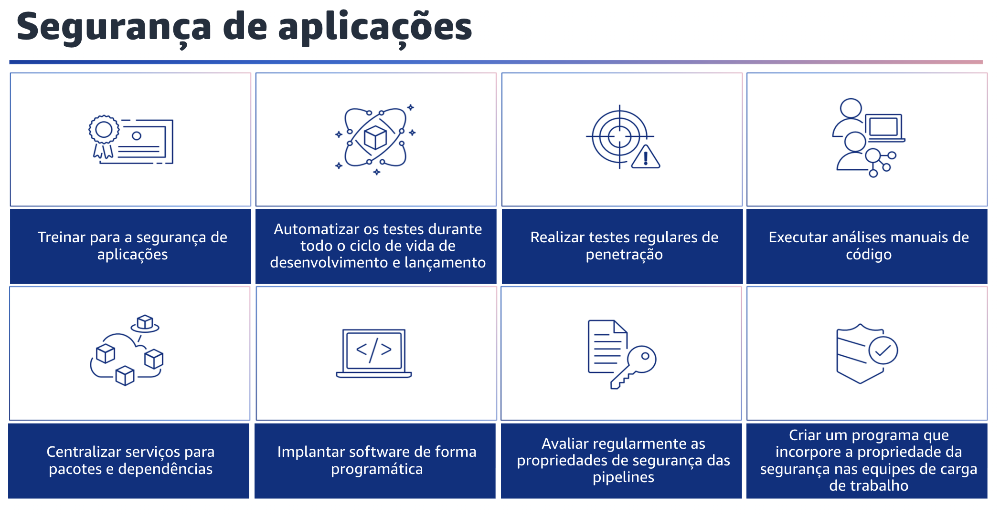

## 1.30 Segurança de aplicações

A última área de práticas recomendadas de segurança é a segurança de aplicações.
A segurança é um tópico que abrange todas as áreas da tecnologia. Você já aprendeu sobre identidade, proteção de infraestrutura, proteção de dados e resposta a incidentes.
A seguir, você aprenderá sobre segurança de aplicações.

## 1.31 Segurança de aplicações

Segurança de aplicações. O treinamento de pessoas, os testes com automação, a compreensão das dependências e a validação das propriedades de segurança de ferramentas e aplicações ajudam a reduzir a probabilidade de problemas de segurança nas cargas de trabalho de produção. É importante realizar treinamentos sobre segurança de aplicações. Ofereça treinamento aos desenvolvedores de sua organização sobre práticas comuns para o desenvolvimento e a operação seguros de aplicações. A adoção de práticas de desenvolvimento com foco na segurança ajuda a reduzir a probabilidade de problemas que só são detectados no estágio de revisão de segurança.

Automatize os testes durante todo o ciclo de vida de desenvolvimento e lançamento, inclusive para propriedades de segurança durante todo o ciclo de vida de desenvolvimento e lançamento. A automação ajuda você a identificar de forma consistente e repetitiva os possíveis problemas no software antes do lançamento. Isso pode reduzir o risco de problemas de segurança no software que está sendo fornecido. Realize testes de penetração regulares em seu software. Esse mecanismo ajuda a identificar possíveis problemas de software que não podem ser detectados por testes automatizados ou por uma revisão manual do código.

Ele também pode ajudar você a entender a eficácia dos seus controles de detecção. Os testes de penetração devem tentar determinar se o software pode ser executado de maneiras inesperadas, como a exposição de dados que deveriam estar protegidos ou a concessão de permissões mais amplas do que o esperado. Realize uma análise manual do código do software que você produz. Esse processo ajuda a verificar se a pessoa que escreveu o código não é a única que está verificando a qualidade do código. Centralize serviços para pacotes e dependências. Forneça serviços centralizados para que as equipes de construtores obtenham pacotes de software e outras dependências. Isso valida os pacotes antes que eles sejam incluídos no software que você escreve e fornece uma origem de dados para análise de software. Realize implantações de software de forma programática sempre que possível. Essa abordagem reduz a probabilidade de uma implantação falhar ou de um problema inesperado ser introduzido devido a um erro humano. Avalie regularmente as propriedades de segurança das pipelines.

Aplique os princípios do pilar de segurança do AWS WA aos seus pipelines, com atenção especial à separação de permissões. Avalie regularmente as propriedades de segurança de sua infraestrutura de pipeline. O gerenciamento eficaz da segurança dos pipelines ajuda você a fornecer a segurança do software que passa pelos pipelines. Por fim, crie um programa que incorpore a propriedade da segurança nas equipes de carga de trabalho. Capacite as equipes de construtores a tomar decisões de segurança sobre o software que criam. Sua equipe de segurança ainda precisa validar essas decisões durante uma revisão, mas incorporar a propriedade da segurança nas equipes de construtores leva à criação de cargas de trabalho mais rápidas e seguras.

Esse mecanismo também promove uma cultura de propriedade que afeta positivamente a operação dos sistemas que você constrói.
