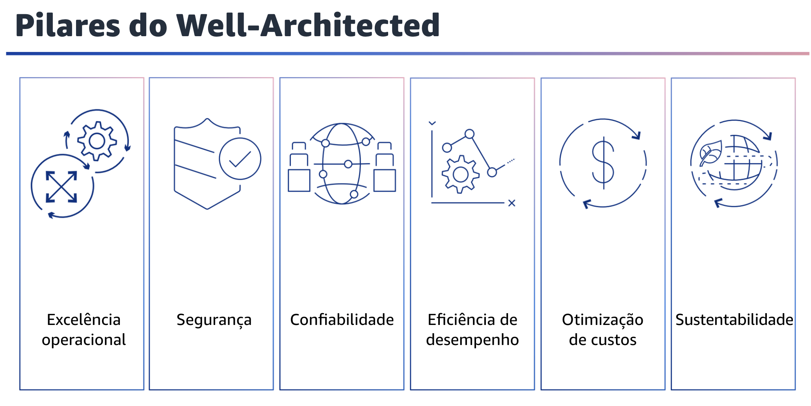

## 1.4 Pilares do Well-Architected

Atualmente, há seis pilares do Well-Architected Framework: excelência operacional, segurança, confiabilidade, eficiência de desempenho, otimização de custos e sustentabilidade. Esses pilares são os fundamentos da arquitetura de suas soluções de tecnologia na nuvem. Este módulo se concentrará no pilar de segurança.

## 1.5 O que é o pilar de segurança?

O que é o pilar de segurança? O pilar de segurança abrange a capacidade de proteger dados, sistemas e ativos na nuvem.
Para operar sua carga de trabalho com segurança, você deve aplicar as práticas recomendadas abrangentes a todas as áreas de segurança.

## 1.6 Princípios de design de segurança

Agora que você já sabe o que é o pilar de segurança, vai se aprofundar nosprincípios de design do pilar de segurança.
