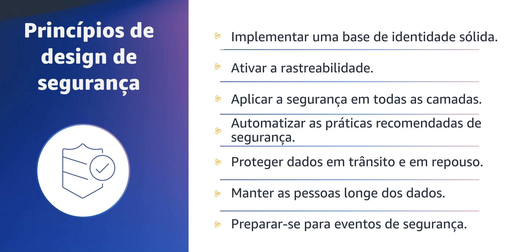
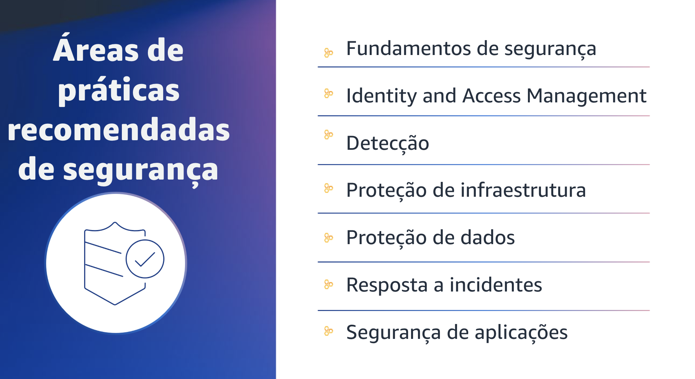
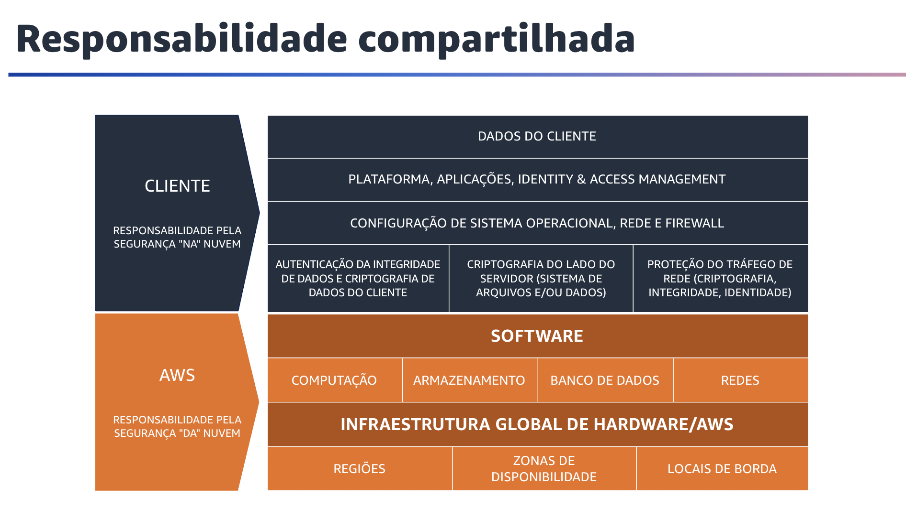

## 1.7 Segurança

Na nuvem, vários princípios podem ajudar você a fortalecer a segurança da carga de trabalho. Primeiro, implemente uma base sólida de identidade. Você pode implementar o princípio de menor privilégio e aplicar a separação de tarefas com a autorização apropriada para cada interação com os recursos da AWS. Centralize o gerenciamento de identidades e tenha como meta eliminar a dependência de credenciais estáticas de longo prazo. Segundo, ative a rastreabilidade. Você pode monitorar, alertar e fazer auditoria de ações e alterações em seu ambiente em tempo real. Integre a coleta de log e métricas com sistemas para investigar e tomar medidas automaticamente. Terceiro, aplique a segurança em todas as camadas: Aplique uma abordagem de defesa em profundidade com vários controles de segurança. Aplique controles a todas as camadas, como rede de borda, nuvem privada virtual ou VPC, balanceamento de carga, instâncias de computação, sistemas operacionais, aplicações e código. Quarto, automatize as práticas de segurança. Os mecanismos automatizados de segurança baseados em software melhoram a capacidade de dimensionar com segurança de modo mais rápido e econômico. Crie arquiteturas seguras, incluindo a implantação de controles definidos e gerenciados como código em modelos com controle de versão. Quinto, proteja dados em trânsito e em repouso. Classifique seus dados em níveis de confidencialidade e use mecanismos como criptografia, tokenização e controle de acesso, conforme apropriado. Sexto, não divulgue dados. Use mecanismos e ferramentas para reduzir ou eliminar a necessidade de acesso direto ou processamento manual de dados. Isso diminui o risco de manuseio incorreto ou erro humano com dados sigilosos. Por fim, prepare-se para eventos de segurança. Prepare-se para um incidente tendo processos e uma política de investigação e gerenciamento de incidentes que estejam alinhados aos requisitos da organização. Execute simulações de resposta a incidentes e use ferramentas automatizadas para acelerar sua detecção, investigação e recuperação.

## 1.8 Práticas recomendadas de segurança

Agora que você entende os princípios de design de segurança, aprenderá sobre as práticas recomendadas de segurança.

## 1.9 Segurança

O pilar de segurança está agrupado em sete áreas de práticas recomendadas.
Isso inclui fundamentos de segurança, Identity and Access Management, detecção, proteção de infraestrutura, proteção de dados, resposta a incidentes e segurança de aplicações.

## 1.10 Fundamentos de segurança

Os fundamentos de segurança são a primeira área de práticas recomendadas de segurança.

## 1.11 Responsabilidade compartilhada

Segurança e conformidade são responsabilidades compartilhadas entre a AWS e o cliente. Esse modelo compartilhado pode auxiliar a reduzir os encargos operacionais do cliente à medida que a AWS opera, gerencia e controla os componentes do sistema operacional do host e a camada de virtualização até a segurança física das instalações em que o serviço opera. O cliente assume a responsabilidade e o gerenciamento do sistema operacional convidado (incluindo atualizações e patches de segurança) e de outros softwares de aplicações associados. O cliente também é responsável pela configuração do firewall do grupo de segurança da AWS. Os clientes devem considerar com cuidado os serviços que escolherem. As responsabilidades variam de acordo com os serviços usados, a integração desses serviços no ambiente de TI e as leis e normas aplicáveis. A natureza dessas responsabilidades compartilhadas também fornece a flexibilidade e o controle do cliente necessários para a implantação.

Como mostra o gráfico, esta distinção entre responsabilidades é normalmente chamada de segurança "da" nuvem, em vez de segurança "na" nuvem. A AWS é responsável pela segurança da nuvem, protegendo a infraestrutura que executa todos os serviços oferecidos na nuvem AWS. Essa infraestrutura é composta por hardware, software, redes e instalações que executam o AWS Cloud Services. O cliente é responsável pela segurança na nuvem. A responsabilidade dele é determinada pela seleção dos AWS Cloud Services. Isso determina a quantidade de operações de configuração que o cliente deverá executar como parte de suas responsabilidades de segurança. Por exemplo, um serviço como o Amazon Elastic Compute Cloud, ou Amazon EC2, é classificado como infraestrutura como serviço. Dessa forma, exige que o cliente execute todas as tarefas necessárias de configuração e gerenciamento de segurança. Os clientes que implantam uma instância do EC2 são responsáveis por gerenciar o sistema operacional convidado (incluindo atualizações e patches de segurança) e qualquer software ou utilitário de aplicações que instalarem nas instâncias. Eles também seriam responsáveis pela configuração do firewall fornecido pela AWS, ou grupo de segurança, em cada instância. Para serviços abstraídos, como o Amazon Simple Storage Service, ou Amazon S3, e o Amazon DynamoDB, a AWS opera a camada de infraestrutura, o sistema operacional e as plataformas. Os clientes acessam os endpoints para armazenar e recuperar dados. São responsáveis por gerenciar os dados (incluindo opções de criptografia), classificar os ativos e usar as ferramentas do AWS IAM, para aplicar as permissões apropriadas.
