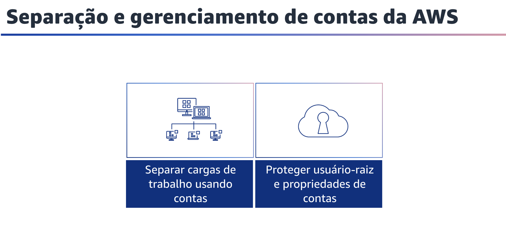
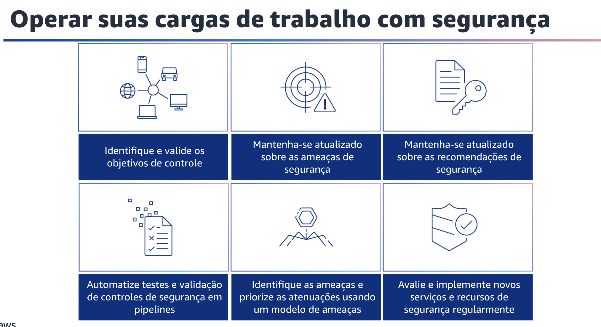

## 1.12 Separação e gerenciamento de contas da AWS

Separação e gerenciamento de contas da AWS. É uma prática recomendada organizar as cargas de trabalho em contas separadas e contas de grupo. Isso pode ser baseado na função, nos requisitos de conformidade ou em um conjunto comum de controles, em vez de espelhar a estrutura de relatórios da sua organização. Na AWS, as contas são um limite rígido. Por exemplo, a separação em nível de conta é altamente recomendada para isolar as cargas de trabalho de produção das cargas de trabalho de desenvolvimento e teste. Você deve gerenciar contas, definir controles e configurar serviços e recursos de forma centralizada. Para separar as cargas de trabalho usando contas, você pode estabelecer proteções comuns e isolamento entre ambientes (como produção, desenvolvimento e teste) e cargas de trabalho por meio de uma estratégia de várias contas. A separação em nível de conta é altamente recomendada porque fornece um limite de isolamento forte para segurança, faturamento e acesso. Você também deve proteger o usuário-raiz e as propriedades da conta. O usuário-raiz é o usuário mais privilegiado em uma conta AWS, com acesso administrativo total a todos os recursos da conta. Em alguns casos, ele não pode ser limitado por políticas de segurança. Você pode tomar as seguintes medidas para ajudar a reduzir o risco de exposição inadvertida de credenciais-raiz e o subsequente comprometimento do ambiente de nuvem. Desative o acesso programático ao usuário-raiz, estabeleça controles apropriados para o usuário-raiz e evite o seu uso rotineiro.

## 1.13 Operar suas cargas de trabalho com segurança

Para operar sua carga de trabalho com segurança, você deve aplicar as práticas recomendadas abrangentes a todas as áreas de segurança. Utilize os requisitos e processos definidos na excelência operacional em nível organizacional e de carga de trabalho e aplique-os a todas as áreas. Manter-se atualizado com as recomendações da AWS e do setor e com a inteligência sobre ameaças ajuda a desenvolver o seu modelo de ameaças e os objetivos de controle. Automatizar processos de segurança, testes e validação ajuda a dimensionar suas operações de segurança. Considere as seguintes práticas recomendadas para operar sua carga de trabalho com segurança. Primeiro, identifique e valide os objetivos de controle. Com base nos requisitos de conformidade e nos riscos identificados no modelo de ameaças, obtenha e valide os objetivos de controle e os controles que você precisa aplicar à sua carga de trabalho. A validação contínua de objetivos de controle e controles ajudam a medir a eficácia da mitigação de riscos. Para ajudar você a definir e implementar controles adequados, reconheça os vetores de ataque mantendo-se atualizado com as ameaças de segurança mais recentes. Mantenha-se atualizado sobre as recomendações de segurança da AWS e do setor para aprimorar o procedimento de segurança de sua carga de trabalho. Automatize testes e validação de controles de segurança em pipelines. Estabeleça linhas de base e modelos seguros para mecanismos de segurança que são testados e validados como parte de sua construção, pipelines e processos. Use ferramentas e automação para testar e validar continuamente todos os controles de segurança. Identifique as ameaças e priorize as atenuações usando um modelo de ameaças. Realize a modelagem de ameaças para identificar e manter um registro atualizado de possíveis ameaças e atenuações associadas à sua carga de trabalho. Priorize ameaças e adapte mitigações de controle de segurança para prevenir, detectar e responder. Revisite-as e mantenha-as no contexto de sua carga de trabalho e do cenário de segurança em evolução. Avalie e implemente serviços e recursos de segurança da AWS e dos parceiros da AWS para ajudar você a aprimorar o procedimento de segurança de sua carga de trabalho.
