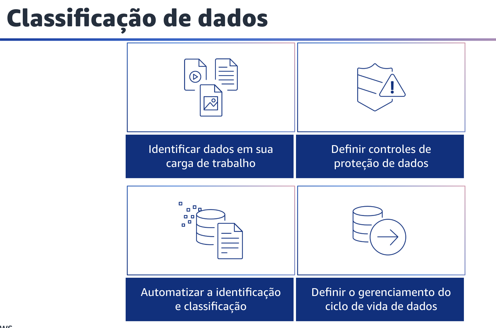
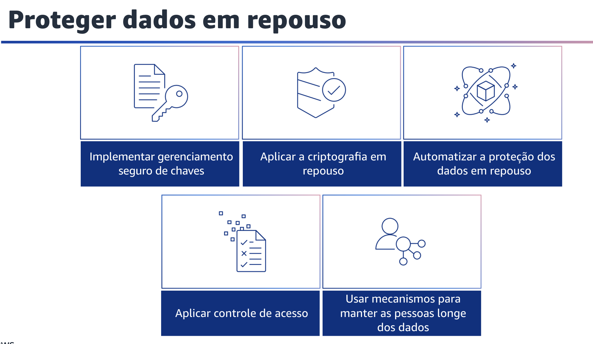
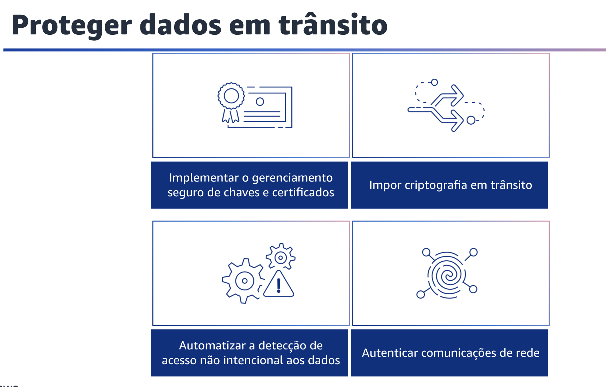

## 1.23 Classificação de dados

Classificação de dados. A classificação de dados oferece uma maneira de categorizar os dados organizacionais com base na criticidade e na confidencialidade. Isso pode ajudar você a determinar os controles adequados de proteção e retenção. Identifique os dados em sua carga de trabalho. É fundamental entender o tipo e a classificação dos dados que sua carga de trabalho está processando, os processos comerciais associados, onde os dados estão armazenados e quem é o proprietário dos dados. Você também deve entender sobre normas legais e de conformidade aplicáveis à sua carga de trabalho e quais controles de dados precisam ser aplicados. A identificação dos dados é a primeira etapa da jornada de classificação de dados.

É importante definir os controles de proteção de dados. Você pode proteger os dados de acordo com seu nível de classificação. Automatizar a identificação e a classificação dos dados ajuda a implementar os controles corretos. O uso da automação, em vez do acesso direto de uma pessoa, reduz o risco de erro humano e exposição. Você também pode definir o gerenciamento do ciclo de vida dos dados. Sua estratégia deve ser baseada no nível de confidencialidade, juntamente com os requisitos legais e da organização.
Aspectos como a duração da retenção de dados, processos de destruição de dados, gerenciamento de acesso a dados, transformação de dados e compartilhamento de dados devem ser considerados.

## 1.24 Proteger dados em repouso

Proteger dados em repouso. Os dados em repouso representam todos os dados que persistem no armazenamento não volátil por qualquer duração em sua carga de trabalho. Isso inclui armazenamento em bloco, armazenamento de objeto, bancos de dados, arquivos, dispositivos de IoT e qualquer outra mídia de armazenamento na qual os dados são mantidos. A proteção dos seus dados em repouso reduz o risco de acesso não autorizado quando a criptografia e os controles de acesso apropriados são implementados.
Considere as seguintes práticas recomendadas para proteger esses dados.

Primeiro, implemente o gerenciamento seguro de chaves.
Defina uma abordagem de criptografia que inclua o armazenamento, a alternância e o controle de acesso das chaves. Isso ajuda você a proteger o conteúdo contra usuários não autorizados e a exposição desnecessária a usuários autorizados.
Em seguida, aplique a criptografia em repouso. Você deve impor o uso de criptografia para dados em repouso. A criptografia mantém a confidencialidade dos dados sigilosos em caso de acesso não autorizado ou divulgação acidental.

Também é possível automatizar a proteção de dados em repouso usando ferramentas automatizadas para validar e aplicar controles de dados em repouso continuamente. Imponha o controle de acesso. Para ajudar a proteger seus dados em repouso, imponha o controle de acesso usando mecanismos como isolamento e versionamento e aplique o princípio de menor privilégio. Previna a concessão de acesso público aos seus dados. Por fim,use mecanismos para distanciar as pessoas dos dados. Mantenha todos os usuários longe do acesso direto a sistemas e dados sigilosos em circunstâncias operacionais normais.

## 1.25 Proteger dados em trânsito

Proteger dados em trânsito. Dados em trânsito são quaisquer dados enviados de um sistema para outro. Isso inclui a comunicação entre os recursos da sua carga de trabalho e também a comunicação entre outros serviços e seus usuários finais. Ao fornecer o nível adequado de proteção para dados em trânsito, você protege a confidencialidade e a integridade dos dados de sua carga de trabalho. Considere as seguintes práticas recomendadas para proteger os dados em trânsito.

Primeiro,implemente o gerenciamento seguro de chaves e certificados.
Armazene chaves de criptografia e certificados de forma segura e troque-os em intervalos de tempo apropriados com controle de acesso rigoroso.

Segundo, imponha criptografia em trânsito.
Imponha os requisitos de criptografia definidos com base nas políticas, obrigações regulamentares e padrões da sua organização para ajudar a atender aos requisitos organizacionais, legais e de conformidade. Use apenas protocolos com criptografia ao transmitir dados sigilosos para fora de sua VPC. A criptografia ajuda a manter a confidencialidade dos dados, mesmo quando eles transitam por redes não confiáveis.

Terceiro, automatize a detecção de acesso não intencional aos dados.
Use ferramentas como o Amazon GuardDuty para detectar automaticamente atividades suspeitas ou tentativas de mover dados para fora dos limites definidos. Autentique as comunicações de rede. Verifique a identidade das comunicações usando protocolos que suportam autenticação, como Transport Layer Security ou IPsec.
