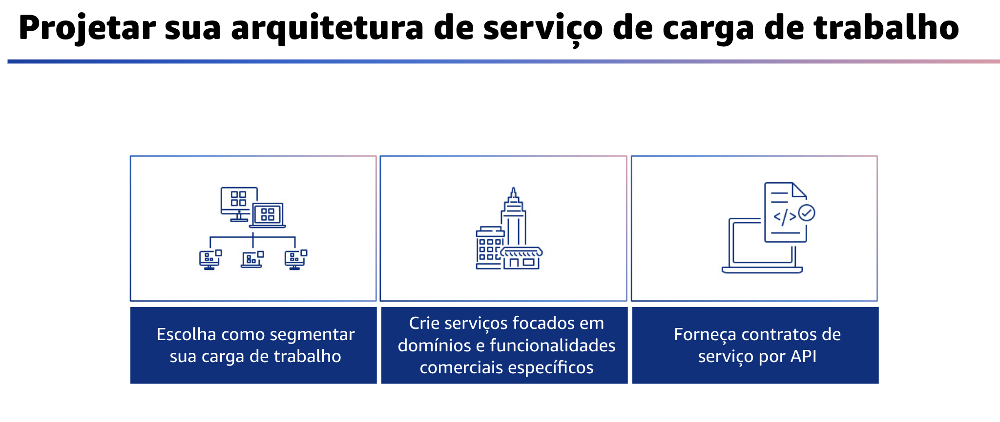
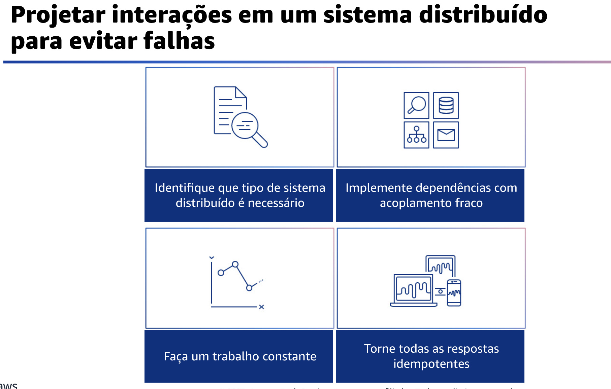
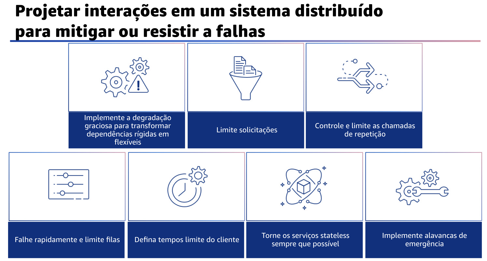

## 1.14 Projetar sua arquitetura de serviço de carga de trabalho

Projete sua arquitetura de serviço de carga de trabalho. Crie cargas de trabalho altamente dimensionáveis e confiáveis usando uma arquitetura orientada a serviços ou uma arquitetura de microsserviços. A arquitetura orientada a serviços é a prática de tornar os componentes de software reutilizáveis por meio de interfaces de serviço. A arquitetura de microsserviços vai além para tornar os componentes menores e mais simples.

Para projetar sua arquitetura, primeiro escolha como segmentar sua carga de trabalho. A segmentação da carga de trabalho é importante ao determinar os requisitos de resiliência de sua aplicação. Evite a arquitetura monolítica sempre que possível. Em vez disso, considere cuidadosamente quais componentes da aplicação podem ser divididos em microsserviços. Dependendo dos requisitos de sua aplicação, isso pode acabar combinando a arquitetura orientada a serviços com microsserviços, sempre que possível. As cargas de trabalho que são capazes de ser stateless são mais capazes de serem implantadas como microsserviços.

Em seguida, crie serviços focados em domínios e funcionalidades comerciais específicos. A arquitetura orientada a serviços cria serviços com funções bem delineadas, definidas pelas necessidades comerciais. Os microsserviços usam modelos de domínio e contexto delimitado para limitar ainda mais isso, de modo que cada serviço faça apenas uma coisa. O foco na funcionalidade ajuda a diferenciar os requisitos de confiabilidade de cada serviço e a direcionar melhor os investimentos. Também é possível fazer um dimensionamento mais rápido da organização com um problema comercial conciso e uma pequena equipe associada a cada serviço.

Por fim, forneça contratos de serviço por API. Os contratos de serviço são acordos documentados entre as equipes sobre a integração de serviços. Eles incluem uma definição de API legível por máquina, limites de taxa e expectativas de desempenho. Uma estratégia de versionamento ajuda seus clientes a continuar usando a API existente para migrar suas aplicações para uma API mais nova quando estiverem prontos. A implantação pode ocorrer a qualquer momento desde que o contrato não seja violado. A equipe do provedor de serviços pode usar a pilha de tecnologia de sua escolha para satisfazer o contrato da API. Da mesma forma, o consumidor do serviço pode usar sua própria tecnologia.

## 1.15 Projetar interações em um sistema distribuído para evitar falhas

Projete interações em um sistema distribuído para evitar falhas. Os sistemas distribuídos dependem de redes de comunicação para interconectar componentes, como servidores ou serviços. Sua carga de trabalho deve operar de forma confiável, apesar da perda de dados ou latência nessas redes. Os componentes do sistema distribuído devem operar de forma que não impacte negativamente outros componentes ou a carga de trabalho. Essas práticas recomendadas podem ajudar a evitar falhas e melhorar o tempo médio entre falhas, ou MTBF.

Primeiro, identifique que tipo de sistema distribuído é necessário.
Os sistemas distribuídos em tempo real exigem que as respostas sejam dadas de forma síncrona e rápida. Os sistemas flexíveis em tempo real têm uma janela de tempo mais generosa, de minutos ou mais, para resposta. Os sistemas off-line tratam as respostas por meio de processamento em batch ou assíncrono. Os sistemas distribuídos em tempo real rígido têm os requisitos de confiabilidade mais rigorosos.

Em segundo lugar, implemente dependências com acoplamento fraco.
Dependências como sistemas de enfileiramento, sistemas de streaming, fluxos de trabalho e balanceadores de carga são fracamente acoplados. O acoplamento fraco ajuda a isolar o comportamento de um componente de outros componentes que dependem dele, aumentando a resiliência e a agilidade.

Terceiro, faça um trabalho constante.
Os sistemas podem falhar quando há mudanças grandes e rápidas na carga. Por exemplo, se a sua carga de trabalho estiver fazendo uma health check que monitora a health de milhares de servidores, ela deverá enviar o mesmo tamanho de payload (um snapshot completo do estado atual) todas as vezes. Independentemente de nenhum servidor estar falhando ou de todos eles, o sistema de health check está fazendo um trabalho constante, sem grandes e rápidas alterações.

Por fim, torne todas as respostas idempotentes.
Um serviço idempotente promete que cada solicitação seja concluída exatamente uma vez, de modo que fazer várias solicitações idênticas tem o mesmo efeito que fazer uma única solicitação. Um serviço idempotente ajuda um cliente a implementar novas tentativas sem medo de que uma solicitação seja processada erroneamente várias vezes. Para fazer isso, os clientes podem emitir solicitações de API com um token de idempotência - o mesmo token é usado sempre que a solicitação é repetida. Uma API de serviço idempotente usa o token para retornar uma resposta idêntica à resposta que foi retornada na primeira vez em que a solicitação foi concluída.

## 1.16 Projetar interações em um sistema distribuído para mitigar

Projete interações em um sistema distribuído para mitigar ou resistir a falhas. Os sistemas distribuídos dependem de redes de comunicação para interconectar componentes, como servidores ou serviços. Sua carga de trabalho deve operar de forma confiável, apesar da perda de dados ou da latência nessas redes. Os componentes do sistema distribuído devem operar de forma que não impacte negativamente outros componentes ou a carga de trabalho. Essas práticas recomendadas ajudam as cargas de trabalho a resistir a estresses ou falhas a se recuperar mais rapidamente e a atenuar o impacto dessas deficiências. O resultado é um melhor tempo médio de recuperação, ou MTTR.

Implemente a degradação graciosa para transformar as dependências rígidas aplicáveis em dependências flexíveis. Quando as dependências de um componente não estão saudáveis, o próprio componente ainda pode funcionar, embora de forma degradada. Por exemplo, quando uma chamada de dependência falhar, faça o failover para uma resposta estática predeterminada.

A limitação de solicitações é um padrão de atenuação para responder a um aumento inesperado na demanda. Algumas solicitações são atendidas, mas as que ultrapassam um limite definido são rejeitadas e retornam uma mensagem indicando que foram limitadas. A expectativa dos clientes é que eles recuem e abandonem a solicitação ou tentem novamente em um ritmo mais lento.

Controle e limite as chamadas de repetição. Use o backoff exponencial para tentar novamente após intervalos progressivamente maiores. Apresente jitter para randomizar esses intervalos de novas tentativas e limitar o número máximo de tentativas.

Falhe rapidamente e limite filas: se a carga de trabalho não puder responder com êxito a uma solicitação, falhe rapidamente. Isso ajuda a liberar os recursos associados a uma solicitação e permite que o serviço se recupere se estiver ficando sem recursos. Se a carga de trabalho for capaz de responder com êxito, mas a taxa de solicitações for muito alta, você poderá usar uma fila para armazenar as solicitações em buffer. No entanto, não permita filas longas que possam resultar no atendimento de solicitações obsoletas das quais o cliente já tenha desistido.

Defina os tempos limite do cliente adequadamente, verifique-os sistematicamente e não confie nos valores padrão, pois eles geralmente são definidos como muito altos. Essa prática recomendada se aplica ao lado do cliente, ou remetente, da solicitação. Torne os serviços stateless sempre que possível. Os serviços não devem exigir estado ou devem descarregar o estado de forma que, entre diferentes solicitações de clientes, não haja dependência de dados armazenados localmente no disco e na memória. Isso ajuda os servidores a serem substituídos à vontade, sem causar um impacto na disponibilidade. Por fim, implemente alavancas de emergência. Esses processos rápidos podem reduzir o impacto da disponibilidade em sua carga de trabalho.

## 1.17 Gerenciamento de alterações

O gerenciamento de alterações é a próxima área de práticas recomendadas de confiabilidade. Alterações à sua carga de trabalho ou ao seu ambiente devem ser previstas e acomodadas para que a operação da carga de trabalho seja confiável. As alterações incluem aquelas impostas à sua carga de trabalho, como picos de demanda. Elas também incluem as de origem interna, como implantações de recursos e patches de segurança. A seção a seguir explica as práticas recomendadas para o gerenciamento de alterações.
Você aprenderá a monitorar os recursos da carga de trabalho, a projetar uma carga de trabalho para se adaptar às mudanças na demanda e a implementar mudanças.

## 1.18 Monitorar recursos de carga de trabalho

Monitore recursos de carga de trabalho. Os logs e as métricas são ferramentas poderosas para obter informações sobre a integridade da sua carga de trabalho.

Você pode configurar sua carga de trabalho para monitorar logs e métricas. Em seguida, eles podem enviar notificações quando os limites são ultrapassados ou quando ocorrem eventos significativos. O monitoramento ajuda sua carga de trabalho a reconhecer quando os limites de baixo desempenho são ultrapassados ou quando ocorrem falhas, para que ela possa se recuperar automaticamente em resposta. Monitore todos os componentes da carga de trabalho. Isso significa que você pode monitorar os componentes da carga de trabalho usando o Amazon CloudWatch ou ferramentas de terceiro. Monitore os serviços AWS com o AWS Health Dashboard.

Defina e calcular métricas. Armazene dados de log e aplique filtros quando necessário para calcular métricas, como contagens de um evento de log específico ou latência calculada a partir de carimbos de data/hora de eventos de log. Envie notificações.
As organizações que precisam saber podem receber notificações quando ocorrerem eventos significativos.

Automatize as respostas implementando o processamento e os alarmes em tempo real. Use a automação para tomar ação quando um evento for detectado, por exemplo, para substituir componentes com falha. Realize analytics coletando arquivos de log e históricos de métricas e, em seguida, analisando-os para obter tendências mais amplas e informações sobre a carga de trabalho.

Conduza análises regularmente. Revise frequentemente como o monitoramento da carga de trabalho é implementado e atualize-o com base em eventos e mudanças significativas. O monitoramento eficaz é orientado pelas principais métricas de negócios. Garanta que essas métricas sejam acomodadas em sua carga de trabalho à medida que as prioridades comerciais mudam.

Por fim, monitore o rastreamento de ponta a ponta das solicitações em seu sistema. Use o AWS X-Ray ou ferramentas de terceiro para que os desenvolvedores possam analisar e depurar rapidamente os sistemas distribuídos. Isso os ajuda a entender o desempenho de suas aplicações e serviços subjacentes.

