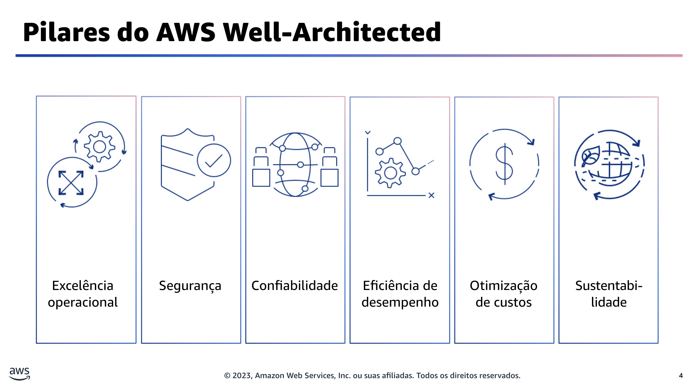
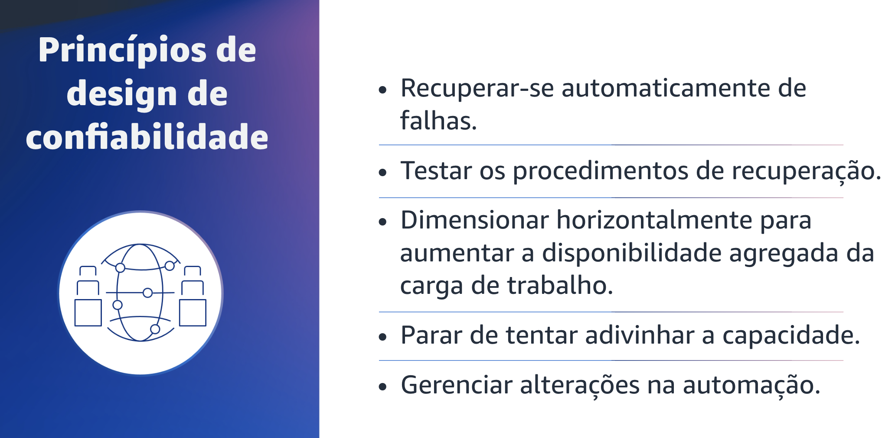

## 1.4 Pilares do AWS Well-Architected

Atualmente, há seis pilares do Well-Architected Framework: excelência operacional, segurança, confiabilidade, eficiência de desempenho, otimização de custos e sustentabilidade. Esses pilares são os fundamentos da arquitetura de suas soluções de tecnologia na nuvem.
Este módulo se concentrará no pilar de confiabilidade

## 1.5 O que é o pilar de confiabilidade?

O que é o pilar de confiabilidade? Como devemos avaliar isso?
Confiabilidade é a capacidade de uma carga de trabalho de executar sua função pretendida de forma correta e consistente durante um período de tempo esperado. O pilar de confiabilidade se concentra na capacidade de uma carga de trabalho de executar sua função pretendida corretamente e de forma consistente quando é esperado. Isso inclui a capacidade de operar e testar a carga de trabalho por meio de seu ciclo de vida total.

## 1.6 Princípios de Design de Confiabilidade

Na nuvem, vários princípios podem ajudar a aumentar a confiabilidade. Agora você vai saber mais sobre esses princípios de design.

## 1.7 Princípios de design de confiabilidade

Primeiro, analise os princípios de design de confiabilidade antes de se aprofundar nas práticas recomendadas. Os princípios de design ajudam a moldar um modelo mental para o pilar de confiabilidade, especialmente se você estiver vindo de um ambiente tradicional on-premises. Um dos princípios é recuperar-se automaticamente de falhas. Para isso, monitore uma carga de trabalho para obter os principais indicadores de desempenho (KPIs) e, em seguida, inicie uma automação para executar um trabalho específico quando o limite for violado.
Esses KPIs devem ser uma medida do valor comercial, não dos aspectos técnicos da operação do serviço. Você pode ter notificação e rastreamento automáticos de falhas e processos de recuperação automatizados que contornam ou reparam a falha. Com automação mais sofisticada, é possível prever e corrigir falhas antes que elas ocorram.

O próximo princípio é testar os procedimentos de recuperação. Em um ambiente on-premises, os testes geralmente são realizados para provar que a carga de trabalho funciona em um cenário específico.
Normalmente, o teste não é usado para validar estratégias de recuperação. Na nuvem, você pode testar como sua carga de trabalho falha e validar seus procedimentos de recuperação. Você pode usar a automação para simular falhas diferentes ou recriar cenários que antes geraram falhas. Essa abordagem expõe caminhos de falha que você pode testar e corrigir antes que ocorra um cenário de falha real, reduzindo assim o risco.
Dimensionar horizontalmente para aumentar a disponibilidade agregada da carga de trabalho. Substitua um recurso grande por vários recursos pequenos para reduzir o impacto de uma única falha na carga de trabalho geral. Distribua solicitações entre vários recursos menores para garantir que eles não compartilhem um ponto comum de falha.
A seguir, pare de adivinhar a capacidade. Uma causa comum de falha em cargas de trabalho on-premises é a saturação de recursos, quando as demandas colocadas em uma carga de trabalho excedem a capacidade dessa carga de trabalho. Um exemplo são os ataques de negação de serviço.
Na nuvem, você pode monitorar a demanda e a utilização da carga de trabalho e automatizar a adição ou remoção de recursos para manter o nível ideal para atender à demanda sem excesso ou falta de provisionamento. Ainda há limites, mas algumas cotas podem ser controladas e outras podem ser gerenciadas.
Outro princípio é como gerenciar as alterações por meio da automação. As alterações em sua infraestrutura devem ser feitas por meio da automação. As alterações que precisam ser gerenciadas incluem alterações na automação, que podem ser rastreadas e analisadas.
