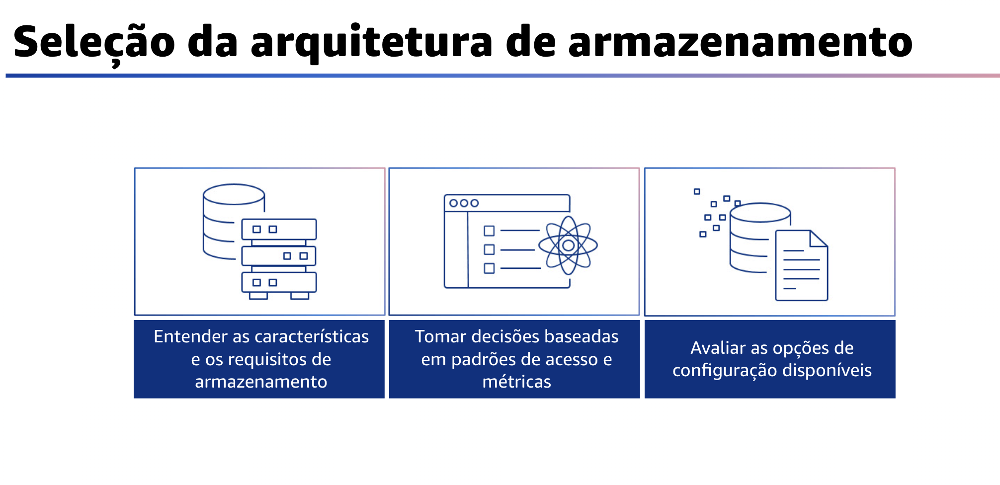

## 1.12 Seleção da arquitetura de computação

Ao selecionar uma arquitetura de computação, escolha recursos de computação que atendam a seus requisitos e necessidades de desempenho e, ao mesmo tempo, ofereçam grande eficiência de custo e esforço. Isso pode ajuda você a realizar mais com o mesmo número de recursos. Porém, a solução de computação ideal para uma carga de trabalho sempre variará com base no design da aplicação, nos padrões de uso e nas definições de configuração. Você deve avaliar as opções de computação disponíveis. Entenda as características de desempenho das opções relacionadas à computação disponíveis para você.

Saiba como funcionam as instâncias, os contêineres e as funções e quais são as vantagens e desvantagens que eles trazem para a sua carga de trabalho. Na AWS, a computação está disponível em três formas: instâncias, contêineres e funções. Além disso, entenda as opções de configuração de computação disponíveis. Como as várias opções complementam sua carga de trabalho e quais opções de configuração são melhores para seu sistema. Os exemplos incluem a família de instâncias, tamanhos, recursos como GPU ou E/S, tamanhos de funções, instâncias de contêineres e único em comparação com multi-tenancy. Você também deve coletar métricas relacionadas à computação. Para entender o desempenho dos seus recursos de computação, é preciso registrar e acompanhar a utilização de vários sistemas.
Você pode usar esses dados para determinar com mais precisão os requisitos de recursos.

Determinar a configuração necessária por meio do dimensionamento correto. Analise as características de desempenho de sua carga de trabalho e como essas características estão relacionadas à memória, à rede, à E/S e ao uso da CPU. Use esses dados para escolher os recursos que melhor atendem ao perfil de sua carga de trabalho. Por exemplo, uma carga de trabalho com uso intensivo de memória, como um banco de dados, pode se beneficiar de uma proporção maior de memória por núcleo. No entanto, uma carga de trabalho com uso intenso de computação pode precisar de uma contagem e frequência de núcleos mais altas, mas pode ser satisfeita com uma quantidade menor de memória por núcleo.
Você também pode usar a elasticidade disponível dos recursos.

A nuvem oferece a flexibilidade de expandir e reduzir seus recursos dinamicamente por meio de uma variedade de mecanismos para atender às mudanças na demanda.
Combinando essa elasticidade com métricas relacionadas à computação, uma carga de trabalho pode responder automaticamente às alterações para usar os recursos de que precisa e somente os recursos de que precisa.
Avalie continuamente as necessidades de computação com base em métricas. Use uma abordagem orientada por dados para avaliar e otimizar os recursos de computação para sua carga de trabalho ao longo do tempo.

## 1.13 Seleção da arquitetura de armazenamento

Para a seleção da arquitetura de armazenamento, a solução de armazenamento ideal para um sistema varia com base no tipo de método de acesso, que pode ser bloco, arquivo ou objeto, e com base no fato de os padrões de acesso serem aleatórios ou sequenciais. A solução de armazenamento ideal varia de acordo com o throughput necessário e as restrições de disponibilidade e durabilidade.

Também pode ser diferente com base na frequência de acesso ou na frequência de atualização. Ao selecionar a solução de armazenamento para sua arquitetura, você pode seguir algumas práticas recomendadas.

Primeiro, entenda as características e os requisitos do armazenamento. Identifique e documente as necessidades de armazenamento da carga de trabalho e defina as características de armazenamento de cada local. Exemplos de características de armazenamento incluem acesso compartilhável, tamanho do arquivo, taxa de crescimento, throughput, operações de entrada e saída por segundo ou IOPS, latência, padrões de acesso e persistência de dados. Use essas características para avaliar se os serviços de armazenamento em bloco, arquivo, objeto ou instância são a solução mais eficiente para suas necessidades de armazenamento. Em seguida, avalie as opções de configuração disponíveis.

Avalie as diversas características e opções de configuração e como se relacionam ao armazenamento. Entenda onde e como usar IOPS provisionado, unidade de estado sólido ou SSDs, armazenamento magnético, armazenamento de objetos, armazenamento de arquivos ou armazenamento temporário para otimizar o espaço de armazenamento e o desempenho de sua carga de trabalho.
A última prática recomendada é tomar decisões com base em padrões e métricas de acesso. Escolha sistemas de armazenamento com base nos padrões de acesso de sua carga de trabalho e configure-os determinando como a carga de trabalho acessa os dados. Aumente a eficiência do armazenamento escolhendo o armazenamento em objetos em vez do armazenamento em blocos. Configure as opções de armazenamento escolhidas de acordo com seus padrões de acesso aos dados.

## 1.14 Seleção da arquitetura do banco de dados

Com relação à seleção da arquitetura do banco de dados, escolher a solução e os recursos errados para um sistema pode reduzir a eficiência do desempenho.
Portanto, ao decidir por uma solução de banco de dados ideal, é importante considerar os requisitos. Os exemplos incluem disponibilidade, consistência, tolerância a partições, latência, durabilidade, dimensionamento e capacidade de consulta. Você pode seguir as práticas recomendadas ao selecionar a solução de banco de dados ideal para sua carga de trabalho.

Primeiro, entenda as características dos dados. Escolha suas soluções de gerenciamento de dados para corresponder de forma ideal às características, aos padrões de acesso e aos requisitos de seus conjuntos de dados de carga de trabalho. Ao selecionar e implementar uma solução de gerenciamento de dados, certifique-se de que as características de consulta, scaling e armazenamento sejam compatíveis com os requisitos de dados da carga de trabalho. Saiba como as opções de banco de dados correspondem aos seus modelos de dados e quais opções de configuração são melhores para o seu caso de uso.Depois, avalie as opções disponíveis.

Entenda as opções de banco de dados disponíveis e como elas podem otimizar seu desempenho antes de selecionar sua solução de gerenciamento de dados.
Use o teste de carga para identificar as métricas do banco de dados que são importantes para sua carga de trabalho. Enquanto você explora as opções de banco de dados, considere as opções de grupos de parâmetros, armazenamento, memória, computação, réplica de leitura, consistência eventual, pool de conexões e armazenamento em cache. Faça experiências com essas opções de configuração para aprimorar as métricas.

Além disso, colete e registre as métricas de desempenho do banco de dados para entender o desempenho dos sistemas de gerenciamento de dados. Essas métricas o ajudarão a otimizar os recursos de gerenciamento de dados para garantir que os requisitos da carga de trabalho sejam atendidos e que você tenha uma visão geral clara do desempenho da carga de trabalho.
Use ferramentas, bibliotecas e sistemas que registram medições de desempenho para o desempenho do banco de dados. Escolha o armazenamento de dados com base em padrões de acesso. Use os padrões de acesso da carga de trabalho e os requisitos das aplicações para decidir sobre as tecnologias e os serviços de dados ideais a serem usados. Por fim, otimize o armazenamento de dados com base em padrões e métricas de acesso.

Use características de desempenho e padrões de acesso que otimizem a forma como os dados são armazenados ou consultados para obter o melhor desempenho. Avalie como as otimizações, como indexação, distribuição de chaves, projeto de data warehouse ou estratégias de cache, afetam o desempenho do sistema ou a eficiência geral.
