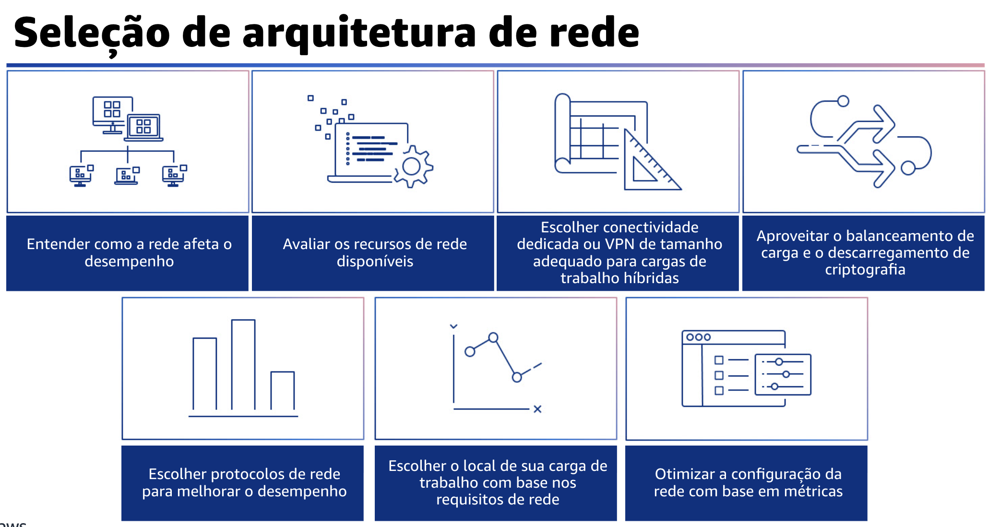

## 1.15 Seleção de arquitetura de rede

A seleção da arquitetura de rede pode ter grandes impactos (positivos e negativos) no desempenho e no comportamento da carga de trabalho, porque a rede está entre todos os componentes da carga de trabalho. Há também cargas de trabalho que dependem muito do desempenho da rede, como a computação de alto desempenho, ou HPC, em que o conhecimento profundo da rede é importante para aumentar o desempenho do cluster. Você deve determinar os requisitos de carga de trabalho para largura de banda, latência, jitter e throughput.

Primeiro, você deve analisar e entender como as decisões relacionadas à rede afetam o desempenho da carga de trabalho. A rede é responsável pela conectividade entre os componentes da aplicação, os serviços de nuvem, as redes de borda e os dados no local. Portanto, isso pode afetar muito o desempenho da carga de trabalho. Além do desempenho da carga de trabalho, a experiência do usuário também é afetada pela latência da rede, pela largura de banda, pelos protocolos, pelo local, pelo congestionamento da rede, pelo jitter, pelo throughput e pelas regras de roteamento.
Você também deve avaliar os recursos de rede na nuvem que podem aumentar o desempenho. Meça o impacto desses recursos por meio de testes, métricas e análises. Por exemplo, aproveite os recursos em nível de rede que estão disponíveis para reduzir a latência, a distância da rede ou o jitter. Escolha conectividade dedicada ou redes privadas virtuais (VPNs) de tamanho adequado para cargas de trabalho híbridas.

Quando for necessária uma rede comum para conectar recursos locais e de nuvem na AWS, verifique se você tem largura de banda adequada para atender aos requisitos de desempenho. Faça uma estimativa dos requisitos de largura de banda e latência para sua carga de trabalho híbrida. Esses números determinarão os requisitos de dimensionamento de suas opções de conectividade. Além disso, use balanceamento de carga e descarregamento de criptografia. Os balanceadores de carga podem ajudar a obter eficiência de desempenho ideal dos recursos de destino e melhorar a capacidade de resposta do sistema.
Você deve avaliar os requisitos de desempenho da sua carga de trabalho e escolher os protocolos de rede que otimizam o desempenho geral da carga de trabalho. Há uma relação entre a latência e a largura de banda para atingir o throughput.

Por exemplo, se a sua transferência de arquivos estiver usando TCP, latências mais altas reduzirão o throughput geral. Há abordagens para corrigir isso com o ajuste do TCP e protocolos de transferência otimizados. Algumas abordagens usam o Protocolo de datagrama de usuário, ou UDP.

O protocolo Scalable Reliable Datagram (SRD), ou Datagrama confiável e dimensionável, é um protocolo de transporte de rede criado pela AWS para Elastic Fabric Adapters (EFAs) que fornece entrega confiável de datagramas. Ao contrário do protocolo TCP, o SRD pode reordenar os pacotes e entregá-los fora de ordem. Esse mecanismo de entrega fora de ordem do SRD envia pacotes em paralelo por caminhos alternativos, aumentando o throughput.
Você também deve escolher o local da sua carga de trabalho com base nos requisitos da rede.

Avalie as opções de posicionamento de recursos para reduzir a latência da rede e melhorar o throughput, proporcionando uma experiência do usuário ideal ao reduzir o tempo de carregamento da página e de transferência de dados. Por fim, você deve otimizar a configuração da rede com base nas métricas.

A configuração inadequada da rede pode afetar o desempenho, a eficiência e o custo da rede. Em ambientes de rede comuns, para concluir rapidamente a implantação em estágio inicial, a configuração adequada da rede não é totalmente considerada em termos de desempenho da rede.
Para otimizar a configuração da rede, primeiro é preciso ter visibilidade e dados sobre o ambiente de rede.

Para entender o desempenho dos seus recursos de rede, colete e analise dados para tomar decisões informadas sobre a otimização da configuração da rede. Meça o impacto dessas mudanças e use as medições de impacto para tomar decisões futuras.

## 1.16 Análise

A análise é a segunda área de práticas recomendadas de eficiência de desempenho.
