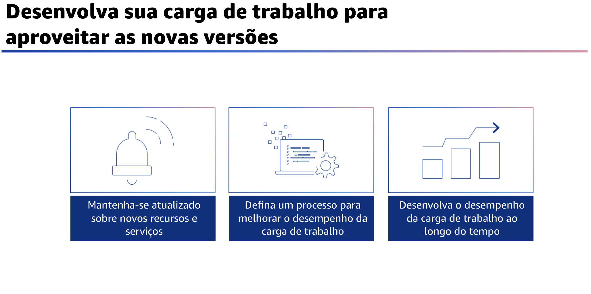
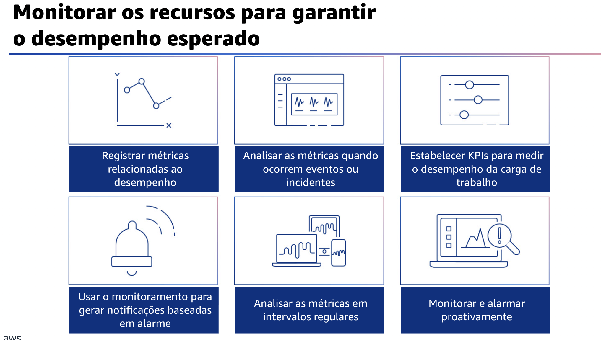

## 1.17 Desenvolva sua carga de trabalho para aproveitar as novas versões

Desenvolva sua carga de trabalho para aproveitar as vantagens das novas versões. Quando você arquiteta cargas de trabalho, há um número limitado de opções que você pode escolher. No entanto, ao longo do tempo, novas tecnologias e abordagens que se tornam disponíveis poderiam melhorar o desempenho de sua carga de trabalho. Existem práticas recomendadas que você pode seguir para revisar e desenvolver continuamente suas cargas de trabalho para aproveitar as vantagens das novas versões.

Primeiro, avalie as maneiras de melhorar o desempenho à medida que novos serviços, padrões de design e ofertas de produtos forem disponibilizados. Determine quais deles poderiam melhorar o desempenho ou aumentar a eficiência da carga de trabalho por meio de avaliação, discussão interna ou análise externa.

Além disso, defina um processo para melhorar o desempenho da carga de trabalho, avaliando novos serviços, padrões de projeto, tipos de recursos e configurações à medida que forem disponibilizados. Por exemplo, execute testes de desempenho existentes em novas ofertas de instância para determinar seu potencial de melhorar sua carga de trabalho.

Por fim, desenvolva o desempenho da carga de trabalho ao longo do tempo. Como organização, use as informações coletadas por meio do processo de avaliação para promover ativamente a adoção de novos serviços ou recursos quando eles estiverem disponíveis.

## 1.18 Monitoramento

O monitoramento é a terceira área de práticas recomendadas de eficiência de desempenho.

## 1.19 Monitorar os recursos para garantir o desempenho esperado

Monitore os recursos para garantir o desempenho esperado após a
implementação da carga de trabalho para corrigir qualquer problema ou desvio dos níveis de desempenho esperados. Para isso, primeiro use um serviço de monitoramento e observabilidade para registrar métricas relacionadas ao desempenho. Por exemplo, registre transações de banco de dados, consultas lentas, latência de E/S, throughput de solicitações HTTP, latência de serviço ou outros dados importantes.

Você também deve analisar as métricas quando ocorrerem eventos ou incidentes, usando painéis ou relatórios de monitoramento para entender e diagnosticar o impacto. Essas exibições fornecem informações sobre quais partes da carga de trabalho não estão funcionando conforme o esperado. Estabeleça os principais indicadores de desempenho, ou KPIs, para medir o desempenho da carga de trabalho. Por exemplo, uma carga de trabalho baseada em API pode usar a latência geral da resposta como uma indicação do desempenho geral.

Um site de comércio eletrônico pode optar por usar o número de compras como seu KPI. Em seguida, com os KPIs relacionados ao desempenho que você definiu, use um sistema de monitoramento que gere alarmes automaticamente quando essas medições estiverem fora dos limites esperados.

Você também deve analisar as métricas em intervalos regulares. Como manutenção de rotina ou em resposta a eventos ou incidentes, analise quais métricas são coletadas.

Use essas revisões para identificar quais métricas foram fundamentais para resolver os problemas e quais métricas adicionais, se estivessem sendo monitoradas, ajudariam a identificar, resolver ou evitar problemas. Por fim, monitore e emita alarmes de forma proativa.

Use KPIs, combinados com sistemas de monitoramento e alerta, para tratar proativamente de problemas relacionados ao desempenho. Use alarmes para automatizar ações e corrigir problemas sempre que possível.

Escale o alarme para aqueles capazes de responder se a resposta automática não for possível. Por exemplo, você pode ter um sistema capaz de prever os valores esperados de KPI e enviar um alarme quando eles violarem determinados limites. Você também pode ter uma ferramenta para interromper ou reverter automaticamente as implantações se os KPIs estiverem fora dos valores esperados.
