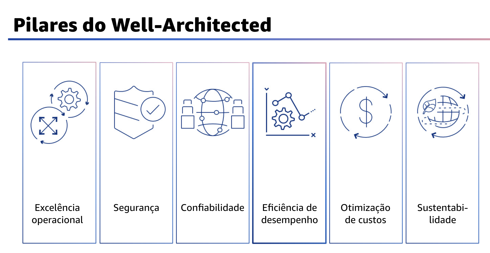
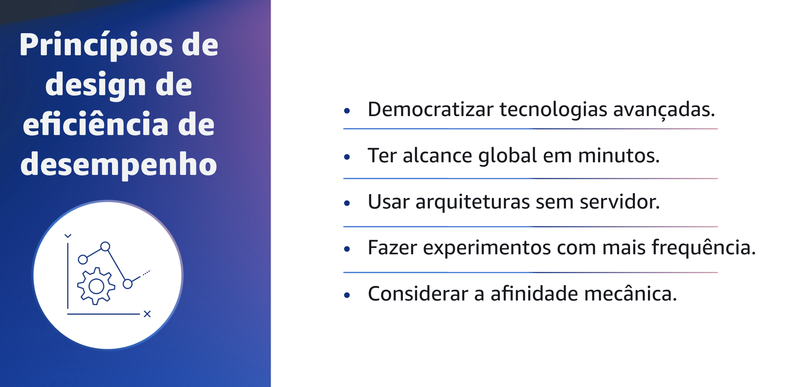

## 1.4 Pilares do Well-Architected

Atualmente, há seis pilares do Well-Architected Framework:
excelência operacional, segurança, confiabilidade, eficiência de desempenho, otimização de custos e sustentabilidade. Esses pilares são os fundamentos da arquitetura de suas soluções de tecnologia na nuvem. Este módulo se concentrará no pilar de eficiência de desempenho.

## 1.5 O que é o pilar de eficiência de desempenho?

O que é o pilar de eficiência de desempenho? O pilar de eficiência de desempenho concentra-se no uso eficiente dos recursos de computação para atender aos requisitos e manter a eficiência à medida que a demanda muda e as tecnologias evoluem.

## 1.6 Princípios de design de eficiência de desempenho

Agora que você já sabe o que é o pilar de eficiência de desempenho, vai se aprofundar nos princípios de design do pilar de eficiência de desempenho.

## 1.7 Princípios de design de eficiência de desempenho

Há cinco princípios de design para a eficiência do desempenho na nuvem.

O primeiro princípio de design é democratizar as tecnologias avançadas.
Simplifique a implementação de tecnologia avançada para a sua equipe e delegue tarefas complexas ao seu fornecedor de nuvem. Não peça à sua equipe de TI para hospedar uma nova tecnologia. Em vez disso, considere consumi-la como um serviço. Na nuvem, as tecnologias que, de outra forma, exigiriam conhecimento especializado, como Machine Learning e bancos de dados NoSQL, tornam-se serviços que sua equipe pode usar. Isso permite que a equipe tenha mais tempo para se concentrar no desenvolvimento de produtos, em vez de gastar tempo com o provisionamento e o gerenciamento de recursos.

O segundo princípio é tornar-se global em minutos.
A implantação em várias Regiões ajuda a aproximar sua carga de trabalho do seu público global. Isso pode resultar em menor latência e em uma experiência melhor. Por exemplo, aproveitando serviços como o AWS CloudFormation, você pode ativar rapidamente recursos em diferentes regiões geográficas globais com o mínimo de sobrecarga. Isso pode oferecer melhor desempenho aos usuários de aplicações e fornecer acesso a outros recursos ou funcionalidades que podem existir em diferentes Regiões.

Outro princípio é usar arquiteturas sem servidor.
As arquiteturas sem servidor eliminam a necessidade de executar e manter servidores físicos para atividades tradicionais de computação. Por exemplo, os serviços de armazenamento sem servidor podem atuar como sites estáticos. Isso elimina a necessidade de servidores da web, e os serviços de eventos podem hospedar códigos. E também reduz a carga operacional do gerenciamento de servidores físicos. Você pode se beneficiar de custos transacionais mais baixos porque os serviços gerenciados operam em escala de nuvem.

O quarto princípio é fazer experimentos com mais frequência.
Na nuvem, com recursos praticamente ilimitados, você pode comparar rapidamente as configurações de suas cargas de trabalho. Isso pode ser tão simples quanto experimentar uma instância de tamanho diferente ou um tipo de armazenamento. Ou quanto experimentar serviços totalmente diferentes, como a execução de código em uma função AWS Lambda em vez de em uma instância do Amazon Elastic Compute Cloud, ou Amazon EC2.

O último princípio de design é considerar a afinidade mecânica.
Alinhe sua abordagem de tecnologia a seus objetivos comerciais gerais, e não o contrário. É importante dedicar algum tempo para entender como os serviços em nuvem são consumidos e usar a abordagem tecnológica que melhor se alinhe às suas metas de carga de trabalho.
Por exemplo, sempre considere os padrões de acesso aos dados ao selecionar abordagens de banco de dados ou armazenamento.
