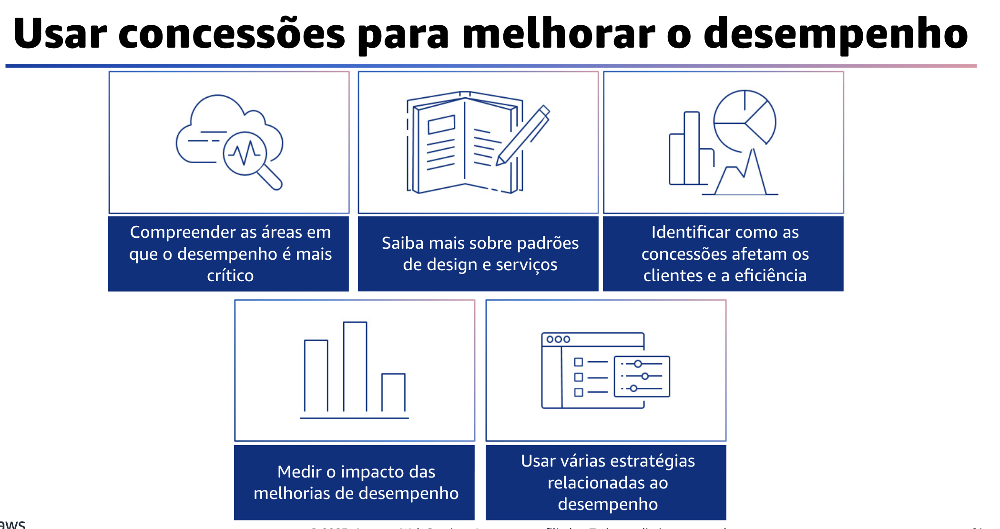

## 1.20 Concessões

As concessões são a última área de práticas recomendadas de eficiência de desempenho.

## 1.21 Usar concessões para melhorar o desempenho

O uso de concessões para melhorar o desempenho ao arquitetar soluções permite que você selecione uma abordagem ideal. Muitas vezes, é possível melhorar o desempenho trocando consistência, durabilidade e espaço por tempo e latência.

Essas práticas recomendadas o ajudarão a responder à pergunta sobre como usar as concessões para melhorar o desempenho. Primeiro, entenda e identifique as áreas em que o aumento do desempenho de sua carga de trabalho terá um impacto positivo na eficiência ou na experiência do cliente. Por exemplo, um site que tenha uma grande quantidade de interação com o cliente pode se beneficiar do uso de serviços de borda para aproximar a entrega de conteúdo dos clientes. Outra prática recomendada é pesquisar e entender os vários padrões de design e serviços que ajudam a melhorar o desempenho da carga de trabalho.

Como parte da análise, identifique o que você poderia negociar para obter maior desempenho. Por exemplo, o uso de um serviço de cache pode ajudar a reduzir a carga colocada nos sistemas de banco de dados. No entanto, isso pode exigir alguma engenharia para implementar o cache seguro ou a possível introdução de consistência eventual em algumas áreas. Além disso, ao avaliar as melhorias relacionadas ao desempenho, determine quais opções afetarão seus clientes e a eficiência da carga de trabalho. Por exemplo, se o uso de um armazenamento de dados de valor-chave aumentar o desempenho do sistema, é importante avaliar como a natureza consistente desse armazenamento afetará os clientes. Meça o impacto das melhorias de desempenho. À medida que forem feitas alterações para melhorar o desempenho, avalie as métricas e os dados coletados. Use essas informações para determinar o impacto que a melhoria de desempenho teve sobre a carga de trabalho, os componentes da carga de trabalho e seus clientes.

Essa medição ajuda a entender as melhorias resultantes da concessão. Ela também pode ajudar a determinar se houve algum efeito colateral negativo. A última prática recomendada é usar várias estratégias relacionadas ao desempenho, quando aplicável.

Por exemplo, você pode usar estratégias como o armazenamento de dados em cache para evitar chamadas excessivas à rede ou ao banco de dados. É possível usar réplicas de leitura para mecanismos de banco de dados para melhorar as taxas de leitura. Você pode experimentar estratégias como sharding ou compactação de dados sempre que possível para reduzir os volumes de dados.

Você também pode usar os resultados de armazenamento em buffer e streaming à medida que estiverem disponíveis para evitar bloqueios.
