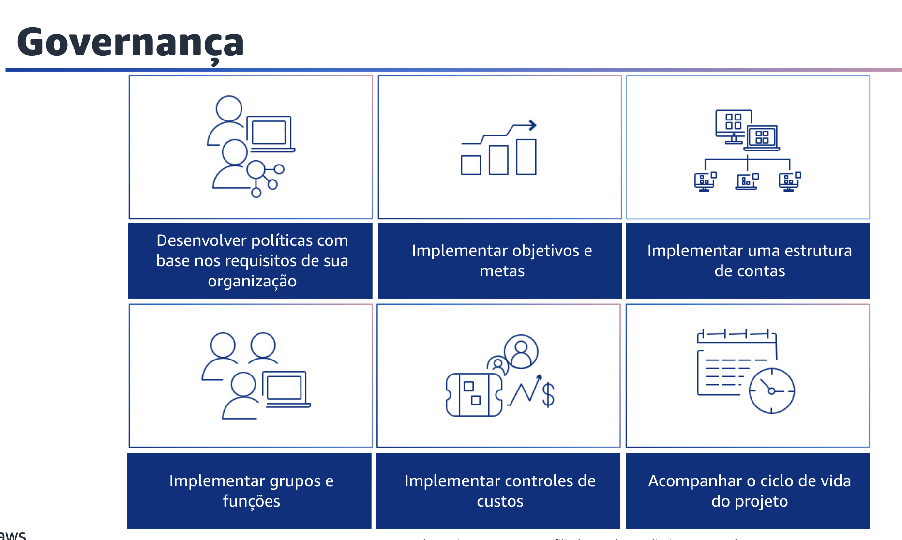
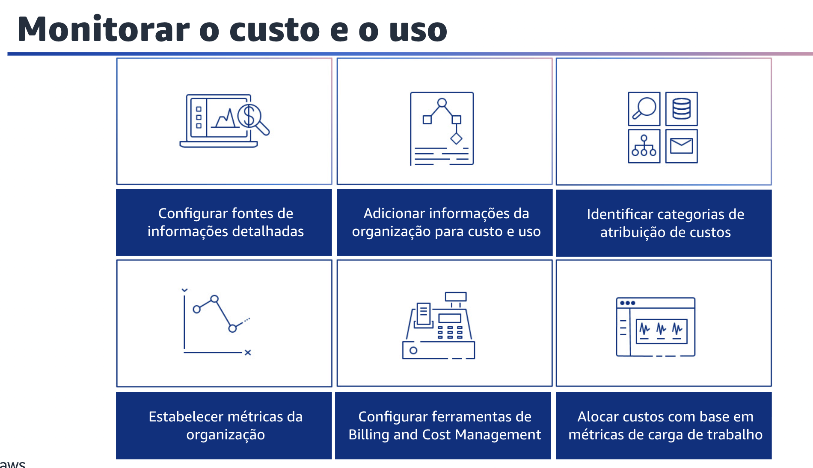

## 1.13 Governança

A governança é usada para estabelecer políticas e mecanismos para garantir que os custos apropriados sejam incorridos enquanto os objetivos são alcançados. Ao empregar uma abordagem de controle e equilíbrio na governança, você pode inovar sem gastar demais.

Primeiro, desenvolva políticas com base nos requisitos de sua organização que definam como os recursos serão gerenciados. As políticas devem abranger aspectos de custo de recursos e cargas de trabalho, incluindo criação, modificação e desativação durante a vida útil do recurso.

Em seguida, implemente metas e objetivos de custo e uso para sua carga de trabalho. Os objetivos orientam sua organização quanto aos resultados esperados, e as metas fornecem resultados mensuráveis específicos a serem alcançados para suas cargas de trabalho. Implemente uma estrutura de contas que corresponda à sua organização. Isso ajuda a alocar e gerenciar os custos em toda a organização.

Você também pode implementar grupos e funções que se alinham às suas políticas. Isso ajuda a controlar quem pode criar, modificar ou desativar instâncias e recursos em cada grupo. Por exemplo, implemente grupos de desenvolvimento, teste e produção. Isso se aplica tanto aos serviços AWS quanto às soluções de terceiro. É possível implementar controles de custo com base nas políticas da organização e nos grupos e funções definidos.

Isso certifica que os custos são incorridos somente conforme definido pelos requisitos da organização. Um exemplo é o controle de acesso a Regiões ou tipos de recursos com as políticas do AWS Identity and Access Management (IAM).

Por fim, acompanhe o ciclo de vida do projeto. Você pode rastrear, medir e auditar o ciclo de vida de projetos, equipes e ambientes para evitar o uso e o pagamento de recursos desnecessários.

## 1.14 Monitorar o custo e o uso

Monitorar o custo e o uso para estabelecer políticas e procedimentos para monitorar e alocar adequadamente seus custos. Isso ajuda você a medir e melhorar a eficiência de custo dessa carga de trabalho. As seguintes áreas são obrigatórias para monitorar seu custo e uso.

Primeiro, configure suas fontes de informação. Para fornecer informações detalhadas de custo e uso, configure a granularidade horária do AWS relatório de uso e custo e do AWS Cost Explorer. Configure sua carga de trabalho para ter entradas de registro para cada resultado comercial fornecido.

Em seguida, adicione informações da organização para custo e uso. Defina um esquema de marcação com base em sua organização, atributos de carga de trabalho e categorias de alocação de custos para que você possa filtrar e pesquisar recursos ou monitorar o custo e o uso em ferramentas de gerenciamento de custos. Implemente uma marcação consistente em todos os recursos, sempre que possível, por finalidade, equipe, ambiente ou outros critérios relevantes para seus negócios. Você também pode identificar categorias de atribuição de custos. Identifique categorias organizacionais que poderiam ser usadas para alocar custos dentro de sua organização.

Além disso, estabeleça as métricas da organização. Identifique as métricas da organização que são necessárias para essa carga de trabalho.
Exemplos de métricas de uma carga de trabalho são os relatórios de clientes produzidos ou as páginas da web fornecidas aos clientes. Você também pode configurar ferramentas de gerenciamento de custos de acordo com as políticas da sua organização para gerenciar e otimizar os gastos com a nuvem.

Isso inclui serviços, ferramentas e recursos para organizar e rastrear dados de custo e uso, além de aumentar o controle por meio de cobrança consolidada e permissão de acesso. Há também serviços, ferramentas e recursos para oferecer suporte a um melhor planejamento por meio de orçamentos e previsões e reduzir ainda mais os custos com recursos e otimizações de preços.

Por fim, aloque os custos da carga de trabalho por métricas ou resultados comerciais para medir a eficiência de custo da carga de trabalho. Implemente um processo para analisar o AWS relatório de uso e custo com o Amazon Athena, que pode fornecer informações e capacidade de estorno.

## 1.15 Desativar recursos

Desativar recursos para implementar o controle de mudanças e o gerenciamento de recursos desde o início do projeto até o fim da vida útil. Isso ajuda a garantir que você termine ou encerre os recursos não utilizados para reduzir o desperdício.

Primeiro, rastreie os recursos ao longo de sua vida útil.
Defina e implemente um método para rastrear recursos e suas associações com sistemas ao longo de sua vida útil. Você pode usar a marcação para identificar a carga de trabalho ou a função do recurso.

Você também pode implementar um processo de desativação para identificar e desativar recursos não utilizados. Desativar recursos invocados por eventos como auditorias periódicas ou alterações no uso. A desativação é normalmente realizada periodicamente e pode ser manual ou automatizada.
Você também pode desativar recursos automaticamente. Projete sua carga de trabalho para que encerre recursos à medida que você identificar e desativar recursos não críticos, recursos que não são necessários ou recursos com baixa utilização.

Por fim, aplique políticas de retenção de dados. Defina políticas de retenção em recursos compatíveis para lidar com a exclusão de objetos de acordo com os requisitos de sua organização. Identifique e exclua recursos e objetos desnecessários ou órfãos que não são mais necessários.
