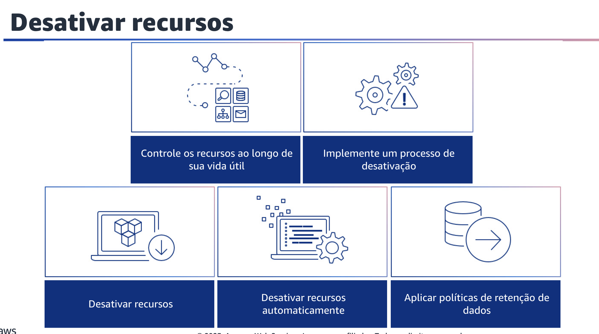

## 1.16 Recursos econômicos

Recursos econômicos é a próxima área de práticas recomendadas de otimização de custos. Usar os serviços, os recursos e as configurações apropriados para suas cargas de trabalho é fundamental para a economia de custos.

## 1.17 Avaliar o custo ao selecionar serviços

Avalie o custo ao selecionar serviços.

- O Amazon Elastic Compute Cloud,
- ou Amazon EC2;
- o Amazon Elastic Block Store, ou Amazon EBS;
- e o Amazon Simple Storage Service, ouAmazon S3;

são serviços AWS que constituem o bloco de construção.

Os serviços gerenciados, como o Amazon Relational Database Service, ou Amazon RDS, e o Amazon DynamoDB, são serviços AWS de nível superior, ou de nível de aplicação. Ao selecionar os componentes básicos e os serviços gerenciados adequados, você pode otimizar uma carga de trabalho em termos de custo. Por exemplo, com o uso de serviços gerenciados, você pode reduzir ou eliminar grande parte de sua sobrecarga administrativa e operacional, liberando-o para trabalhar em aplicações e atividades relacionadas aos negócios.

Considere as práticas recomendadas a seguir para ajudar a avaliar o custo ao
selecionar os serviços certos para sua carga de trabalho.

Primeiro, identifique os requisitos de custo da organização. Trabalhe com os membros da equipe para definir o equilíbrio entre a otimização de custos e outros pilares, como desempenho e confiabilidade, para essa carga de trabalho.

Em seguida, analise todos os componentes da carga de trabalho. Verifique se todos os componentes da carga de trabalho são analisados, independentemente do tamanho ou dos custos atuais. O esforço de revisão deve refletir o benefício potencial, como os custos atuais e projetados.

Em seguida, faça uma análise completa de cada componente. Analise o custo geral de cada componente para a organização. Calcule o custo total de propriedade levando em conta o custo das operações e do gerenciamento, especialmente ao usar serviços gerenciados pelo provedor de nuvem. O esforço de revisão deve refletir o benefício potencial.

Você também pode selecionar um software com licenciamento econômico. O software de código aberto elimina os custos de licenciamento de software, que podem contribuir com custos significativos para as cargas de trabalho.

Quando for necessário um software licenciado, evite licenças vinculadas a atributos arbitrários, como CPUs, e, em vez disso, busque licenças vinculadas a produtos ou resultados. O custo dessas licenças está mais próximo do benefício que elas proporcionam. Selecione os componentes dessa carga de trabalho para otimizar o custo de acordo com as prioridades da organização. Leve em conta o custo ao selecionar todos os componentes para sua carga de trabalho. Isso inclui o uso de serviços gerenciados e em nível de aplicações ou sem servidor, contêineres ou arquitetura orientada a eventos para ajudar a reduzir o custo geral.

Minimize os custos de licença usando software de código aberto, software que não tenha taxas de licença ou alternativas para reduzir o custo. Por fim, realize uma análise de custo para cargas de trabalho que mudam com o tempo. Alguns serviços ou recursos são mais econômicos em diferentes níveis de uso. Ao analisar cada componente ao longo do tempo e de acordo com o uso projetado, a carga de trabalho pode permanecer econômica ao longo de sua vida útil.

## 1.18 Selecionar o tipo, o tamanho e o número corretos de recursos

Selecione o tipo de recurso, o tamanho e o número de recursos corretos para garantir que você tenha a configuração adequada para a tarefa em questão.

Você minimiza o desperdício selecionando o tipo, o tamanho e o número de recursos mais econômicos. Com a AWS, há várias abordagens diferentes.

Primeiro, faça a modelagem de custos. Identifique os requisitos da organização, como necessidades comerciais e compromissos existentes. Depois, execute a modelagem de custos para os custos gerais da carga de trabalho e de cada componente.
Realize atividades de benchmark para a carga de trabalho sob diferentes cargas previstas e, depois, compare os custos. O esforço de modelagem deve refletir o benefício potencial. Por exemplo, o tempo gasto é proporcional ao custo do componente.

Em segundo lugar, selecione o tipo, o tamanho e o número de recursos com base nos dados sobre a carga de trabalho e as características dos recursos. Os exemplos incluem computação, memória, throughput ou gravação intensiva.
Normalmente, essa seleção é feita com base em uma versão anterior da carga de trabalho on-premises, na documentação ou em outras fontes de informação sobre a carga de trabalho.

Terceiro, selecione o tipo, o tamanho e o número de recursos automaticamente com base nas métricas. Use métricas da carga de trabalho em execução no momento para selecionar o tamanho e o tipo corretos para otimizar o custo.
Provisione adequadamente o throughput, o dimensionamento e o armazenamento para serviços de computação, armazenamento, dados e rede.
Isso pode ser feito com um circuito de feedback, como auto scaling ou código personalizado na carga de trabalho.
