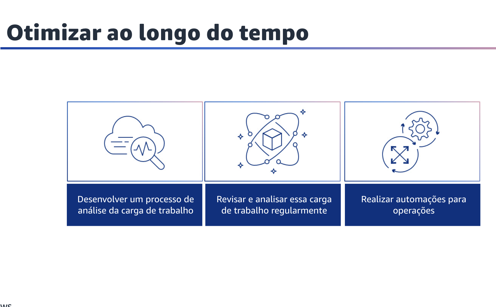

## 1.21 Gerenciar recursos de oferta e demanda

Gerenciar a demanda e os recursos de suprimento é a próxima área de práticas recomendadas de otimização de custos.

Quando você migra para a nuvem, paga apenas pelo que precisa. Você pode fornecer recursos para atender à demanda de carga de trabalho no momento em que eles são necessários, eliminando a necessidade de provisionamento dispendioso.

Você também pode modificar a demanda usando um limitador, buffer ou fila para suavizar a demanda e atendêla com menos recursos. Os benefícios econômicos do fornecimento just-in-time devem ser equilibrados com a necessidade de provisionamento para levar em conta as falhas de recursos, a alta disponibilidade e o tempo de fornecimento.
Dependendo do fato de sua demanda ser fixa ou variável, planeje criar métricas e automação que garantam que o gerenciamento do seu ambiente seja mínimo, mesmo quando você o dimensiona. Ao modificar a demanda, você deve saber o atraso aceitável e máximo que a carga de trabalho pode permitir.

## 1.22 Gerenciar recursos de oferta e demanda

Gerencie recursos de oferta e demanda. Para uma carga de trabalho que tenha gastos e desempenho equilibrados, garanta que tudo o que você paga seja usado e evite subutilizar significativamente as instâncias. Uma métrica de utilização distorcida em qualquer direção pode afetar negativamente sua organização. Isso pode afetar os custos operacionais na forma de desempenho degradado devido à utilização excessiva ou ao desperdício de gastos com a AWS devido ao provisionamento excessivo.
As práticas recomendadas a seguir descrevem como usar essas abordagens.

Primeiro, faça uma análise da demanda de carga de trabalho.
Analise a demanda da carga de trabalho ao longo do tempo. Verifique se a análise abrange tendências sazonais e representa com precisão as condições operacionais durante toda a vida útil da carga de trabalho. O esforço de análise deve refletir o benefício potencial, como, por exemplo, gastar tempo proporcional ao custo da carga de trabalho.

Em segundo lugar, implemente um buffer ou limitador para gerenciar a demanda. O buffering e a limitação modificam a demanda em sua carga de trabalho, suavizando os picos. Implemente a limitação quando seus clientes fizerem novas tentativas. Implemente o buffering para armazenar a solicitação e adiar o processamento para um momento posterior. Verifique se seus limitadores e buffers foram projetados para que os clientes recebam uma resposta no tempo necessário.

Por fim, forneça recursos de forma dinâmica. Os recursos são provisionados de forma planejada. Isso pode ser baseado na demanda, por exemplo, por meio de auto scaling, ou baseado no tempo, em que a demanda é previsível e os recursos são fornecidos com base no tempo. Esses métodos resultam na menor quantidade de excesso ou falta de provisionamento.

## 1.23 Otimizar ao longo do tempo

Otimizar ao longo do tempo é a próxima área de práticas recomendadas de otimização de custos.
Com a AWS, você otimiza ao longo do tempo, analisando novos serviços e implementando-os em sua carga de trabalho. À medida que a AWS lança novos serviços e recursos, é uma prática recomendada revisar suas decisões de arquitetura existentes para ajudar a garantir que elas permaneçam econômicas.
À medida que seus requisitos mudam, tome medidas para desativar recursos, componentes e cargas de trabalho que não são mais necessários.

## 1.24 Otimizar ao longo do tempo

Otimizar ao longo do tempo. À medida que a AWS lança novos serviços e recursos, é uma prática recomendada revisar suas decisões de arquitetura existentes para garantir que elas continuem a ser as mais econômicas.

Primeiro,desenvolva um processo de análise da carga de trabalho que defina os critérios e o processo de análise.
O esforço de análise deve refletir o benefício potencial. Por exemplo, cargas de trabalho essenciais ou cargas de trabalho com um valor superior a 10% da conta devem ser analisadas trimestralmente ou a cada seis meses. As cargas de trabalho abaixo de 10% podem ser revisadas anualmente.

Em segundo lugar, revise e analise essa carga de trabalho com frequência.
As cargas de trabalho existentes são revisadas regularmente com base em cada processo definido. Isso ajuda a determinar se novos serviços podem ser adotados, se os serviços existentes podem ser substituídos ou se as cargas de trabalho podem ser rearquitetadas.

Por fim, execute automações para operações.
Avalie o custo do esforço para operações na nuvem. Quantifique a redução de tempo e esforço para tarefas de administrador, implantação e outras operações usando a automação. Avalie o tempo e o custo necessários para o esforço das operações e automatize as tarefas administrativas para reduzir o esforço humano sempre que possível.
