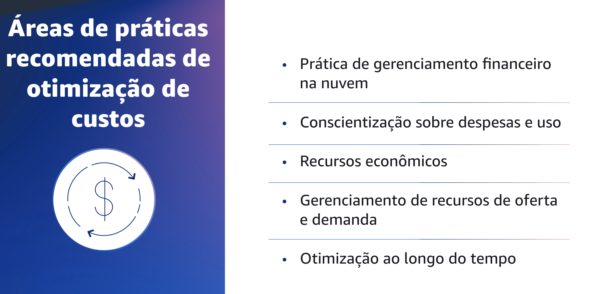
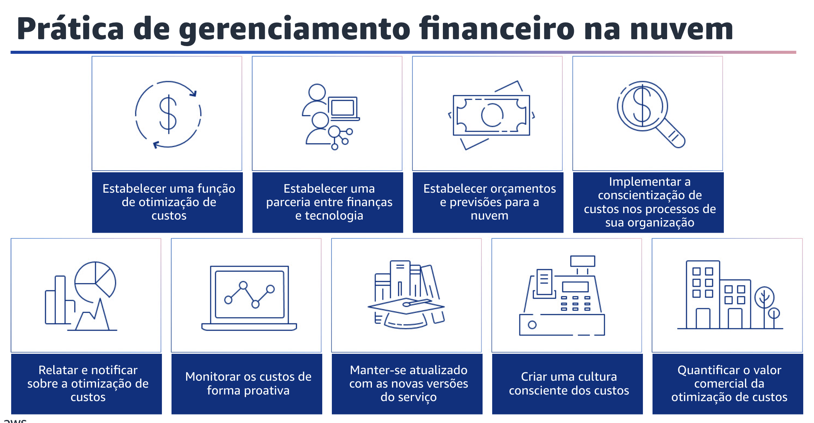
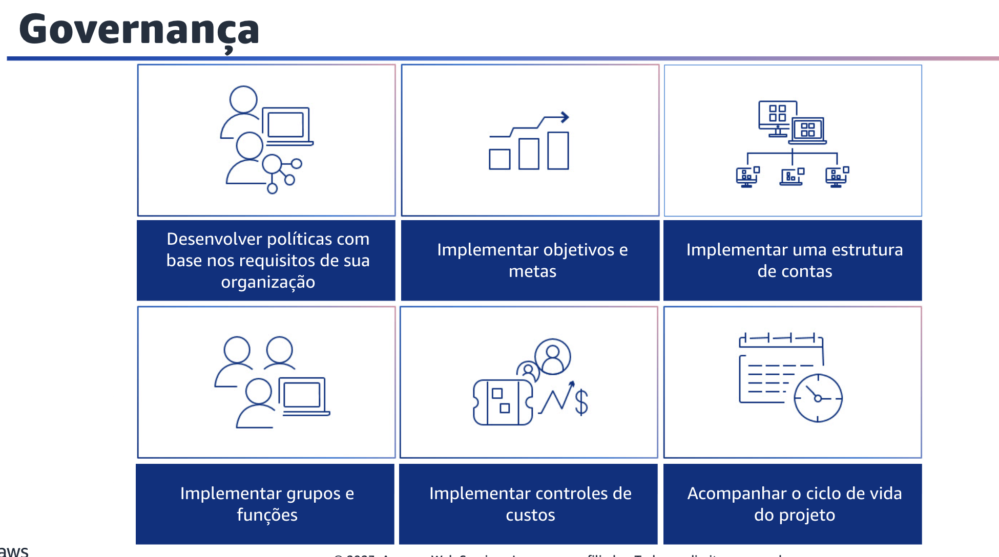

## 1.8 Áreas de práticas recomendadas de otimização de custos

Agora que você entende os princípios de design de otimização de custos, aprenderá sobre as práticas recomendadas de otimização de custos.

## 1.9 Áreas de práticas recomendadas de otimização de custos

O pilar de otimização de custos está agrupado em cinco áreas de práticas recomendadas.

Elas incluem: CFM, conscientização de gastos e uso, recursos econômicos, gerenciamento de recursos de demanda e fornecimento e otimização ao longo do tempo.

## 1.10 Prática de gerenciamento financeiro na nuvem

A prática de gerenciamento financeiro na nuvem é a primeira área de práticas recomendadas de otimização de custos.

## 1.11 Prática de gerenciamento financeiro na nuvem

A prática do gerenciamento financeiro da nuvem, ou CFM, ajuda as organizaçõesa obterem valor comercial e sucesso financeiro à medida que otimizam o custo e  o uso para dimensionamento na AWS.

Primeiro, estabeleça uma função de otimização de custos. Crie uma equipe, como um Cloud Business Office ou um Cloud Center of Excellence, que seja responsável por estabelecer e manter a conscientização dos custos em toda a organização. A equipe requer participantes de áreas como finanças, tecnologia e negócios.
Estabeleça uma parceria entre finanças e tecnologia. Envolva as equipes de finanças e tecnologia nas discussões de custo e uso em todos os estágios da sua jornada para a nuvem. As equipes podem se reunir regularmente e discutir tópicos como metas e objetivos organizacionais, custo e uso atuais e práticas financeiras e contábeis.

Você também pode estabelecer orçamentos e previsões para a nuvem. Ajuste os processos organizacionais existentes de orçamento e previsão para que sejam compatíveis com a natureza altamente variável dos custos e do uso da nuvem.
Os processos devem ser dinâmicos, usando algoritmos baseados em tendências ou em direcionadores de negócios, ou uma combinação deles.

Implemente a conscientização de custos em processos organizacionais novos ou existentes que afetam o uso e considerar os processos existentes para a conscientização de
custos. Implemente a conscientização dos custos no treinamento dos funcionários.

Em seguida, informe e notifique sobre a otimização de custos. Configure o AWS Budgets para fornecer notificações sobre o custo e o uso em relação às metas.
Realize reuniões periódicas para analisar a eficiência de custos de sua carga de trabalho e promover uma cultura consciente dos custos.

Monitore o custo de forma proativa para a carga de trabalho, implementando ferramentas e painéis de controle. Não olhe apenas para os custos e as categorias quando receber notificações. Isso ajuda a identificar tendências positivas e a promovê-las em toda a organização. Mantenha-se atualizado com as novas versões do serviço. Consulte regularmente especialistas ou parceiros da AWS para considerar quais serviços e recursos oferecem menor custo. Analise os AWS Blogs e outras fontes de informação.

Você também pode criar uma cultura consciente dos custos implementando mudanças ou programas em toda a organização. Você pode começar aos poucos.

Depois, à medida que seus recursos aumentarem e o uso da nuvem pela sua organização crescer, implemente programas grandes e abrangentes. Por fim, quantifique o valor comercial da otimização de custos, o que o ajudará a entender todo o conjunto de benefícios para sua organização.

Como a otimização de custos é um investimento necessário, a quantificação do valor comercial lhe dá a oportunidade de explicar o retorno do investimento aos stakeholders. A quantificação do valor comercial pode ajudar a obter mais adesão dos stakeholders para futuros investimentos em otimização de custos.
Ela também fornece um framework para medir os resultados das atividades de otimização de custos de sua organização.

## 1.12 Conscientização sobre despesas e uso

A conscientização sobre despesas e uso é a próxima área de práticas recomendadas de otimização de custos. Compreender os custos e os motivadores de sua organização é fundamental para gerenciar seus custos e uso de forma eficaz e identificar oportunidades de redução de custos. Normalmente, as organizações operam várias cargas de trabalho executadas por várias equipes.

Essas equipes podem estar em diferentes unidades organizacionais, cada uma com sua própria transmissão de receita.
A capacidade de atribuir os custos dos recursos às cargas de trabalho, à organização individual ou aos proprietários de produtos impulsiona o comportamento de uso eficiente e ajuda a reduzir o desperdício.
O monitoramento preciso do custo e do uso ajuda a entender a rentabilidade das unidades da organização e dos produtos. Assim, você pode tomar decisões mais informadas sobre onde alocar recursos em sua organização. A conscientização do uso em todos os níveis da organização é fundamental para promover a mudança, pois a mudança no uso gera mudanças no custo.
