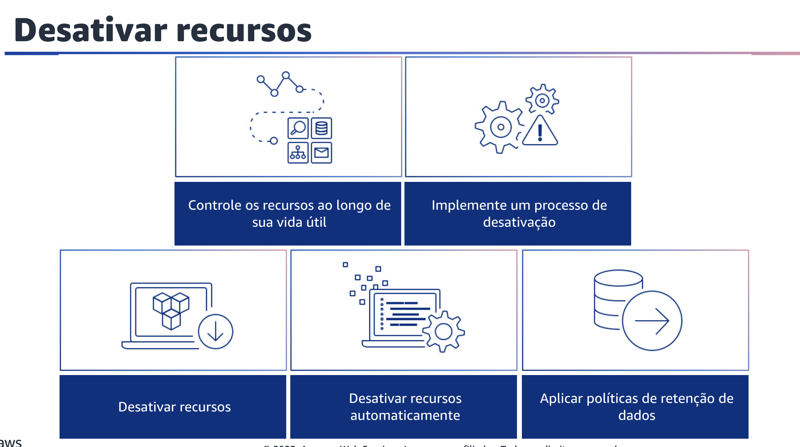

## 1.19 Selecionar o modelo de preço

Selecione o modelo de preço mais adequado para seus recursos para minimizar as despesas. Realize a análise do modelo de preços analisando cada componente da carga de trabalho. Determine se o componente e os recursos serão executados por períodos prolongados (para descontos de compromisso) ou dinâmicos e de curta duração (para Spot ou sob demanda). Realize uma análise da carga de trabalho usando as recomendações das ferramentas de gerenciamento de custos. Em seguida, aplique regras de negócios a essas recomendações para obter altos retornos.

Em seguida, implemente as Regiões com base no custo. O preço dos recursos pode variar de acordo com a Região. Identifique as diferenças de custo regionais e implante somente em Regiões com custos mais altos para atender aos requisitos de latência e soberania de dados. Considerar o custo da Região ajuda você a pagar o menor preço geral por essa carga de trabalho.

Selecione contratos de terceiros com termos econômicos, o que pode ajudar a garantir que o custo dos serviços seja dimensionado de acordo com os benefícios que eles proporcionam. Selecione contratos e preços que sejam dimensionados quando proporcionarem benefícios adicionais à sua organização.

Você também pode implementar modelos de preços para todos os componentes dessa carga de trabalho. Os recursos em execução permanente devem usar a capacidade reservada, como o Savings Plans ou o instâncias reservadas.
A capacidade de curto prazo é configurada para usar instâncias spot ou frota spot. As instâncias sob demanda são usadas somente para cargas de trabalho de curto prazo que não podem ser interrompidas e não são executadas por tempo suficiente para a capacidade reservada, entre 25 por cento e 75 por cento do período, dependendo do tipo de recurso.

Por fim, realize a análise do modelo de preços no nível da conta de gerenciamento. Explore as ferramentas de Billing and Cost Management. Considere os descontos recomendados com compromissos e reservas para realizar análises regulares no nível da conta de gerenciamento.

## 1.20 Planejar a transferência de dados

Planejar a transferência de dados para garantir que você planeje e monitore as cobranças de transferência de dados, de modo que possa tomar decisões arquitetônicas para minimizar os custos. Uma mudança arquitetônica pequena, porém eficaz, pode reduzir drasticamente seus custos operacionais ao longo do tempo. Você também pode reunir os requisitos da organização e realizar a modelagem de transferência de dados da carga de trabalho e de cada um de seus componentes. Isso identifica o ponto de menor custo para seus requisitos atuais de transferência de dados.

Em seguida, selecione os componentes para otimizar o custo de transferência de dados. Todos os componentes são selecionados e a arquitetura é projetada para reduzir os custos de transferência de dados. Isso inclui o uso de componentes como a otimização da rede de longa distância (WAN) e várias configurações de Zona de Disponibilidade.

Por fim, selecione serviços para reduzir os custos de transferência de dados. Por exemplo, use uma rede de entrega de conteúdo como o Amazon CloudFront para entregar conteúdo aos usuários finais, camadas de cache usando o Amazon ElastiCache ou experimente o AWS Direct Connect em vez da rede privada virtual (VPN) para se conectar à AWS.
