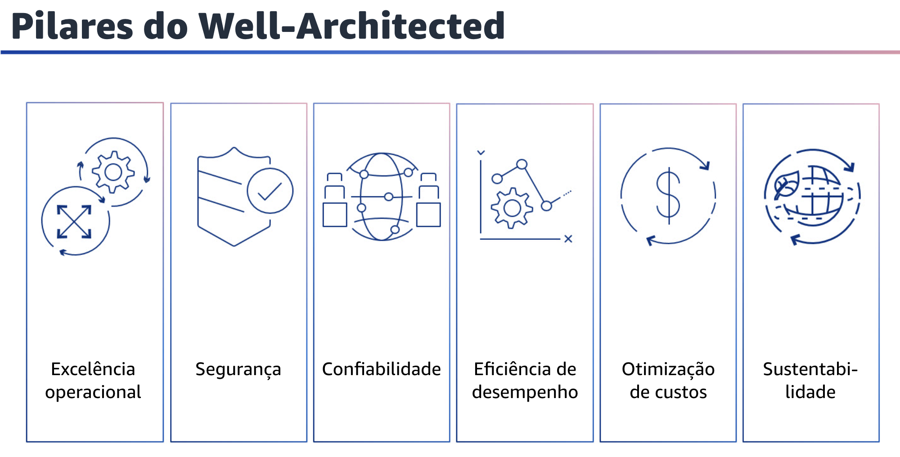
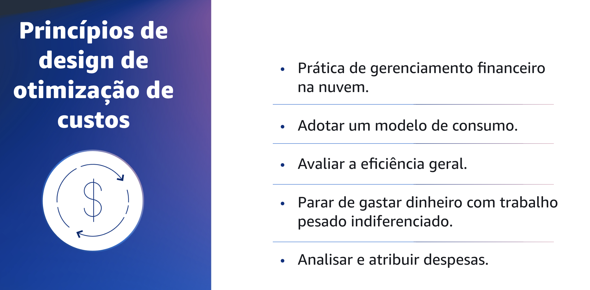

## 1.4 Pilares do Well-Architected

Atualmente, há seis pilares do Well-Architected Framework: excelência operacional, segurança, confiabilidade, eficiência de desempenho, otimização de custos e sustentabilidade. Esses pilares são os fundamentos da arquitetura de suas soluções de tecnologia na nuvem.
Este módulo se concentrará no pilar de otimização de custos.

## 1.5 O que é o pilar de otimização de custos?

O que é o pilar de otimização de custos? Da mesma forma que os outros pilares do Well-Architected Framework, há compensações a serem consideradas para a otimização de custos. Um exemplo é a otimização da velocidade de entrada no mercado ou do custo. Em alguns casos, é melhor otimizar a velocidade, entrar rapidamente no mercado, enviar novos recursos ou cumprir um prazo, em vez de investir na otimização de custo inicial.
Às vezes, as decisões de design são direcionadas pela pressa e não pelos dados.

Sempre existe a tentação de compensar em excesso, em vez de gastar tempo fazendo benchmarking para obter a implantação mais econômica possível. A compensação excessiva pode levar a implantações excessivamente provisionadas e subotimizadas. No entanto, pode ser uma opção razoável se você precisar liftand-shift recursos do seu ambiente on-premises para a nuvem e, em seguida, otimizar. Investir a quantidade certa de esforço em uma estratégia de otimização de custos desde o início pode ajudá-lo a perceber mais prontamente os benefícios econômicos da nuvem. Você pode adotar uma adesão consistente às práticas recomendadas e evitar o excesso de provisionamento desnecessário.

As seções a seguir fornecem técnicas e práticas recomendadas para a implementação inicial e contínua do CFM (Cloud Financial Management) e otimização de custos para suas cargas de trabalho.

## 1.6 Princípios de design de otimização de custos

Agora que você já sabe o que é o pilar de otimização de custos, vai se aprofundar nos princípios de design do pilar de otimização de custos.

## 1.7 Princípios de design de otimização de custos

Vários princípios podem ajudar você a otimizar os custos na nuvem. Primeiro, para ajudar a obter sucesso financeiro e acelerar a realização do valor comercial na nuvem, pratique o CFM. Sua organização precisará dedicar o tempo e os recursos necessários para desenvolver a capacidade nesse novo domínio de tecnologia e gerenciamento de uso. Semelhante à sua capacidade de segurança ou de operações, aumente a capacidade por meio do desenvolvimento de conhecimento, programas, recursos e processos para ajudar você a se tornar uma organização econômica.

Adote um modelo de consumo. Pague apenas pelos recursos de computação que você consome e aumente ou diminua o uso de acordo com os requisitos da empresa. Por exemplo, ambientes de desenvolvimento e teste são geralmente usados apenas por oito horas por dia durante a semana de trabalho. Você pode interromper esses recursos quando não estiverem em uso para obter uma potencial economia de custos de 75%, ou 40 horas em comparação com 168 horas. Você também pode medir a eficiência geral.
Monitore o resultado comercial da carga de trabalho e os custos associados à entrega. Use esses dados para entender os ganhos que você obtém ao aumentar a produção, aumentar a funcionalidade e reduzir os custos.

Pare de gastar dinheiro em trabalho pesado comum. A AWS faz o trabalho pesado das operações do data center, como armazenamento, empilhamento e alimentação de servidores, o que remove a sobrecarga operacional de gerenciar sistemas operacionais e aplicações com serviços gerenciados.

Isso ajuda você a se concentrar em seus clientes e projetos de negócios, e não na infraestrutura de TI. Por fim, analise e atribua as despesas. A nuvem ajuda você a identificar com precisão o custo e o uso das cargas de trabalho para atribuir de forma transparente os custos de TI às transmissões de receita e aos proprietários das cargas de trabalho. Isso ajuda a medir o retorno sobre o investimento (ROI) e oferece aos proprietários da carga de trabalho a oportunidade de otimizar seus recursos e reduzir custos.
