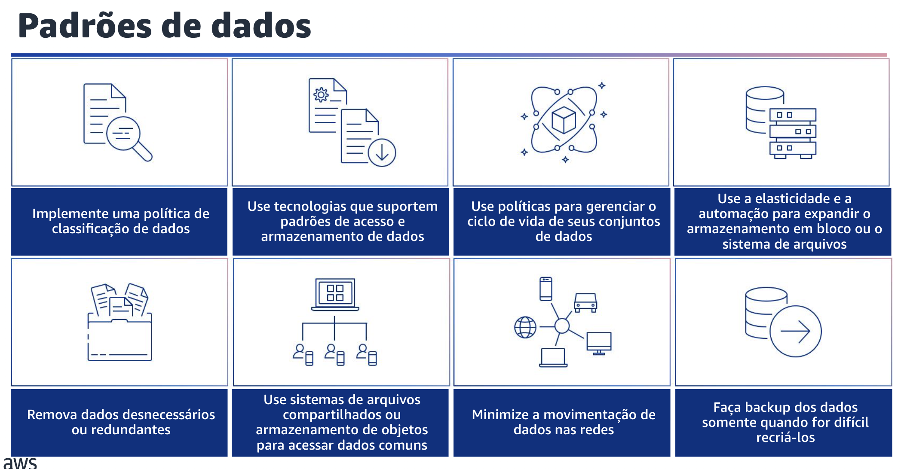

## 1.16 Padrões de dados

Agora, você vai se aprofundar na área de práticas recomendadas de padrões de dados em sustentabilidade.

## 1.17 Padrões de dados

A primeira prática recomendada para considerar padrões de dados implementar uma política de classificação de dados. Você precisa classificar os dados para entender a importância deles para os resultados comerciais e escolher a camada de armazenamento com eficiência energética correta para armazenar os dados.

Além disso, use tecnologias que suportem padrões de acesso e armazenamento de dados. Isso pode minimizar os recursos provisionados e, ao mesmo tempo, dar suporte à sua carga de trabalho.

Outra prática recomendada é usar políticas para gerenciar o ciclo de vida de seus conjuntos de dados e aplicar automaticamente cronogramas de exclusão para minimizar os requisitos totais de armazenamento de sua carga de trabalho.

Você também pode usar a elasticidade e a automação para expandir o armazenamento em bloco ou o sistema de arquivos à medida que os dados crescem para minimizar o armazenamento total provisionado.
Outra prática recomendada é remover dados desnecessários ou redundantes para minimizar os recursos de armazenamento necessários para armazenar seus conjuntos de dados.

Além disso,o uso de sistemas de arquivos ou armazenamento compartilhados pode ajudá-lo a evitar a duplicação de dados e promover uma infraestrutura mais eficiente para sua carga de trabalho.

Você pode minimizar a movimentação de dados nas redes. Use sistemas de arquivos compartilhados ou armazenamento de objetos para acessar dados comuns e minimizar o total de recursos de rede necessários para dar suporte à movimentação de dados para sua carga de trabalho.

Por fim,para minimizar o consumo de armazenamento, faça backup apenas dos dados que tenham valor comercial ou que sejam necessários para atender aos requisitos de conformidade. Examine as políticas de backup e exclua o armazenamento temporário que não agrega valor em um cenário de recuperação.
